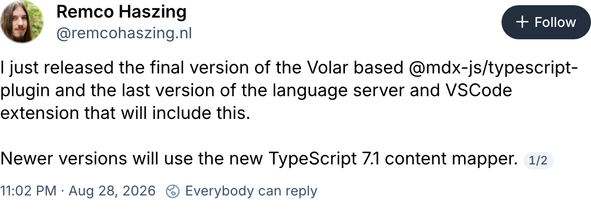
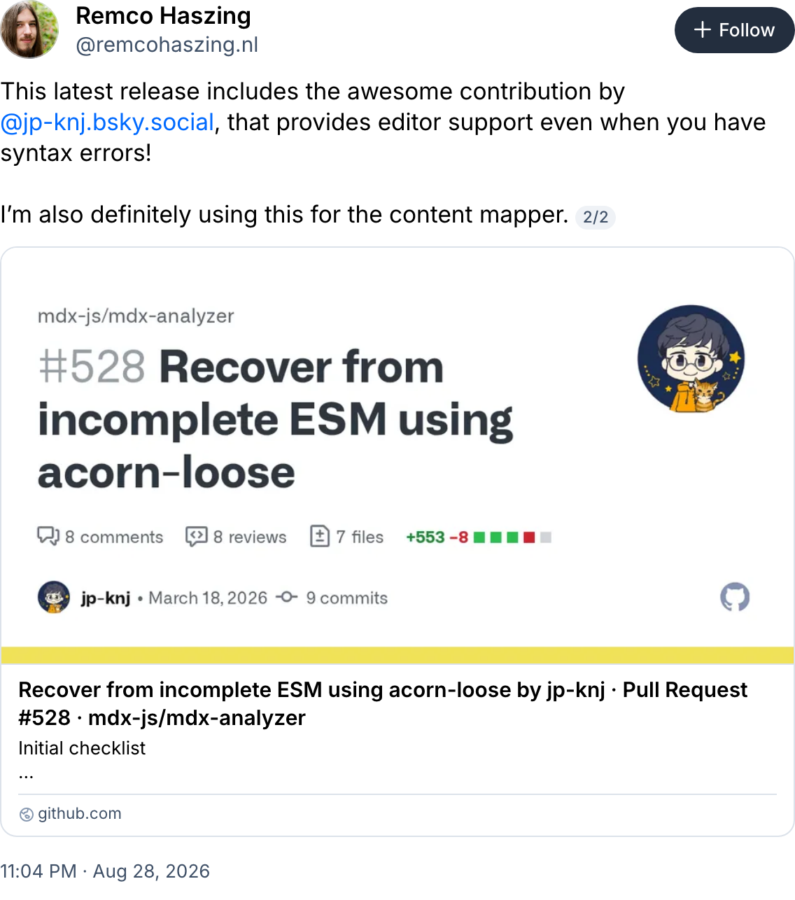

<h1 class="!text-5xl !font-700 leading-tight">
  Astro と Rust で考える<br />フロントエンドツールチェーンの今
</h1>

<div class="text-2xl text-black mt-10">Vue Fes 2026</div>

<div class="text-2xl text-black mt-3">kenji(jp-knj)</div>

<!--
こんにちは、kenji です。今日は、Astro と Rust で考えるフロントエンドツールチェーンの今について話します。題材は Astro Compiler で、動いていたものをなぜ書き直すのかを考えます。2021年に Go と WASM で書かれた Compiler が、2026年に Rust で書き直されました。その判断の中身を、4つの章に分けて追いかけます。
-->

---
class: flex items-center justify-center h-full
---

<div class="grid grid-cols-2 gap-10">
  <div>
    <div class="flex items-center gap-4">
      
      <div class="flex flex-col justify-center gap-0">
        <p class="text-2xl !my-0">ケンジ</p>
        <p class="text-xl !my-0">GitHub: <a href="https://github.com/jp-knj">jp-knj</a></p>
      </div>
    </div>
  </div>
  <div>
    <ul class="text-xl">
      <li>Astro Maintainer</li>
      <li>Astro Japan Community</li>
    </ul>
  </div>
</div>

<!--
自己紹介です。Astro のメンテナをしていて、Astro Japan Community の運営もしています。あとで出てきますが、Markdown と MDX まわりで Astro 本体への提案もしています。
-->

---
layout: default
class: community-story
clicks: 5
---

## Vue Fes 2025 から Astro Japan Community へ

<ol v-show="$clicks <= 4" class="community-thread" data-community-step="thread">
  <li class="thread-post" :class="{ 'thread-continues': $clicks >= 1 }">
    <span class="thread-avatar avatar-pilcrow" aria-hidden="true"></span>
    <div>
      <p class="thread-meta"><b>pilcrow</b> @pilcrowonpaper · <a href="https://x.com/pilcrowonpaper/status/1981982063650812385" target="_blank" rel="noreferrer">2025-10-25 16:12</a></p>
      <p class="thread-text">Why isn’t anyone from @astrodotbuild here at @vuefes :(</p>
    </div>
  </li>
  <li v-show="$clicks >= 1" class="thread-post" :class="{ 'thread-continues': $clicks >= 2 }">
    <span class="thread-avatar avatar-astro" aria-hidden="true"></span>
    <div>
      <p class="thread-meta"><b>Astro</b> @astrodotbuild · <a href="https://x.com/astrodotbuild/status/1982160958450520242" target="_blank" rel="noreferrer">2025-10-26 04:02</a></p>
      <p class="thread-text">@jp_knj was there!</p>
    </div>
  </li>
  <li v-show="$clicks >= 2" class="thread-post" :class="{ 'thread-continues': $clicks >= 3 }">
    <span class="thread-avatar avatar-pilcrow" aria-hidden="true"></span>
    <div>
      <p class="thread-meta"><b>pilcrow</b> @pilcrowonpaper · <a href="https://x.com/pilcrowonpaper/status/1982259070112292924" target="_blank" rel="noreferrer">2025-10-26 10:32</a></p>
      <p class="thread-text">We need more people!</p>
    </div>
  </li>
  <li v-show="$clicks >= 3" class="thread-post" :class="{ 'thread-continues': $clicks >= 4 }">
    <span class="thread-avatar avatar-astro" aria-hidden="true"></span>
    <div>
      <p class="thread-meta"><b>Astro</b> @astrodotbuild · <a href="https://x.com/astrodotbuild/status/1982483654858441181" target="_blank" rel="noreferrer">2025-10-27 01:25</a></p>
      <p class="thread-text">Who is organizing Astro meetups in Japan?</p>
    </div>
  </li>
  <li v-show="$clicks >= 4" class="thread-post">
    <span class="thread-avatar avatar-pilcrow" aria-hidden="true"></span>
    <div>
      <p class="thread-meta"><b>pilcrow</b> @pilcrowonpaper · <a href="https://x.com/pilcrowonpaper/status/1982493498877386783" target="_blank" rel="noreferrer">2025-10-27 02:04</a></p>
      <p class="thread-text">Don't know anyone tbh. But @vuefes is essentially ViteConf Japan so hoping to see a core maintainer or two next year (maybe as a speaker)</p>
    </div>
  </li>
</ol>

<div v-show="$clicks === 5" class="community-state" data-community-step="5">
  <a class="community-post" href="https://x.com/PLAID_Tech/status/1991667457032089615" target="_blank" rel="noreferrer" aria-label="PLAID の開催告知を開く">
    
  </a>
  <p class="community-caption">コミュニティを設立し、PLAID で Meetup を開催</p>
  <a class="community-source" href="https://x.com/PLAID_Tech/status/1991667457032089615" target="_blank" rel="noreferrer">PLAID の開催告知を見る</a>
</div>

<!--
コミュニティを始めるきっかけは Vue Fes 2025 でした。初期表示では、pilcrow が Vue Fes の会場で、Astro の人がいないと投稿したところから始めます。
[click] Astro 公式が、私が会場にいたと返信してくれました。
[click] pilcrow は、もっと人が必要だと返しました。
[click] 翌日、Astro 公式が、日本で Meetup を開いている人を尋ねました。
[click] pilcrow は、知り合いはいないが、来年は Vue Fes にコアメンテナが来てほしい、できれば登壇者として、と返しました。今日ここで話しているのは、この流れの続きです。
[click] そこでコミュニティを設立し、PLAID で Meetup を開催しました。開催告知の投稿と添付画像を掲載しています。
会話の本文は投稿の原文のまま引用し、日時は日本時間で書いています。Astro 公式の返信に付いていた私の投稿へのリンクは省きました。日時から元の投稿を開けます。画像は X の公式埋め込みから撮影し、原文と表示色を変更していません。出典と撮影方法は images/community/README.md に記録しています。
-->

---
layout: statement
class: flex flex-col justify-center h-full
---

# Go で動いていたものを、<br />なぜ、Rust に書き直すのか？

<!--
今日の問いは、動いていた Go Compiler を、Astro はなぜ Rust で書き直したのかです。速さに加えて、何が問題で、何が変わって、どう責務を分け直したのかを確認します。
-->

---
layout: default
class: body-center
---

## 話すこと

<div class="grid grid-cols-1 gap-4 mt-10">
  <div>
    <div class="text-3xl font-600 mt-1" style="color: var(--astro-heading)">1. 当時の判断</div>
    <div class="text-lg mt-2">なぜ最初に Go と WASM を選んだのか</div>
  </div>
  <div>
    <div class="text-3xl font-600 mt-1" style="color: var(--astro-heading)">2. 発見した問題</div>
    <div class="text-lg mt-2">使い続けるなかで何が見えたのか</div>
  </div>
  <div>
    <div class="text-3xl font-600 mt-1" style="color: var(--astro-heading)">3. 前提の変化</div>
    <div class="text-lg mt-2">2026年までに周囲はどう変わったのか</div>
  </div>
  <div>
    <div class="text-3xl font-600 mt-1" style="color: var(--astro-heading)">4. 新しい判断</div>
    <div class="text-lg mt-2">その結果、責務をどう分け直したのか</div>
  </div>
</div>

<!--
構成は4つです。当時の判断、発見した問題、前提の変化、新しい判断。この順で、判断の材料がどう入れ替わったのかを追います。
-->

---
layout: section
---

# 1. 当時の判断
## なぜ最初に Go と WASM を選んだのか

<!--
まず第1章。2021年に何を選んだのか、そしてそれはどういう条件下での選択だったのかを確認します。
-->

---
layout: center
---

<Overview
  visible="source,compiler,build,browser"
  :labels="{ compiler: 'Svelte Compiler', build: 'Snowpack' }"
  :icons="{ compiler: 'svelte', build: 'snowpack' }"
/>

<div class="text-center text-xl mt-2">Astro 0.x の出発点</div>

<!--
これが出発点です。最初の Astro は、.astro を Svelte Compiler の fork で読んで、Snowpack が Build と配信を担い、Browser が表示する。この4つでした。ここに出ている Svelte Compiler と Snowpack は、このあと Go Compiler と Vite に入れ替わります。その入れ替えがこの章の話です。そしてこの図には、この講演で何度も戻ってきます。章が進むごとに、登場人物と矢印が増えていきます。
-->

---
layout: default
class: body-center
---

## 2021年は、Rust 一色ではなかった

<div class="mt-12 relative">

  <!-- 軸。ドットの中心（上から 50px）に合わせて引く -->
  <div class="absolute left-0 right-0 top-[50px] h-[2px] bg-[#D9D3E2]"></div>

  <div class="relative flex items-start">
    <div class="flex-1 min-w-0 flex flex-col items-center">
      <div class="text-3xl text-black h-11 leading-none">Feb</div>
      <div class="w-3.5 h-3.5 rounded-full bg-[#9A90AB]"></div>
      <logos-vitejs class="text-6xl mt-8" />
      <div class="text-xl mt-5 leading-snug">Vite 2.0</div>
      
    </div>
    <div class="flex-1 min-w-0 flex flex-col items-center">
      <div class="text-3xl text-black h-11 leading-none">Sep</div>
      <div class="w-3.5 h-3.5 rounded-full bg-[#9A90AB]"></div>
      <logos-rome-icon class="text-6xl mt-8" />
      <div class="text-xl mt-5 leading-snug">Rome</div>
      
    </div>
    <div class="flex-1 min-w-0 flex flex-col items-center">
      <div class="text-3xl text-black h-11 leading-none">Oct</div>
      <div class="w-3.5 h-3.5 rounded-full bg-[#9A90AB]"></div>
      <logos-parcel-icon class="text-6xl mt-8" />
      <div class="text-xl mt-5 leading-snug">Parcel 2</div>
      
    </div>
    <div class="flex-1 min-w-0 flex flex-col items-center">
      <div class="text-3xl text-black h-11 leading-none">Oct</div>
      <div class="w-3.5 h-3.5 rounded-full bg-[#9A90AB]"></div>
      <logos-nextjs-icon class="text-6xl mt-8" />
      <div class="text-xl mt-5 leading-snug">Next.js 12</div>
      
    </div>
    <div class="flex-1 min-w-0 flex flex-col items-center">
      <div class="text-3xl text-primary font-700 h-11 leading-none">Nov</div>
      <div class="w-5 h-5 rounded-full bg-[#BC52EE] -mt-[3px]"></div>
      <logos-astro-icon class="text-6xl mt-8" />
      <div class="text-xl mt-5 leading-snug text-primary font-600">Astro 0.21</div>
      
    </div>
    <div class="flex-1 min-w-0 flex flex-col items-center">
      <div class="text-3xl text-black h-11 leading-none">Dec</div>
      <div class="w-3.5 h-3.5 rounded-full bg-[#9A90AB]"></div>
      <logos-turborepo-icon class="text-6xl mt-8" />
      <div class="text-xl mt-5 leading-snug">Turborepo</div>
      
    </div>
  </div>
</div>

<!--
2021年は、Rome が Rust への書き直しを発表し、Parcel 2 と Next.js 12 が Rust で実装された Compiler を採用した年です。同時に、Vite 2 は Go 製の esbuild を使い、Turborepo も Go でした。Rust の採用が進むなかでも、Go を選ぶことは珍しい判断ではありませんでした。
-->

---
layout: default
class: go-era-slide go-era-build
---

<div class="go-era-heading">
  <h2>Astro v1</h2>
  <span class="go-era-year">2022年</span>
</div>

<div class="go-era-summary">Build のための Compiler だった</div>

<Overview
  visible="source,compiler,build,browser"
  subs="html5-parser,esbuild-css"
  :labels="{ compiler: 'Go Compiler', build: 'Vite' }"
  :icons="{ compiler: 'go' }"
  :subnotes="{ build: 'esbuild' }"
/>

<div class="go-era-reason">
  <div class="text-2xl font-600 text-primary">深く考えすぎずに選んだ</div>
  <div class="text-xl mt-2">esbuild が Go だった。Go は学びやすかった。</div>
</div>

<Ref href="https://natemoo.re/posts/hello-from-the-other-side/">Nate Moore: Hello from the other side</Ref>

<!--
Astro v0.21 で、Svelte Compiler の fork から Go Compiler に移行し、Build は Vite が担うようになりました。この図は2022年の Astro v1 を示しています。JavaScript からは WASM を介して Compiler を呼び出します。Build を目的とした Compiler は、.astro を TypeScript を含むコードへ変換し、Astro の Vite plugin が esbuild を使って JavaScript に変換します。
Go を選んだ理由は、実装した Nate Moore 本人がこう書いています。esbuild が Go で書かれていたこと、Go が学びやすかったこと。深く考えすぎずに選んだ、と。
Go Compiler の中では、HTML5 Parser 由来の実装を Astro syntax に対応するよう拡張しています。CSS には、2022年3月に導入した esbuild 由来の CSS Parser と Printer を使い、CSS の解析とスコープ化を行います。Vite の部分に示した esbuild は TypeScript を変換するためのもので、Compiler 内の esbuild は CSS の解析と生成を担当します。HTML5 Parser をベースにしたことが、第2章の話につながります。

実装の出典: [esbuild の CSS Parser の導入](https://github.com/withastro/compiler/pull/329)、[Astro v1 の Vite plugin](https://github.com/withastro/astro/blob/astro%401.0.0/packages/astro/src/vite-plugin-astro/index.ts)、[Go Compiler と Vite を採用した Astro v0.21](https://astro.build/blog/astro-021-release/)。

次の章では、Compiler が Editor のツールでも使われるようになり、どのような問題が分かったのかを確認します。
-->

---
layout: section
---

# 2. 発見した問題
## 使い続けるなかで何が見えたのか

<!--
第2章です。Go と WASM の Compiler を使い続けるなかで、何が見えてきたのか。ここからは具体的なコードと AST を見ていきます。なお、これから出す AST の例は、説明に必要な部分だけを抜き出したものです。実際には位置情報などのフィールドが付きます。
-->

---
layout: default
class: go-era-slide go-era-tools
---

<div class="go-era-heading">
  <h2>Astro v2〜v5</h2>
  <span class="go-era-year">2023〜2025年</span>
</div>

<div class="go-era-summary">Editor のツールと Content Collections も利用する</div>

<Overview
  subs="html5-parser,esbuild-css"
  :labels="{ compiler: 'Go Compiler', build: 'Vite' }"
  :icons="{ compiler: 'go' }"
  :subnotes="{ build: 'esbuild' }"
/>

<!--
この図は、2023年から2025年の Astro v2〜v5 で利用していたツールと、その役割をまとめた図です。Editor のツール、つまり ESLint や Language Server や Formatter も Go Compiler を利用していました。Compiler の中の HTML5 Parser と CSS の解析と生成のための esbuild、Vite の部分の TypeScript を変換するための esbuild は、9枚目と同じ役割です。
時代の表記は、この章で扱う期間を示しています。Editor のツールや Markdown と MDX がすべて v2 で初めて登場したという意味ではありません。MDX は v1 ですでに利用でき、v2 では Content Collections が導入されました。Markdown と MDX は Content Processor で変換し、Build へ渡します。
この章では、HTML の親子関係と埋め込まれた JavaScript を確認します。Content の解析と変換は、第3章の後半で説明します。

出典: [Astro v1 の MDX 対応](https://astro.build/blog/astro-1/)、[Astro v2 の Content Collections](https://astro.build/blog/astro-2/)、[Astro v5 の TypeScript 変換](https://github.com/withastro/astro/blob/astro%405.0.0/packages/astro/src/vite-plugin-astro/compile.ts)。
-->

---
layout: default
class: syntax-overview body-center
clicks: 6
---

## Astro Syntax

````md magic-move
```astro
---
const products = await getProducts();
---
```
```astro
---
const products = await getProducts();
---

<ul>
  <!-- template -->
</ul>
```
```astro
---
const products = await getProducts();
---

<ul>
  {products.map((product) => (
    <li>{product.name}: {product.price}</li>
  ))}
</ul>
```
```astro {3,7}
---
const products = await getProducts();
const props = { title: "second" };
---
<ul>
  {products.map((product) => (
    <li title="first" {...props}>{product.name}</li>
  ))}
</ul>
```
````

<div class="mt-0 text-center text-2xl">
  <div v-if="$clicks === 0"><span class="text-primary font-600">Component script</span><br /><code>---</code> で囲む。ビルド時とサーバーで実行する JavaScript と TypeScript</div>
  <div v-if="$clicks === 1"><span class="text-primary font-600">Template</span><br />HTML を基礎に、expression（JavaScript の式）や<br />コンポーネントを書ける</div>
  <div v-if="$clicks === 2"><span class="text-primary font-600">JavaScript expression</span><br />波かっこの中の式を評価し、結果をその場所に表示する</div>
  <div v-if="$clicks === 3"><span class="text-primary font-600">Q. </span>この <code>title</code> は、どちらの値になる？</div>
  <div v-if="$clicks === 3" class="mt-4"><code>first</code> か、<code>second</code> か</div>
  <div v-if="$clicks === 4"><span class="text-primary font-600">A. </span><code>first</code></div>
  <Overlay v-if="$clicks >= 5" aria-label="Astro Syntax への問いと答え">
    <template #title>
      <span v-if="$clicks === 5">これは、Astro Syntax がおかしいのでは？</span>
      <span v-else>もともとのブラウザの解釈や</span>
    </template>
    <p v-if="$clicks >= 6">
      同じ属性を重複して出力した場合<br />
      ブラウザは先の <code>title="first"</code> を採用するため、<code>first</code> になった。
    </p>
    <template #reference>
      <a href="https://github.com/withastro/astro/issues/5558#issuecomment-1343799494" target="_blank" rel="noopener noreferrer">astro#5558 の説明</a>
    </template>
  </Overlay>
</div>

<Ref v-if="$clicks < 3" href="https://docs.astro.build/en/reference/astro-syntax/">Astro Syntax</Ref>

<!--
Astro Syntax をおさらいします。初めに三本線で囲まれた Component script を示します。1クリック目で Template、2クリック目で波かっこに埋め込んだ JavaScript expression を示します。
products.map(...) は、商品を表す配列 products から li 要素の一覧を作る式です。li の中にある product.name と product.price も式で、商品の名前と価格を参照します。波かっこの中の式を評価し、その結果をその場所に表示します。
3クリック目では同じ例に属性を加え、title がどちらの値になるかを問いかけます。4クリック目で答えの first を示します。5クリック目で Astro Syntax がおかしいのではないかと問いかけ、参照リンクを示します。6クリック目でブラウザの解釈によるものと答え、属性の重複と先の値を採用する規則を説明します。
報告者は、後から指定した props が優先されて second になると予想しました。当時の Astro は同名の属性を出力し、ブラウザは先にある title="first" を採用しました。HTML の重複属性では先の値を採用し、JSX での props 合成では後の指定を優先します。Astro Syntax は HTML を基礎にした構文で、JSX に似ていても同じ規則とは限りません。この違いが利用者の期待との不一致になりました。
2022年の元の報告にある class 属性を、ここでは title に簡略化しています。現在の Astro の挙動を示す例ではありません。次は、要素間の改行が表示にどう影響するかを確認します。
-->

---
layout: default
class: body-center
clicks: 3
---

## Astro Syntax

```astro
<span>Astro</span>
<span>1200</span>
```

<!-- クイズと答えの表示領域を固定し、Astro Syntax への問いと短い答えは Overlay で切り替える -->
<div class="mt-4 h-[96px] flex flex-col items-center justify-center text-center text-2xl">
  <div v-if="$clicks === 0"><span class="text-primary font-600">Q. </span>このコードは、どちらの表示になる？</div>
  <div v-if="$clicks === 0" class="mt-4"><code>Astro1200</code> か、<code>Astro 1200</code> か</div>
  <div v-if="$clicks === 1"><span class="text-primary font-600">A. </span><code>Astro 1200</code></div>
  <Overlay v-if="$clicks >= 2" aria-label="Astro Syntax への問いと答え">
    <template #title>
      <span v-if="$clicks === 2">これは、Astro Syntax がおかしいのでは？</span>
      <span v-else>もともとのブラウザの解釈や</span>
    </template>
    <p v-if="$clicks >= 3">
      ブラウザはその改行を空白として表示するため、<code>Astro 1200</code> になる。
    </p>
  </Overlay>
</div>

<Ref>
  <a href="https://github.com/withastro/astro/issues/6011">astro#6011: 要素間の空白テキスト node</a>
  <a v-if="$clicks >= 2" href="https://blog.dwac.dev/posts/html-whitespace/" class="ml-8">HTML Whitespace is Broken</a>
</Ref>

<!--
最初に表示の候補を問いかけ、1クリック目で答えの Astro 1200 を示します。2クリック目で Astro Syntax がおかしいのではないかと問いかけ、3クリック目でブラウザの解釈によるものと答え、改行が空白として表示される理由を示します。
2023年の報告です。要素を改行して並べると、要素間に空白だけのテキスト node ができます。Astro は .astro の改行を出力にも保持し、ブラウザが要素間の改行を空白として表示します。この空白の扱いにより、JSX で期待する Astro1200 とは表示が異なります。次は、Compiler 内の HTML5 Parser が生成結果に影響した例を確認します。
-->

---
layout: default
class: table-comparison body-center code-example-compact
clicks: 3
---

## Astro Syntax

<div>

<div class="flex gap-8 w-full">
  <div class="min-w-0 code-split" :class="$clicks >= 1 ? 'w-[calc(50%-1rem)]' : 'w-full'">
    <div class="text-primary font-600 text-xl mb-1 flex items-center gap-2"><logos-astro-icon class="w-5 h-5 shrink-0" aria-hidden="true" />.astro</div>

```astro
<table>
  <tr><td>{'foo'}</td></tr>
</table>
<h2>Chats</h2>
```

  </div>
  <Transition name="reveal-right">
  <div class="min-w-0 w-[calc(50%-1rem)]" v-if="$clicks >= 1">
    <div class="text-primary font-600 text-xl mb-1 flex items-center gap-2"><logos-html-5 class="w-5 h-5" />生成された HTML</div>

```html
<table>
  <tr><td>foo</td></tr>
  <h2>Chats</h2>
</table>
```

  </div>
  </Transition>
</div>

<Overlay v-if="$clicks >= 2" aria-label="Astro Syntax への問いと答え">
  <template #title>
    <span v-if="$clicks === 2">これは、Astro Syntax がおかしいのでは？</span>
    <span v-else>それは、そう</span>
  </template>
  <p v-if="$clicks >= 3">
    この挙動は、HTML correctionの挙動<br />
    そのため、表の後の <code>h2</code> が <code>table</code> の中に入った。
  </p>
</Overlay>

</div>

<Ref href="https://github.com/withastro/compiler/issues/870">compiler#870</Ref>

<!--
最初は書いた Astro を確認します。1クリック目で、報告された生成 HTML を右に表示します。2クリック目で Astro Syntax がおかしいのではないかと問いかけ、3クリック目で Compiler がブラウザの HTML 解析も担っていたと答え、式の解析後に状態を正しく戻せなかった不具合を説明します。
Go Compiler は HTML5 Parser 由来の実装を Astro syntax に対応するよう拡張していました。HTML5 Parser は、表の内外などの文脈に応じて解析状態を切り替えます。Astro の式を解析した後には、周囲の HTML に合う状態へ戻る必要があります。
compiler#870 の報告当時、表のセルに式を含む例で、table の後の h2 が table の中に入る不具合がありました。修正 PR #925 では、表の中の式を特別扱いしていた分岐を削除し、式の終了時に resetInsertionMode() で解析状態を選び直すよう変更しています。表の後にある要素が表に含まれないこともテストしています。これは式の解析後の状態復帰に関する Compiler の不具合で、HTML5 の正しい補正結果ではありません。
Compiler が生成する HTML と、ブラウザがその HTML から作る DOM は区別します。DOM は、ブラウザが表示のために作る HTML の木です。HTML5 の補正は、HTML の規則に従って要素の移動や追加を行うことです。たとえば p の中に div を書くと、div の開始で p が閉じられます。補正後の木からは、元の入れ子を診断できません。
参照: [式を含む表の解析を修正した PR #925](https://github.com/withastro/compiler/pull/925)
次は、属性と空白と表の例から、Astro Syntax に必要な規則を振り返ります。
-->

---
layout: default
class: ch2-detail
---

## Astro syntax を振り返る

<div class="ch2-reflection">
  <div>
    <h3>HTML らしさ</h3>
    <ul><li>HTML に似た構文と、利用者が期待する挙動</li></ul>
  </div>
  <div>
    <h3>空白の扱い</h3>
    <ul><li>Browser で空白になる改行を、Astro syntax の規則で扱えないか</li></ul>
  </div>
  <div>
    <h3>HTML5 Parser のふるまい</h3>
    <ul><li>タグの補完や入れ子の補正まで、Astro で採用する必要があるか</li></ul>
  </div>
</div>
<div class="ch2-next-question">HTML5 Parser は必要なのか？</div>

<!--
12枚目の属性と13枚目の空白と14枚目の不具合を振り返ります。HTML に似た構文を解析することと、Browser と同じ HTML correction を採用することは別の判断です。
改行を含む空白の表示は、HTML correction とは別の論点です。Astro syntax でどの規則を採用するかという問いであり、空白の仕様が変更済みだという説明ではありません。
table の後の h2 が table の中に入った例は、Compiler の不具合です。HTML5 の正しい挙動として説明しません。Rust への移行だけで、これらの課題をすべて解決できるという説明もしません。
次は、Go Compiler の情報をツールがどう利用していたかを確認します。
-->

---
layout: default
class: go-era-slide go-era-tools
---

<div class="go-era-heading">
  <h2>Astro v2〜v5</h2>
  <span class="go-era-year">2023〜2025年</span>
</div>

<div class="go-era-summary">Editor のツールも Go Compiler を使う</div>

<Overview
  highlight="source,compiler,editor"
  subs="html5-parser,esbuild-css"
  :labels="{ compiler: 'Go Compiler', build: 'Vite' }"
  :icons="{ compiler: 'go' }"
  :subnotes="{ build: 'esbuild' }"
/>

<!--
ここからは Editor のツールが Compiler をどう使うか確認します。.astro から Go Compiler を経由して、ESLint と Language Server と Formatter が使う情報を渡します。
次のスライドから Linter、Formatter、Language Tool の順に、全体の流れと工程が必要な理由を説明します。
-->

---
layout: default
class: ch2-detail ch2-tool-overview
---

## Linter が .astro を検査するまで

<div class="ch2-tool-route">
<div class="ch2-route-step"><div class="ch2-route-node">.astro</div><div class="ch2-route-caption">検査したい元のコード</div></div>
<svg class="ch2-route-arrow" viewBox="0 0 24 18" aria-hidden="true"><path d="M12 0 V15 M7 10 L12 15 L17 10" /></svg>
<div class="ch2-route-step"><div class="ch2-route-node">JavaScript と JSX</div><div class="ch2-route-caption">astro-eslint-parser が解析するために変換<br />JSX は JavaScript にタグを書ける構文</div></div>
<svg class="ch2-route-arrow" viewBox="0 0 24 18" aria-hidden="true"><path d="M12 0 V15 M7 10 L12 15 L17 10" /></svg>
<div class="ch2-route-step"><div class="ch2-route-node">AST</div><div class="ch2-route-caption">Espree が構文解析<br />AST は文や式を node で表すデータ</div></div>
<svg class="ch2-route-arrow" viewBox="0 0 24 18" aria-hidden="true"><path d="M12 0 V15 M7 10 L12 15 L17 10" /></svg>
<div class="ch2-route-step"><div class="ch2-route-node">AST とスコープ情報</div><div class="ch2-route-caption">宣言と参照を対応させる<br />位置を元の .astro に対応させて返す</div></div>
<svg class="ch2-route-arrow" viewBox="0 0 24 18" aria-hidden="true"><path d="M12 0 V15 M7 10 L12 15 L17 10" /></svg>
<div class="ch2-route-step"><div class="ch2-route-node">ESLint の診断</div><div class="ch2-route-caption">ルールが検査し、元の .astro の範囲で報告</div></div>
</div>

<Ref href="https://github.com/ota-meshi/astro-eslint-parser/blob/v1.2.2/src/parser/index.ts">astro-eslint-parser 1.2.2 の解析と位置対応</Ref>

<!--
Linter はコードをルールに照らして検査するツールです。ここでは未定義の変数を検査する ESLint を使います。最初に .astro を解析して診断を返すまでを確認します。
astro-eslint-parser は Compiler で Astro AST を取得し、JavaScript Parser が扱えるコードを生成します。この例は型注釈を含まないため、生成コードは JavaScript と JSX です。JSX は JavaScript にタグを書ける構文、Parser はコードを文や式として解析する機能です。Espree が構文解析し、AST を返します。AST は抽象構文木の略で、文や式を node とその親子関係で表すデータです。
スコープは変数の宣言が有効な範囲です。スコープ解析は宣言と参照を対応させます。Espree 自体がスコープ情報を返すという説明ではありません。今回の検証では astro-eslint-parser がスコープ解析を行い、AST とスコープ情報を用意します。参照位置を .astro に対応させて ESLint に渡し、no-undef が未定義の参照を検査します。
次は、Go Compiler の AST だけで式を検査できるかを確認します。
TypeScript の型注釈を含む入力には対応する Parser を使います。Language Tool が型を検査するために生成するコードとは、生成元も目的も異なります。
参照: [スコープ解析の実装](https://github.com/ota-meshi/astro-eslint-parser/blob/v1.2.2/src/parser/script.ts)
参照: [ESLint のスコープ情報](https://eslint.org/docs/latest/extend/scope-manager-interface)
-->

---
layout: default
class: ch2-detail
---

## Go Compiler の AST だけで式を検査できるのか

<div class="ch2-cols">
<div>
<div class="ch2-label flex items-center gap-2"><logos-astro-icon class="w-5 h-5 shrink-0" aria-hidden="true" />.astro の構文は Espree へ直接渡せない</div>

```astro
---
const price = 10;
const amount = 3;
---

<p>{price * amount}</p>
```

</div>
<div>
<div class="ch2-label">Go Compiler が返す式の AST</div>

```js
{
  type: "expression",
  children: [{
    type: "text",
    value: "price * amount"
  }]
}
```

<div class="ch2-note"><code>TextNode.value</code> は文字列</div>
</div>
</div>
<div class="ch2-summary">式を再解析できるように、JavaScript と JSX へ変換する</div>

<Ref href="https://github.com/withastro/compiler/blob/ab9b285a34c482544da359f0ca91d0b0c25cdee4/README.md#parse-astro-and-return-an-ast">Compiler 2.12.2 と AST</Ref>

<!--
Go Compiler の AST だけでは、この式の変数名と演算子を個別に検査できません。
Espree は JavaScript と JSX を解析できますが、Astro の Component script の区切りや Template をそのまま扱えません。Component script は --- で囲むスクリプト、Template はその後のタグや式です。まず、Parser が扱える構文へ変換する必要があります。
もう一つの理由は Go Compiler の AST の内容です。右は Compiler 2.12.2 の parse(source, { position: true }) の結果から抜粋しています。expression は式を表す node ですが、この price * amount の中身は TextNode.value の文字列です。変数名と演算子を個別の JavaScript AST node としてたどれません。そこで JavaScript として再解析します。
左の入力は5行目が空行で、末尾に LF があります。後の位置の例もこの全文を基準にします。
Astro の Template には式、その式には Markup、Markup には再び式を書けます。Go Compiler は expression の子に element を含めることができ、Markup の入れ子を保持します。式に含まれる情報がすべて一つの文字列になる、という説明ではありません。
Linter が JavaScript と JSX に変換する工程は、astro-eslint-parser が担当します。次は、そのコードを解析して変数名と演算子を取得します。
-->

---
layout: default
class: ch2-detail
clicks: 2
---

## 式の変数名と演算子をどう取得するのか

<div v-show="$clicks < 2" class="ch2-cols ch2-expression-cols">
<div>
<div class="ch2-label flex items-center gap-2"><logos-astro-icon class="w-5 h-5 shrink-0" aria-hidden="true" />.astro</div>

```astro
---
const price = 10;
const amount = 3;
---

<p>{price * amount}</p>
```

</div>
<div v-click="1" class="ch2-expression-stages">
<div class="ch2-label">解析するための JavaScript と JSX</div>

```jsx
const price = 10;
const amount = 3;
<>
  <p>{price * amount}</p>
</>;
```

<div class="ch2-note">Espree で構文解析する</div>
</div>
</div>
<div v-if="$clicks >= 2" class="ch2-expression-data">
<div>
<div class="ch2-label">Espree で解析した AST の抜粋</div>

```js
{
  type: "BinaryExpression",
  operator: "*",
  left:
    { type: "Identifier", name: "price" },
  right:
    { type: "Identifier", name: "amount" }
}
```

</div>
<div class="ch2-expression-terms">
  <div><div class="ch2-label">BinaryExpression</div><p>二つの値を演算子で組み合わせた式。この例では掛け算。</p></div>
  <div><div class="ch2-label">Identifier</div><p>識別子。ここでは <code>price</code> と <code>amount</code> という変数名。</p></div>
</div>
</div>
<div v-if="$clicks < 2" class="ch2-summary"><code>astro-eslint-parser</code> が JavaScript Parser へ渡すコードを作る</div>
<div v-else class="ch2-summary">変数名と演算子を AST の項目として取得できる</div>

<!--
Go Compiler の AST では、price * amount の中身は文字列でした。変数名と演算子は、JavaScript と JSX へ変換したコードを Espree で解析して取得します。

クリック1で解析するための JavaScript と JSX を表示します。astro-eslint-parser がこのコードを作ります。これは JavaScript Parser へ渡すためのコードです。この例では、Espree という Parser で解析します。

JavaScript Parser を使うと、変数名や演算子を個別の node として取得できます。クリック2で本文全体を切り替え、左に AST データの抜粋、右に二つの用語の説明を表示します。BinaryExpression は二つの値を演算子で組み合わせた式で、この例では掛け算です。Identifier は識別子で、ここでは price と amount という変数名です。変数名と演算子を AST の項目として取得できます。

取得した AST の位置は、変換後のコードを基準としています。次は、なぜその位置を元の .astro に戻すのかを確認します。

補足。Language Tool が TypeScript へ渡すコードとは別の変換です。JSX Fragment は複数の要素をまとめる <> と </> の構文です。この例は JavaScript と JSX だけで表せるため、検証では Espree を使います。Component script の区切りを外し、Template を Fragment で囲みます。実装は区切りを除いた位置にセミコロンを挿入するなどの調整も行います。スライドに掲載した抜粋では、そのセミコロンと一部の空行を省き、Fragment 内を字下げしています。AST データは expression の部分を抜粋し、位置などの項目を省略しています。

参照: [astro-eslint-parser 1.2.2 と processTemplate](https://github.com/ota-meshi/astro-eslint-parser/blob/v1.2.2/src/parser/process-template.ts)
-->

---
layout: default
class: ch2-detail ch2-position-slide
---

## AST の位置をなぜ元の .astro に戻すのか

<div class="ch2-context-flow ch2-lint-context" aria-label="Linter の全体図から、AST の取得と位置対応と診断の工程を再掲">
  <div class="ch2-context-node">AST</div>
  <svg class="ch2-context-arrow" viewBox="0 0 28 24" aria-hidden="true"><path d="M1 12 H25 M19 6 L25 12 L19 18" /></svg>
  <div class="ch2-context-node is-current">AST とスコープ情報<span>位置を元の .astro に対応させる</span></div>
  <svg class="ch2-context-arrow" viewBox="0 0 28 24" aria-hidden="true"><path d="M1 12 H25 M19 6 L25 12 L19 18" /></svg>
  <div class="ch2-context-node">ESLint の診断</div>
</div>

<div class="ch2-position-purpose">変換すると文字位置が変わるため、<br />診断の範囲を元のコードに対応させる</div>
<div class="ch2-cols ch2-position-mapping">
  <div>
    <div class="ch2-label">変換後の JavaScript と JSX</div>
    <pre class="ch2-position-code">&lt;&gt;&lt;p&gt;{<span>price</span> * amount}&lt;/p&gt;</pre>
    <div class="ch2-range-value">[46, 51)</div>
    <div class="ch2-note">Espree が返す AST の位置</div>
  </div>
  <div>
    <div class="ch2-label">元の .astro</div>
    <pre class="ch2-position-code">&lt;p&gt;{<span>price</span> * amount}&lt;/p&gt;</pre>
    <div class="ch2-range-value">[49, 54)</div>
    <div class="ch2-note">astro-eslint-parser が対応させた位置</div>
  </div>
</div>
<div class="ch2-note ch2-position-note">範囲は変換後と元のコードの全文を基準とする値。<br />0始まりで終端を含まない。表示した抜粋の先頭から数えた値ではない。</div>

<Ref href="https://github.com/ota-meshi/astro-eslint-parser/blob/v1.2.2/src/parser/index.ts">astro-eslint-parser 1.2.2 の解析と位置対応</Ref>

<!--
元の .astro の文字を診断するために、AST の位置を元のコードに戻します。17枚目の全体図で、AST とスコープ情報を ESLint に渡す前の工程です。19枚目では JavaScript と JSX に変換して式の AST を取得しました。Espree が返す位置は変換後のコードを基準とするため、そのままでは元の .astro の文字を指しません。
この例では、式にある price は変換後の全文で [46, 51)、元の .astro の全文で [49, 54) です。astro-eslint-parser が記録した対応を使い、AST の位置を元のコードの位置に変換してから ESLint に渡します。この範囲では差が3文字ですが、ファイル全体で常に3を加えるという意味ではありません。次は、宣言と参照を照合して未定義の変数を検出し、診断がこの5文字を指すことを確認します。
範囲は0始まりで終端を含みません。左も右も表示は抜粋です。前の枚の読みやすく整えたコード例から数えた値ではなく、検証で取得した全文に対する値です。左の冒頭にある JSX Fragment など、変換で追加した文字や除いた文字により位置が変わります。

補足：Compiler の位置計算の問題
コード変換による位置の変化とは別に、Compiler 2.12.2 が返す Astro expression の範囲にも問題がありました。内部では expression も ElementNode で表します。HTML タグの範囲を求める計算では、タグ名の位置から開始を1文字戻し、終端にタグ名の長さと1を加えます。expression にも適用していたため、開始は 48 - 1 = 47、終端は 63 + 16 + 1 = 80 になります。16 は内部名 astro:expression の文字数です。波かっこを含む正しい範囲は [48, 64) で、astro-eslint-parser が補正します。
ESTree は AST の形式を定める仕様です。Espree が付けた範囲を .astro に対応させると、BinaryExpression は [49, 63)、price は [49, 54)、amount は [57, 63) です。この例は ASCII なので、UTF-8 の byte と UTF-16 の文字オフセットの値が一致します。一般の日本語を含む入力で両者が一致するとは限りません。
参照: [Compiler 2.12.2 の位置情報の実装](https://github.com/withastro/compiler/blob/ab9b285a34c482544da359f0ca91d0b0c25cdee4/internal/printer/print-to-json.go#L134-L175)
参照: [astro-eslint-parser の位置対応](https://github.com/ota-meshi/astro-eslint-parser/blob/v1.2.2/src/context/restore.ts)
-->

---
layout: default
class: ch2-detail code-example-dense ch2-linter-check
---

## 未定義の変数をどう検出するのか

<div class="ch2-context-flow ch2-lint-context" aria-label="Linter の全体図から、AST の取得と位置対応と診断の工程を再掲">
  <div class="ch2-context-node">AST</div>
  <svg class="ch2-context-arrow" viewBox="0 0 28 24" aria-hidden="true"><path d="M1 12 H25 M19 6 L25 12 L19 18" /></svg>
  <div class="ch2-context-node">AST とスコープ情報<span>位置を元の .astro に対応させる</span></div>
  <svg class="ch2-context-arrow" viewBox="0 0 28 24" aria-hidden="true"><path d="M1 12 H25 M19 6 L25 12 L19 18" /></svg>
  <div class="ch2-context-node is-current">ESLint の診断</div>
</div>

<div class="ch2-cols ch2-scope">
<div>
<div class="ch2-label">ここで変数名を誤記する</div>

```astro
---
const price = 10;
const amount = 3;
---

<p>{pirce * amount}</p>
<!-- pirce は診断のための誤記 -->
```

</div>
<div>
<div class="ch2-label">スコープ情報で宣言と参照を照合する</div>
<div class="ch2-lint-matches"><div><code>price</code><span>宣言あり</span></div><div><code>amount</code><span>参照先の宣言あり</span></div><div><code>pirce</code><span>参照先の宣言なし</span></div></div>
<div class="ch2-label flex items-center gap-2"><logos-astro-icon class="w-5 h-5 shrink-0" aria-hidden="true" />.astro への診断</div>
<pre class="ch2-lint-diagnostic">&lt;p&gt;{<span>pirce</span> * amount}&lt;/p&gt;</pre>
<div class="ch2-note">元のコードの範囲 <code>[49, 54)</code><br /><code>no-undef</code>: <code>'pirce' is not defined.</code></div>
</div>
</div>
<div class="ch2-summary">未定義の参照を検出し、元の5文字に波線を表示する</div>

<Ref href="https://github.com/ota-meshi/astro-eslint-parser/blob/v1.2.2/src/parser/index.ts">astro-eslint-parser と ESLint への返却値</Ref>

<!--
未定義の変数は、スコープ情報で宣言と参照を照合して検出します。17枚目の全体図の最後、ESLint の診断です。20枚目で元の .astro に対応させた位置を使い、診断する文字の範囲を示します。この枚で初めて pirce という誤記を示します。AST の Identifier は参照の名前を表します。スコープ情報を使うと、その参照に対応する宣言があるか確認できます。スコープ解析では price と amount の宣言を記録し、amount の参照はその宣言に対応します。pirce の参照には対応する宣言がなく、globalScope.through に含まれます。
astro-eslint-parser は AST の位置を .astro に対応させ、Astro の node や visitorKeys も含む返却値を ESLint へ渡します。visitorKeys は AST の子をたどるためのプロパティ名の一覧です。ESLint の no-undef は、スコープ情報から未定義の参照を検査するルールです。意図した綴りを推測して修正するルールではありません。
診断 JSON の抜粋は { "ruleId": "no-undef", "message": "'pirce' is not defined.", "line": 6, "column": 5, "endLine": 6, "endColumn": 10 } です。ESLint 9.36.0 で確認した値で、文字オフセットの範囲は [49, 54) です。波線はこの範囲を示しています。次は、Formatter が .astro をどう整形するか確認します。
-->

---
layout: default
class: ch2-detail ch2-tool-overview
---

## Formatter が .astro を整形するまで

<div class="ch2-tool-route">
<div class="ch2-route-step"><div class="ch2-route-node">.astro</div><div class="ch2-route-caption">整形したい元のコード</div></div>
<svg class="ch2-route-arrow" viewBox="0 0 24 18" aria-hidden="true"><path d="M12 0 V15 M7 10 L12 15 L17 10" /></svg>
<div class="ch2-route-step"><div class="ch2-route-node">式のコード</div><div class="ch2-route-caption">Compiler の parse() で Astro AST を取得<br />prettier-plugin-astro が式を取り出す</div></div>
<svg class="ch2-route-arrow" viewBox="0 0 24 18" aria-hidden="true"><path d="M12 0 V15 M7 10 L12 15 L17 10" /></svg>
<div class="ch2-route-step"><div class="ch2-route-node">式の AST</div><div class="ch2-route-caption">JavaScript の Parser である Babel で再解析</div></div>
<svg class="ch2-route-arrow" viewBox="0 0 24 18" aria-hidden="true"><path d="M12 0 V15 M7 10 L12 15 L17 10" /></svg>
<div class="ch2-route-step"><div class="ch2-route-node">整形の指示 Doc</div><div class="ch2-route-caption">Prettier が式と Astro の整形指示を作成<br />Doc は文字と改行候補と字下げの指示</div></div>
<svg class="ch2-route-arrow" viewBox="0 0 24 18" aria-hidden="true"><path d="M12 0 V15 M7 10 L12 15 L17 10" /></svg>
<div class="ch2-route-step"><div class="ch2-route-node">整形後の .astro</div><div class="ch2-route-caption">Prettier が行幅に合わせて文字列を生成</div></div>
</div>

<Ref href="https://github.com/withastro/prettier-plugin-astro/blob/v0.14.1/src/printer/embed.ts">prettier-plugin-astro 0.14.1 と式の整形</Ref>

<!--
Formatter は空白と改行を整えるツールです。ここでは prettier-plugin-astro と Prettier が .astro をどう整形するか示します。図にある parse() は、.astro を解析して Astro AST を返す Compiler の API です。この例では位置情報も取得しています。parse() で取得した Astro AST から、プラグインが expression のコードを取り出します。Babel は JavaScript の Parser として使い、構文解析を担当します。この例では Prettier に含まれる babel-ts を基にした Parser を使います。
続いて Prettier の JavaScript のための Printer が式の AST から Doc を作ります。Printer は AST から出力のためのデータを作る機能です。Doc は文字と改行候補と字下げの指示を組み合わせたデータです。Astro のための Printer が式の Doc とタグや波かっこの Doc を組み合わせ、Prettier が行幅などの設定に従って文字列にします。
Babel が解析し、Prettier が整形を担当します。次は、式を再解析するために、なぜ JSX で囲むのかを確認します。
参照: [Prettier の Parser と Printer](https://prettier.io/docs/plugins)
参照: [Prettier の整形方式](https://prettier.io/docs/technical-details)
-->

---
layout: default
class: ch2-detail code-example-compact ch2-formatter-parse
clicks: 2
---

## 式を再解析するために、なぜ JSX で囲むのか

<div class="ch2-label flex items-center gap-2"><logos-astro-icon class="w-5 h-5 shrink-0" aria-hidden="true" />整形前の .astro</div>

```astro
<ul>
{products.map(product=><li>
{product.name}:{product.price}</li>)}
</ul>
```

<div v-if="$clicks === 1" class="ch2-format-stage">
<div class="ch2-label">1. Astro AST から取り出した式のコード</div>

```jsx
products.map(product=><li>
{product.name}:{product.price}</li>)
```

</div>
<div v-if="$clicks >= 2" class="ch2-format-stage">
<div class="ch2-label">2. JSX の波かっこで囲み、式として解析する</div>

```jsx
<>{products.map(product=><li>
{product.name}:{product.price}</li>)
}</>
```

</div>
<div v-if="$clicks === 0" class="ch2-bottom-note">式の空白と改行を整えるには、JavaScript としての再解析が必要</div>
<div v-else-if="$clicks === 1" class="ch2-bottom-note">取り出した式を、Babel の Parser に渡す</div>
<div v-else class="ch2-bottom-note">オブジェクトリテラルも文と区別して、式として解析できる</div>

<Ref href="https://github.com/withastro/prettier-plugin-astro/blob/v0.14.1/src/index.ts">prettier-plugin-astro 0.14.1 の式の解析</Ref>

<!--
JSX の波かっこで囲むと、取り出したコードを文と区別して式として解析できます。この例では products.map の空白と改行をそろえます。Go Compiler の AST には、JavaScript の関数呼び出しや引数を表す node がありません。プラグインが式のコードを取り出し、Babel で再解析します。
クリック1で取り出した式を表示します。Markup を含む式は、プラグインが JSX として解析できるコードにします。クリック2で JSX Fragment と波かっこで囲んだ入力へ切り替えます。JSX の波かっこの中には式を書きます。この文脈で Babel に解析させ、囲みの中の式の AST を取得します。式として解析するための Fragment は整形結果に含めません。
この products.map(...) 自体は単独でも解析できます。囲みの役割は、別の式で確認できます。{ count: 1 } をプログラムとして解析すると、ラベル付きの文を含むブロックになります。<>{{ count: 1 }}</> の形なら、その波かっこの中はオブジェクトの式として解析されます。プラグインは式をこの形式で一律に解析します。
astroExpressionParser.preprocess は閉じ波かっこの前に改行を追加します。式の末尾が行コメントでも、閉じ波かっこがコメントに含まれないようにするためです。babel-ts を基にした Parser が解析し、Fragment に含まれる式の AST を返します。
入力と整形結果は prettier-plugin-astro 0.14.1 と Prettier 3.6.2 で確認しています。設定は printWidth 80、tabWidth 2、endOfLine lf です。次は、取得した式の AST から作る整形の指示 Doc を説明します。
-->

---
layout: default
class: ch2-detail ch2-doc-slide ch2-doc-explainer
---

## 式の AST から作る Doc とは何か

<div class="ch2-context-flow ch2-doc-context" aria-label="Formatter の全体図から、式の AST と整形の指示 Doc と出力を再掲">
  <div class="ch2-context-node">式の AST</div>
  <svg class="ch2-context-arrow" viewBox="0 0 28 24" aria-hidden="true"><path d="M1 12 H25 M19 6 L25 12 L19 18" /></svg>
  <div class="ch2-context-node is-current">整形の指示 Doc<span>文字と改行候補と字下げの指示</span></div>
  <svg class="ch2-context-arrow" viewBox="0 0 28 24" aria-hidden="true"><path d="M1 12 H25 M19 6 L25 12 L19 18" /></svg>
  <div class="ch2-context-node">整形後の .astro</div>
</div>

<div class="ch2-cols ch2-doc">
<div>
<div class="ch2-label">整形の指示 Doc の抜粋</div>

```js
group([
  "{",
  indent([softline,
    expressionDoc]),
  softline, "}"
])
```

<div class="ch2-note"><code>group</code> は改行の判断単位<br /><code>softline</code> は改行候補<br /><code>indent</code> は字下げ</div>
</div>
<div>
<div class="ch2-label">整形後の .astro</div>

```astro
<ul>
  {
    products.map((product) => (
      <li>
        {product.name}:{product.price}
      </li>
    ))
  }
</ul>
```

<div class="ch2-note">行幅に合わせて改行と字下げを決める</div>
</div>
</div>

<Ref href="https://github.com/withastro/prettier-plugin-astro/blob/v0.14.1/src/printer/embed.ts">Astro Printer と Doc</Ref>

<!--
23枚目では、Babel で式を再解析して AST を取得しました。ここでは、その AST から作る整形の指示 Doc を説明します。22枚目の全体図では、式の AST と整形後の .astro の間にある工程です。Doc は、出力する文字列と改行候補と字下げの指示を組み合わせたデータです。Prettier の JavaScript のための Printer は、Babel が解析した式の AST から Doc を作ります。Astro のための Printer は式の Doc を受け取り、Astro の波かっこやタグの Doc と組み合わせます。左は expression を囲む Doc の抜粋で、実装の lineSuffixBoundary を省いています。expressionDoc は式の整形指示を指す、この説明で使う名前です。
group は、まとまりを1行で表示するか改行するかを選ぶ単位です。softline は1行に収まれば空文字、改行を選べば改行になります。indent は改行後の字下げを表します。Prettier がこれらを行幅などの設定に従って文字列にします。
Doc を作ると、出力の長さを確認して改行を選べます。右は Prettier 3.6.2 と prettier-plugin-astro 0.14.1 の整形結果です。外の波かっこも改行されます。整形前後で式の AST が一致することを確認しています。product.name と product.price の間にはコロンだけがあり、空白を追加しません。次は、Language Tool が Editor に補完と診断をどう返すか確認します。
参照: [Doc の定義と命令](https://github.com/prettier/prettier/blob/main/commands.md)
-->

---
layout: default
class: ch2-detail ch2-language-overview
---

## Language Tool が補完と診断を返すまで

<div class="ch2-virtual-definition">Virtual Code は、解析器へ渡すために生成するコード</div>
<div class="ch2-language-origin">元の .astro</div>
<svg class="ch2-language-fork" viewBox="0 0 868 28" aria-hidden="true"><path d="M434 0 V10 H210 V25 M434 10 H658 V25 M205 20 L210 25 L215 20 M653 20 L658 25 L663 20" /></svg>
<div class="ch2-cols ch2-language-routes">
  <div>
    <div class="ch2-route-node">Virtual HTML<span>Language Tool が生成</span></div>
    <svg class="ch2-route-arrow" viewBox="0 0 24 18" aria-hidden="true"><path d="M12 0 V15 M7 10 L12 15 L17 10" /></svg>
    <div class="ch2-route-node">HTML Language Service<span>HTML の補完機能を利用</span></div>
    <svg class="ch2-route-arrow" viewBox="0 0 24 18" aria-hidden="true"><path d="M12 0 V15 M7 10 L12 15 L17 10" /></svg>
    <div class="ch2-route-output">属性の補完候補</div>
  </div>
  <div>
    <div class="ch2-route-node">Virtual TSX<span>Compiler の convertToTSX() が生成</span></div>
    <svg class="ch2-route-arrow" viewBox="0 0 24 18" aria-hidden="true"><path d="M12 0 V15 M7 10 L12 15 L17 10" /></svg>
    <div class="ch2-route-node">TypeScript<span>型に基づく補完と検査を利用</span></div>
    <svg class="ch2-route-arrow" viewBox="0 0 24 18" aria-hidden="true"><path d="M12 0 V15 M7 10 L12 15 L17 10" /></svg>
    <div class="ch2-route-output">プロパティ名などの型の診断</div>
  </div>
</div>
<div class="ch2-language-return">結果の位置を .astro に対応させて Editor へ返す</div>

<Ref href="https://github.com/withastro/language-tools/blob/b4bcb4fc02cd960936a5faee6c9cc0ad94fc4c05/packages/language-server/src/core/index.ts">language-tools と Virtual Code の生成</Ref>

<!--
Language Tool は Editor に補完や診断を提供する機能を指します。この例では Astro の Language Server が、HTML Language Service と TypeScript の機能を利用します。Language Server は Editor と通信して言語機能を提供するプログラム、Language Service は補完や診断の機能を提供するライブラリです。
.astro の構文を HTML Language Service と TypeScript が扱える形へ変換します。Virtual Code は、このために生成するコードです。HTML の属性補完には Virtual HTML、型に基づく補完や診断には Virtual TSX を使います。TSX は TypeScript で JSX を扱うコード形式です。今回の生成例は型注釈を含みませんが、TypeScript が TSX として解析します。
Virtual HTML は Language Tool が生成します。図にある convertToTSX() は、.astro から TypeScript が解析するための TSX と、元のコードとの位置対応を返す Compiler の API です。Virtual TSX はこの API が生成し、生成コードと元のコードの位置を対応させる Source map も返します。Linter が使う JavaScript と JSX は、astro-eslint-parser が生成します。
この例では HTML の属性補完と TypeScript のプロパティ名の診断を確認します。診断位置などを .astro に対応させ、Editor へ返します。次は、なぜ一つの形式に統一せず、HTML と TSX を作り分けるのかを確認します。
参照: [TypeScript と JSX](https://www.typescriptlang.org/docs/handbook/jsx.html)
-->

---
layout: default
class: ch2-detail code-example-dense ch2-language-example
clicks: 2
---

## なぜ HTML と TSX を作り分けるのか

<div class="ch2-cols">
<div>
<div class="ch2-label flex items-center gap-2"><logos-astro-icon class="w-5 h-5 shrink-0" aria-hidden="true" />.astro</div>

```astro
---
const product = {
  name: "Notebook", price: 1200,
};
---

<a href="/products">
  {product.nmae}
</a>
```

</div>
<div class="ch2-language-results">
<div v-if="$clicks === 0" class="ch2-language-purpose">
  <div><div class="ch2-label">HTML の属性を補完したい</div><p>HTML Language Service が扱える<br />HTML のコードを用意する。</p></div>
  <div><div class="ch2-label">式の型を検査したい</div><p>TypeScript が扱える<br />TSX のコードを用意する。</p></div>
</div>
<div v-if="$clicks === 1">
<div class="ch2-label">Virtual HTML</div>

```html
<a href="/products">
  {product.nmae}
</a>
```

<div class="ch2-note">HTML Language Service<br />属性補完: <code>target</code> と <code>title</code></div>
<div class="ch2-result">Component script を空白化し、<br />文字オフセットを保持する</div>
</div>
<div v-if="$clicks >= 2">
<div class="ch2-label"><code>convertToTSX()</code> の出力</div>

```tsx
const product = {
  name: "Notebook", price: 1200,
};
<Fragment>
<a href="/products">
  {product.nmae}
</a>
</Fragment>
```

<div class="ch2-note">TypeScript が型を検査する Virtual TSX<br />TypeScript: <code>nmae</code> は型にない</div>
</div>
</div>
</div>

<Ref href="https://github.com/withastro/language-tools/blob/b4bcb4fc02cd960936a5faee6c9cc0ad94fc4c05/packages/language-server/src/core/index.ts">language-tools b4bcb4f と AstroVirtualCode</Ref>

<!--
HTML の属性補完と式の型検査では、利用する解析器が異なります。必要な形式へ変換すると、HTML Language Service の補完と TypeScript の型検査を利用できます。この例では product.name を宣言し、Template で product.nmae と誤記しています。
クリック1で Virtual HTML を示します。Component script を区切りごと同じ長さの空白へ変えます。抜粋では先頭の空白を省いています。HTML Language Service は、a タグの href 属性の直前で target や title を補完候補として返します。
空白化は改行も変えるため、保持するのは UTF-16 の文字オフセットです。.astro と Virtual HTML の行番号が一致する、という意味ではありません。
クリック2で表示を切り替え、Compiler の convertToTSX が作る Virtual TSX の抜粋を示します。Component script の宣言も同じ TSX に含まれます。抜粋では先頭の pragma と一部の空行と末尾の関数を省いています。TypeScript は product の型を調べ、nmae というプロパティがないことを診断します。次は、TSX の診断位置を元の .astro に戻す方法を確認します。
参照実装は language-tools b4bcb4fc02cd960936a5faee6c9cc0ad94fc4c05 です。HTML の前変換は packages/language-server/src/core/parseHTML.ts、TSX と位置対応は同じディレクトリの astro2tsx.ts にあります。
-->

---
layout: default
class: ch2-detail ch2-mapping-slide
---

## TSX の診断位置をどう .astro に戻すのか

<div class="ch2-mapping-purpose">変換すると文字位置が変わるため、元のコードとの対応が必要</div>

<div class="ch2-cols">
<div>
<div class="ch2-label">Virtual TSX</div>

```tsx
  {product.nmae}
```

<div class="ch2-range-value">[129, 133)</div>
<div class="ch2-note">TypeScript 診断 <code>TS2339</code><br />型にあるのは <code>name</code> と <code>price</code></div>
</div>
<div>
<div class="ch2-label flex items-center gap-2"><logos-astro-icon class="w-5 h-5 shrink-0" aria-hidden="true" />.astro</div>

```astro
  {product.nmae}
```

<div class="ch2-range-value">[95, 99)</div>
<div class="ch2-note">8行目の12列目から16列目<br />元のプロパティ名に波線を表示する</div>
</div>
</div>
<div class="ch2-mapping"><strong>Source map は、生成コードと元のコードの位置の対応表</strong><span>TSX の範囲を .astro の範囲へ対応させる</span></div>
<div class="ch2-result ch2-editor-result">
<div><div class="ch2-label">Editor に表示する診断</div><div class="ch2-note">行と列は0始まり</div></div>
<div>
<code>start: { line: 7, character: 11 }</code><br />
<code>end: { line: 7, character: 15 }</code>
</div>
</div>

<Ref href="https://github.com/withastro/language-tools/blob/b4bcb4fc02cd960936a5faee6c9cc0ad94fc4c05/packages/language-server/src/core/astro2tsx.ts">convertToTSX と位置対応</Ref>

<!--
20枚目では、Linter が取得した AST の位置を元の .astro に対応させました。ここでは、同じ位置対応の考え方を TypeScript の診断に適用します。
前の .astro 全文から、Compiler 2.12.2 で生成した TSX を TypeScript 5.9.3 へ渡した結果です。型にない nmae に対する診断 TS2339 は、TSX 上の [129, 133) を指します。Compiler の Source map で対応する位置を調べると、.astro では [95, 99) です。抜粋の表示位置から数えた値ではありません。
language-tools は Source map を Volar の mapping へ変換します。Volar がこの対応を利用し、診断範囲を .astro へ戻します。一定の差分34を常に引く方法ではなく、この範囲について対応が確認できたという意味です。
下は Editor へ渡す診断の range の抜粋です。LSP は行と列が0始まりなので、8行目の12列目を line 7 と character 11 で表します。終端は含みません。
Volar は Virtual Code を使った言語機能の開発基盤です。mapping は、その Virtual Code と元のコードの位置対応です。LSP は Language Server と Editor の通信プロトコルです。次は、三つのツールが Compiler に求める情報をまとめます。
-->

---
layout: default
class: ch2-detail
---

## ツールは Compiler にどんな情報を求めるのか

<div class="ch2-cols ch2-tool-recap">
  <div>
    <div class="ch2-label">Compiler の情報の不足</div>
    <h3>Linter と Formatter が再解析する</h3>
    <p>式の変数名や演算子の node がない。<br />JavaScript Parser で AST を取得する。</p>
    <p>位置情報が不正確な箇所もあり、<br />元のコードに合わせた補正が必要。</p>
  </div>
  <div>
    <div class="ch2-label">ツールを利用するための変換</div>
    <h3>用途に合うデータを用意する</h3>
    <p>Prettier は Doc を使って整形する。</p>
    <p>Language Tool は Virtual Code を作り、<br />補完や診断を .astro に対応させる。</p>
  </div>
</div>
<div class="ch2-summary">式の AST と正確な位置を提供できる基盤が必要になる</div>

<!--
ツールが Compiler に求めるのは、式の AST と正確な位置情報です。三つのツールが Compiler の情報をどう使うか振り返ります。Linter は AST とスコープ情報から参照を検査します。Formatter は式を解析した後、Doc で空白と改行を決めます。Language Tool は用途に合わせた Virtual Code を作り、HTML Language Service の補完や TypeScript の型検査を利用します。
Go Compiler の parse() が JavaScript expression の AST を提供しないことと、一部の位置情報が不正確なことから、ツールには再解析や位置の補正が必要でした。一方、Prettier に渡す Doc を作る工程や、TypeScript に渡す TSX を生成する工程は、ツールを利用するための変換です。
式の AST を提供できても、スコープ解析や型検査や形式変換の担当は別です。Compiler には書かれた親子関係と式の AST と正確な位置情報を求めます。Compiler が生成したコードとの位置対応は Compiler が、Adapter が独自に生成したコードとの位置対応は Adapter が管理します。Adapter はツールに必要な形式へ変換する機能を指します。
この要求を満たすために、Astro が利用できる基盤は2021年からどう変わったのでしょうか。次の問いから、第3章へ進みます。
-->

---
layout: statement
---

<h1 class="!text-5xl !leading-relaxed !m-0">Astro が使える基盤は、<br />2021年からどう変わったのか？</h1>

<!--
第3章では、Go Compiler を選んだ2021年から、Astro が利用できる基盤がどう変わったかを確認します。
-->

---
layout: section
---

# 3. 前提の変化
## Astro が再利用できる基盤はどう変わったのか

<!--
第2章では、expression の AST と位置情報がツールに必要なことを確認した。ここからは、その要求に使える基盤と資料を確認する。
-->

---
layout: default
class: ch3-detail chapter-three ch3-tools
---

## Rust で実装されたフロントエンドツールが増えた

<div class="ch3-tool-grid">
  <div class="ch3-tool">
    <logos-swc class="ch3-tool-logo" aria-hidden="true" />
    <h3><a href="https://swc.rs/">SWC</a></h3>
    <p>JavaScript と TypeScript の<br />変換</p>
  </div>
  <div class="ch3-tool">
    <logos-oxc-icon class="ch3-tool-logo" aria-hidden="true" />
    <h3><a href="https://oxc.rs/">Oxc</a></h3>
    <p>JavaScript と TypeScript の<br />解析と変換</p>
  </div>
  <div class="ch3-tool">
    <logos-biomejs-icon class="ch3-tool-logo" aria-hidden="true" />
    <h3><a href="https://biomejs.dev/">Biome</a></h3>
    <p>検査と整形</p>
  </div>
  <div class="ch3-tool">
    
    <h3><a href="https://lightningcss.dev/">Lightning CSS</a></h3>
    <p>CSS の変換と最適化</p>
  </div>
  <div class="ch3-tool">
    <logos-rolldown-icon class="ch3-tool-logo" aria-hidden="true" />
    <h3><a href="https://rolldown.rs/">Rolldown</a></h3>
    <p>バンドル</p>
  </div>
  <div class="ch3-tool">
    
    <h3><a href="https://rspack.rs/">Rspack</a></h3>
    <p>バンドル</p>
  </div>
  <div class="ch3-tool">
    <logos-turbopack-icon class="ch3-tool-logo" aria-hidden="true" />
    <h3><a href="https://nextjs.org/docs/app/api-reference/turbopack">Turbopack</a></h3>
    <p>Next.js のバンドル</p>
  </div>
  <div class="ch3-tool">
    <logos-turborepo-icon class="ch3-tool-logo" aria-hidden="true" />
    <h3><a href="https://turborepo.dev/blog/turbo-1-11-0">Turborepo</a></h3>
    <p>タスク実行</p>
  </div>
</div>

<!--
Rust で実装されたツールは、JavaScript と TypeScript の解析と変換から、CSS、バンドル、タスク実行まで広がった。
SWC は2021年にも利用されていた。Oxc や Rolldown、Rspack、Turbopack など、その後に登場したツールもある。Biome は Rome を引き継いだプロジェクトである。Turborepo は Go から Rust へ移行し、2023年の1.11で移行を完了した。
製品の主な役割を一つずつ示した。Astro がこれらをすべて採用しているという意味ではない。完成したツールを利用する場合と、解析や変換のライブラリを組み込む場合がある。次は Oxc を例に、JavaScript の expression から AST を取得する。
参照：https://nextjs.org/blog/next-12
参照：https://biomejs.dev/blog/announcing-biome/
参照：https://turborepo.dev/blog/turbo-1-11-0
-->

---
layout: default
class: ch3-detail chapter-three code-example-dense
clicks: 1
---

## Oxc で expression の AST を取得する

<div class="ch3-cols ch3-oxc">
<div>
<div class="ch3-label">JavaScript から Parser を呼ぶ</div>

```js
import { parseSync } from "oxc-parser";

const { program } = parseSync(
  "example.js",
  "price * amount",
);
```

</div>
<div v-click="1">
<div class="ch3-label">AST の抜粋</div>

```text
BinaryExpression
├─ operator: "*"
├─ left: Identifier
│  └─ name: "price"
└─ right: Identifier
   └─ name: "amount"
```

</div>
</div>
<div class="ch3-summary">Rust で実装された Parser を npm package から利用できる</div>

<Ref href="https://oxc.rs/docs/guide/usage/parser.html">Oxc Parser</Ref>

<!--
price * amount という JavaScript expression を解析する。右は program.body[0].expression の抜粋で、位置などのフィールドを省いている。Identifier の name で price と amount を、BinaryExpression の operator で掛け算を確認できる。
このコードは npm package の利用例である。Astro Compiler での Rust crate の利用と Astro syntax への対応は第4章で説明する。

補足：利用できるツールと機能
SWC は JavaScript と TypeScript の変換基盤、Biome は検査と整形のツール、Oxc は解析と変換のツール群、Rolldown は Bundler である。Parser には Oxc と SWC、Transformer には SWC と esbuild、Resolver には Oxc と Vite、Bundler には Rollup と Rolldown、Minifier には esbuild と Oxc、Linter には Biome と ESLint、Formatter には Biome と Prettier という選択肢がある。完成したツールとして利用する方法と、ライブラリとして組み込む方法を区別する。
Vite 2では開発時の事前バンドルを esbuild、本番バンドルを Rollup が担っていた。Vite 8は Rolldown を採用した。Astro syntax の変換と汎用的な Build 基盤を分けて考える例である。
参照：https://vite.dev/blog/announcing-vite8

補足：napi-rs と配布方法
Node-API はネイティブ実装を Node.js から利用する API で、napi-rs は Rust の関数を公開する bindings と型定義を生成する。たとえば #[napi] を付けた multiply(p: u32, q: u32) が p * q を返す Rust 関数なら、JavaScript から multiply(1200, 3) を呼び、3600を受け取れる。生成された index.js が OS と CPU に合う実装をロードする。これは呼び出し方の例であり、Astro の実装を示すものではない。
ネイティブバイナリは OS と CPU に対応する実行形式、WASM は対応する実行環境で動かすバイナリ形式、Rust crate は Rust の実装へ組み込むライブラリである。実装言語と配布方法を分けて選ぶ。Node-API と WASM は2021年にも存在し、napi-rs も bindings と型定義の生成を提供していた。
参照：https://napi.rs/docs/introduction/simple-package
参照：https://napi.rs/blog/announce-v2
-->

---
layout: default
class: ch3-detail chapter-three ch3-format-comparison
---

## Prettier と Biome は何を使って整形するのか

<table class="ch3-format-flow">
  <thead><tr><th>工程</th><th>Prettier（Babel）</th><th>Biome</th></tr></thead>
  <tbody>
    <tr><th>入力</th><td>JavaScript のコード</td><td>JavaScript のコード</td></tr>
    <tr><th>解析結果</th><td>AST とコメント</td><td>CST</td></tr>
    <tr><th>整形の指示</th><td>Doc</td><td>整形指示</td></tr>
    <tr><th>出力</th><td>整形後のコード</td><td>整形後のコード</td></tr>
  </tbody>
</table>
<div class="ch3-summary">コメントを保持しながら、出力の改行と字下げを決め直す</div>

<Ref><a href="https://prettier.io/docs/plugins#the-printing-process">Prettier の整形工程</a> と <a href="https://biomejs.dev/internals/architecture/">Biome の設計資料</a></Ref>

<!--
Oxc では式の AST を取得できることを確認しました。ここでは JavaScript の整形を対象に、Prettier 3.6.2 の Babel Parser と Biome が使う情報を比較します。Prettier は言語や plugin により解析器が異なります。コメントや位置情報を持つ AST もあり、コメントを保持することだけで CST に分類されるわけではありません。Prettier は AST とコメントから Doc を作り、行幅などの設定に従って文字列にします。Prettier も元のコードを参照し、コメントの位置や空行などを判断します。AST だけを使い元のコードを参照しないという意味ではありません。
Biome は CST を使い、整形指示を経て出力を生成します。どちらもコメントを保持しながら、出力の改行と字下げを決め直します。元の情報を保持することと、出力の空白をそのまま再現することは目的が異なります。
Biome が使う CST とは何でしょうか。次のページで、何を保持するデータなのかと、その利点を確認します。ここではツールの設計を紹介しており、Astro が Biome を採用するという説明ではありません。
参照: [Prettier の整形工程](https://prettier.io/docs/plugins#the-printing-process)、[Biome の設計資料](https://biomejs.dev/internals/architecture/)。
-->

---
layout: default
class: ch3-detail chapter-three ch3-cst
---

## Lossless CST は何を保持するのか

<div class="ch3-cst-definitions">
  <div><strong>CST</strong><p>Concrete Syntax Tree、具象構文木。<br />変数名や演算子に加え、記号なども表す構文の木。</p></div>
  <div><strong>Lossless</strong><p>空白と改行とコメントも保持し、<br />元のコードを一文字も変えずに再現できること。</p></div>
</div>

<pre class="ch3-cst-source"><code>price  * amount; // 税込
</code></pre>
<div class="ch3-cst-sequence" aria-label="元の順序で並べた、保持する内容の模式図">
  <div><code>price</code><span>変数名</span></div>
  <div class="ch3-cst-trivia"><span>空白</span><span>2 文字</span></div>
  <div><code>*</code><span>演算子</span></div>
  <div class="ch3-cst-trivia"><span>空白</span><span>1 文字</span></div>
  <div><code>amount</code><span>変数名</span></div>
  <div><code>;</code><span>記号</span></div>
  <div class="ch3-cst-trivia"><span>空白</span><span>1 文字</span></div>
  <div class="ch3-cst-trivia"><code>// 税込</code><span>コメント</span></div>
  <div class="ch3-cst-trivia"><code>\n</code><span>改行</span></div>
</div>
<div class="ch3-cst-caption">元の順序で並べた模式図。実際の木の形は省略。</div>
<div class="ch3-cst-benefit">コードの修正で、変更しない部分の空白とコメントを保てる</div>

<Ref href="https://biomejs.dev/internals/architecture/">Biome の設計資料と CST</Ref>

<!--
CST は Concrete Syntax Tree、具象構文木である。変数名や演算子に加え、セミコロンなどの記号も表す構文の木を指す。Lossless は、元のコードを一文字も変えずに再現できるという性質である。空白と改行とコメントも保持する。
例の price の後ろには空白が2文字あり、演算子の後ろとセミコロンの後ろには空白が1文字ある。コメントは // 税込 で、末尾には LF の改行が1文字ある。下の図は文字の順序を示す模式図であり、実際の木の親子関係は省略している。Biome では空白やコメントなどを trivia として token に付随させる。
前のページで Biome が使うと紹介した CST の定義である。Lossless である利点は、変更しない部分の空白とコメントを保ちながら、コードを修正するための情報を木から取得できることにある。たとえば price だけを unitPrice に変更するとき、空白2文字とコメントと末尾の改行をそのまま再現できる。実際にどの部分を書き換えるかは、ツールが決める。Formatter は保持した情報を参照し、出力の空白と改行を決め直す。
次のページでは、保持した情報を使って 1 か所の変数名を変更し、元の書式を保つ例を確認する。
参照: [Biome の設計資料](https://biomejs.dev/internals/architecture/)。ここでは Biome の設計例を紹介する。Astro が Biome や Lossless CST を採用したという説明ではない。
-->

---
layout: default
class: ch3-detail chapter-three ch3-cst-edit
---

## 変数名だけを変え、元の書式を保つ

<div class="ch3-cst-edit-intro">Lossless CST は、構文と元の文字を保持する</div>

<div class="ch3-cst-edit-label">変更前</div>
<pre class="ch3-cst-edit-source"><code><span class="ch3-cst-edit-name">price</span>  * amount; // 税込
</code></pre>

<div class="ch3-cst-edit-operation">CST の変数名を <code>price</code> から <code>unitPrice</code> に変更</div>

<div class="ch3-cst-edit-label">変更後</div>
<pre class="ch3-cst-edit-source"><code><span class="ch3-cst-edit-name">unitPrice</span>  * amount; // 税込
</code></pre>
<div class="ch3-cst-edit-result">空白 2 文字とコメントと末尾の改行を、そのまま再現できる</div>

<Ref href="https://biomejs.dev/internals/architecture/#parser-and-cst">Biome の設計資料</Ref>

<!--
前のページでは、Lossless CST が構文に加えて空白と改行とコメントも保持することを説明した。ここでは、その情報を使って元の書式を保ちながら 1 か所の変数名を変更する。
編集ツールが対象の price の token を選び、unitPrice の token に変更する。元の token に付随する空白などの trivia を引き継ぎ、変更しない token とその trivia も保持する。この例では、変数名の直後の空白 2 文字と、ほかの空白と、コメント // 税込 と、末尾の LF の改行をそのまま再現できる。
biome_rowan の BatchMutation::replace_token は replace_element を呼び、元の token の leading trivia と trailing trivia を新しい token に引き継ぐ。変更は commit で反映する。コメントなどが付随するほかの token は、この編集では変更しない。
ここで示すのは 1 か所の token の変更である。同じ変数の宣言と参照をまとめて変更するには、名前の参照関係を調べる機能も必要になる。
参照: [Biome の設計資料](https://biomejs.dev/internals/architecture/#parser-and-cst)、[biome_rowan の replace_token と replace_element の実装](https://github.com/biomejs/biome/blob/main/crates/biome_rowan/src/ast/batch.rs)。
-->

---
layout: default
class: ch3-detail chapter-three ch3-syntax-spec
---

## Astro syntax の規則も整理された

<div class="ch3-syntax-date">2026年2月、仕様ドラフトとして文書化された</div>

<div class="ch3-cols ch3-syntax">
<div>

```astro
---
const name = "Astro";
---
<h1 class="title">{name}</h1>
<p>複数のルート要素</p>
```

</div>
<div class="ch3-syntax-labels">
  <div><strong>Component script</strong><span><code>---</code> で囲んだ領域</span></div>
  <div><strong>HTML 属性</strong><span><code>class="title"</code></span></div>
  <div><strong>expression</strong><span><code>{name}</code></span></div>
  <div><strong>複数のルート要素</strong><span><code>h1</code> と <code>p</code> を並べた Template</span></div>
</div>
</div>

<Ref href="https://github.com/withastro/compiler/blob/04170031ce2f30d1882fe480e87998197e0016aa/SYNTAX_SPEC.md">Astro syntax 仕様ドラフト（Draft、2026年2月）</Ref>

<!--
2026年2月3日付の Draft を参照する。Component script、HTML の属性名、expression、複数ルートの規則を確認できる。右の expression ラベルは波かっこを含む Astro expression の領域に対応し、その中の name が JavaScript expression である。
このページでは構文規則を紹介する。位置情報の精度と編集中の入力への対応は、ツールの要求と合わせて別途設計する。仕様ドラフトが、それらの実装を保証しているという説明ではない。
-->

---
layout: default
class: content-overview
---

## Markdown と MDX を変換する

<Overview
  highlight="mdsource,content,build,browser"
  :labels="{ build: 'Build' }"
/>

<div class="content-overview-summary">Content Processor が Markdown と MDX を変換し、Build へ渡す</div>

<!--
ここからは Content の解析と変換を説明します。Markdown と MDX は Content Processor で変換し、Build へ渡します。次のページでは、Astro に MDX の高速化を提案した経緯を紹介します。
-->

---
layout: default
class: ch3-detail chapter-three mdx-proposals mdx-astro-proposal
---

## Astro に MDX の高速化を提案した

<div class="mdx-lead">Rust で実装した Compiler の統合と AST Bridge を試作</div>
<div class="mdx-proposal-grid">
  <div class="mdx-evidence mdx-evidence-pair">
    
    
  </div>
  <div class="mdx-efforts">
    <section>
      <h3>Compiler を統合する</h3>
      <p>MDX の変換を高速化したい。<br />remark と rehype plugin との<br />互換性が課題になった</p>
    </section>
    <section>
      <h3>AST Bridge を試す</h3>
      <p>Rust で解析した AST を<br />JavaScript の plugin に渡す</p>
    </section>
    <section class="mdx-current">
      <h3>upstream での取り組みへ</h3>
      <p>Astro のメンバーから、<br />依存先の package での開発を<br />勧められた</p>
    </section>
  </div>
</div>

<Ref><a href="https://github.com/withastro/astro/pull/14080">Astro PR #14080</a> と <a href="https://github.com/withastro/astro/pull/14181#issuecomment-3311059055">PR #14181 での提案と助言</a></Ref>

<!--
Astro に MDX の高速化を提案し、Rust で実装した Compiler の統合を試した。Astro は remark と rehype plugin を使うため、plugin の互換性が課題になった。続いて AST Bridge を試作し、Rust で解析した AST を JavaScript の plugin に渡す方法を検証した。
PR #14181 では、Astro のメンバーから、Astro 本体よりも upstream の package で取り組むことを勧められた。二つの PR は未マージで終了している。画像は提案時点の画面ではなく、2026年9月23日に撮影した編集版である。
38枚目から40枚目は、提案先と判断の経緯に沿って説明する。Astro と upstream への提案と package の試作は、時期に重なりがある。ページの順序が厳密な時系列を表すわけではない。
-->

---
layout: default
class: ch3-detail chapter-three mdx-proposals mdx-upstream-proposal
clicks: 1
---

## Markdown と MDX の upstream にも提案した

<div class="mdx-lead">JavaScript から利用するための配布方法と機能を提案</div>
<div class="mdx-proposal-grid">
  <div class="mdx-evidence">
    
    <div v-if="$clicks >= 1" class="mdx-evidence-pair">
      
      
    </div>
  </div>
  <div class="mdx-efforts">
    <section :class="{ 'mdx-current': $clicks === 0 }">
      <h3>mdxjs-rs への提案</h3>
      <p>npm 配布と native bindings で<br />Node.js から利用できるようにする</p>
    </section>
    <section :class="{ 'mdx-current': $clicks >= 1 }">
      <h3>markdown-rs への提案</h3>
      <p>WASM bindings を用意する。<br />GFM の表を AST から<br />Markdown へ再生成する</p>
    </section>
    <section>
      <h3>自作して検証を続ける</h3>
      <p>採用の見通しが立たず、<br />xmdx の自作を選んだ</p>
    </section>
  </div>
</div>

<Ref><a href="https://github.com/wooorm/mdxjs-rs/issues/71">mdxjs-rs Issue #71</a> と <a href="https://github.com/wooorm/markdown-rs/pull/184">markdown-rs PR #184</a> と <a href="https://github.com/wooorm/markdown-rs/pull/185">PR #185</a></Ref>

<!--
upstream は、利用しているライブラリの開発元を指す。初期表示は mdxjs-rs への npm 配布と native bindings の提案で、PR ではなく Issue である。
クリック 1 で markdown-rs への二つの提案を示す。GFM は GitHub Flavored Markdown である。表を AST から Markdown へ再生成する機能と、WASM bindings を提案した。
提案の採用の見通しが立たず、必要な機能と配布方法を自分で検証するため、xmdx を作ることにした。採用を拒否されたという意味ではない。提案の時期には重なりがあり、このページは判断の経緯をまとめている。
-->

---
layout: default
class: ch3-detail chapter-three mdx-integration
clicks: 2
---

## Processor を自作して Astro に組み込む

<div class="mdx-relation" :class="{ 'is-rust-focus': $clicks === 1 }" role="group" aria-label="Astro と Vite と Rollup、および Astro integration と Vite plugin と Node-API bindings と Compiler の関係">
  <svg class="mdx-relation-lines" viewBox="0 0 868 398" aria-hidden="true">
    <defs><marker id="mdx-relation-arrow" viewBox="0 0 10 10" refX="9" refY="5" markerWidth="7" markerHeight="7" orient="auto-start-reverse"><path d="M 1 1 L 9 5 L 1 9" /></marker></defs>
    <g class="mdx-relation-context">
      <path d="M 240 64 H 300" /><path d="M 550 64 H 634" />
      <path d="M 120 104 V 162" /><path d="M 240 206 H 300" />
      <path d="M 425 104 V 162" />
    </g>
    <path class="mdx-relation-call" d="M 425 254 V 306" />
    <path class="mdx-relation-native" d="M 550 350 H 634" />
  </svg>
  <div class="mdx-relation-context">
    <div class="mdx-starlight">Starlight のサイトが利用</div>
    <section class="mdx-relation-node mdx-node-astro"><strong>Astro</strong></section>
    <section class="mdx-relation-node mdx-node-vite"><strong>Vite</strong></section>
    <section class="mdx-relation-node mdx-node-rollup"><span>Bundler</span><strong>Rollup</strong><small>module をまとめる</small></section>
    <section class="mdx-relation-node mdx-node-integration"><strong>Astro integration</strong></section>
    <section class="mdx-relation-node mdx-node-plugin"><strong>Vite plugin</strong><small>Astro のために<br />module に変換</small></section>
    <span class="mdx-edge-label mdx-edge-use">利用</span>
    <span class="mdx-edge-label mdx-edge-build">本番で<br />利用</span>
    <span class="mdx-edge-label mdx-edge-introduce">導入</span>
    <span class="mdx-edge-label mdx-edge-register">登録</span>
    <span class="mdx-edge-label mdx-edge-hook">hook を実行</span>
  </div>
  <section class="mdx-relation-node mdx-node-bindings"><strong>Node-API bindings</strong><small>JavaScript から Rust を呼ぶ</small></section>
  <section class="mdx-relation-node mdx-node-compiler"><strong>Compiler</strong><small>Rust で解析と変換<br />MDX の生成に mdxjs-rs</small></section>
  <span class="mdx-edge-label mdx-edge-binding-call">呼び出し</span>
  <span class="mdx-edge-label mdx-edge-compiler-call">呼び出し</span>
</div>

<!--
Rust で実装した Markdown と MDX の package と Astro integration を自作した。Astro と Starlight に組み込み、当時の Astro Docs で変換と表示と Build を検証した。提案と試作の時期には重なりがある。
初期表示では図全体を示す。上段は Astro と Vite と Bundler、中段は integration と Vite plugin、下段は Node-API bindings と Rust の Compiler である。Starlight のサイトは Astro を利用する。
Astro は astro-xmdx を integration として導入する。astro-xmdx は astro:config:setup で Vite plugin を登録し、Vite が plugin の hook を実行する。vite-plugin-xmdx は plugin の name であり、astro-xmdx に含まれる。@xmdx/vite は bindings のロードとキャッシュと JSX の変換など、plugin の共通機能を提供する package である。
参照例は Astro 5 と Vite 6 と Rollup の組み合わせである。固定コミットの Starlight の例では Astro 5.17.2 を指定し、lockfile では Vite 6.4.1 と Rollup 4.60.1 を確認できる。Vite は本番ビルドで Rollup を使い、Rollup が module をまとめる。
クリック 1 では bindings と Compiler を強調する。@xmdx/napi が Rust の Compiler を JavaScript から呼べるようにする。Compiler は Rust で解析と変換を行い、MDX のコード生成には mdxjs-rs を利用する。frontmatter と見出し情報は xmdx が取得する。WASM 版もある。
クリック 2 では図全体を同じ濃さに戻す。plugin は bindings から生成コードと frontmatter と見出し情報を受け取り、wrapMdxModule で Astro が実行する module に変換する。component の対応とコードの色付けを含む transformPipeline を実行し、transformJsx で JSX を変換する。
参照コミットは https://github.com/jp-knj/xmdx/tree/7a89fdb17140e2b710e40d52d26338d978bc5c13 。実装の参照先は images/mdx/README.md に記録する。互換性のない入力には JavaScript の MDX 実装を利用する fallback もある。38 枚目の AST Bridge は Astro への別の提案であり、この図では生成コードと付随情報を受け渡す。
-->

---
layout: default
class: ch3-detail chapter-three mdx-contribution
---

## MDX 自体にも興味があった

<div class="mdx-contribution-grid">
  <a class="mdx-contribution-image" href="https://bsky.app/profile/remcohaszing.nl/post/3mu5jnocvbk2r" target="_blank" rel="noreferrer" aria-label="Remco Haszing の告知投稿を開く">
    
  </a>
  <a class="mdx-contribution-image" href="https://bsky.app/profile/remcohaszing.nl/post/3mu5jrfpj222r" target="_blank" rel="noreferrer" aria-label="Remco Haszing の貢献を紹介する返信を開く">
    
  </a>
</div>

<Ref><a href="https://github.com/mdx-js/mdx-analyzer/pull/528" target="_blank" rel="noreferrer">MDX PR #528</a> と <a href="https://bsky.app/profile/remcohaszing.nl/post/3mu5jnocvbk2r" target="_blank" rel="noreferrer">Remco Haszing の告知投稿</a></Ref>

<!--
MDX 自体にも興味があり、Editor の改善にも取り組んだ。
経緯は三段階である。まず Astro のメンバーに Remco Haszing を紹介してもらった。次に試作で学んだ解析とエラー回復の知識を MDX の Editor の改善に使い、PR #528 を作成した。最後に PR がマージされ、Remco がリリースの投稿で貢献を紹介した。
mdx-analyzer の PR #528 は、不完全な import と export があるとファイル全体の補完と診断とホバーが利用できなくなる問題を改善した。ESM の解析に acorn-loose を使い、expression は厳密な Parser で解析する。
不完全な import と export があっても、補完と診断とホバーを継続できるようにした。
PR は2026年8月25日にマージされた。Remco は2026年8月28日のリリースの投稿で、この貢献を紹介した。左は告知投稿、右は貢献を紹介する返信である。2 投稿は実ページから別々に撮影し、投稿者とアカウント名と本文と投稿日を含めた。右の画像には GitHub PR #528 のプレビュー全体も含めた。ナビゲーションと返信入力欄と他の返信は撮影範囲から除いた。文字と表示色は変更していない。画像から対応する投稿を開ける。
-->

---
layout: default
class: ch3-detail chapter-three
---

## 第3章の結論

<table class="ch3-recap">
<thead><tr><th>第2章からの課題</th><th>第3章で確認したこと</th></tr></thead>
<tbody>
<tr><td>expression の AST</td><td>Oxc の Parser を利用できる</td></tr>
<tr><td>元の Source と編集中の入力</td><td>Biome の設計を参考にできる</td></tr>
<tr><td>Astro syntax</td><td>仕様ドラフトで規則を確認できる</td></tr>
</tbody>
</table>
<div class="ch3-summary">Astro の実装と、<br />基盤に任せる範囲を選び直せる</div>

<!--
expression の AST には Oxc の Parser、元の Source の保持と編集中の入力には Biome の設計例、Astro syntax には仕様ドラフトという基盤と資料を確認した。Markdown と MDX での試作も、plugin の互換性と配布方法という利用条件を検証する経験になった。試作で得た知識を、MDX の Editor の補完と診断とホバーを継続する改善にも使えた。
Astro の実装と、基盤に任せる範囲を選び直せる。第4章では位置情報も含めて Astro Compiler の担当範囲を確認する。
-->

---
layout: section
---

# 4. 新しい判断
## Astro は何を実装し、何を基盤に任せるのか

<!--
ここから、Astro 自身の実装と基盤の担当範囲を説明する。次の全体図で、Compiler と Editor と Build と Content の担当範囲を確認する。
-->

---
layout: center
---

<Overview
  subs="oxc,lightning-css,astro-syntax"
  :roles="{
    editor: 'Source の情報を、診断や補完につなげる',
    build: '変換されたコードをまとめ、実行や配信につなげる',
    content: 'Markdown と MDX の解析と変換',
  }"
/>

<!--
先に結論の図を出します。領域が何を担当するか。Astro Compiler は Astro syntax と変換を担当する。Parser と AST には Astro syntax に対応するよう拡張した Oxc を使い、CSS の解析と生成には Lightning CSS を使う。Build は変換されたコードをまとめて実行や配信につなげる。Editor のツールは Source の情報を診断や補完につなげる。Content Processor は Markdown と MDX の解析と変換。Browser は出力された HTML を解釈して DOM を構築する。
実装の出典: [Astro の構文解析と AST](https://github.com/withastro/compiler-rs/blob/main/crates/astro_napi/src/lib.rs)、[CSS の解析と生成](https://github.com/withastro/compiler-rs/blob/main/crates/astro_codegen/src/css_scoping.rs)。
-->

---
layout: default
class: chapter-four ch4-axes
---

## 判断の軸

<ul class="ch4-list">
  <li>どの Source 情報を保持するか</li>
  <li>どの段階で補正と変換を行うか</li>
  <li>汎用的な解析と変換を、どの基盤に任せるか</li>
  <li>Astro が、どの機能を実装して保守するか</li>
</ul>

<!--
第 3 章で紹介した基盤と試作の経験を踏まえ、Astro が選んだ実装と保守の範囲を説明する。判断の軸は、保持する Source 情報、補正と変換の段階、再利用する基盤、Astro が実装して保守する機能の四つ。次の全体比較から、Compiler とツール、Content Processor と plugin の担当を具体化する。
-->

---
layout: default
class: chapter-four ch4-comparison
clicks: 1
---

## Go 版と Rust 版のツールチェーン

<div class="ch4-state"><b>{{ $clicks === 0 ? 'Before　Go 版' : 'After　Rust 版' }}</b><span>{{ $clicks === 0 ? 'Build 時の変換で HTML correction' : 'Compiler は HTML correction を行わない' }}</span></div>
<Overview
  :subs="$clicks === 0 ? 'html5-parser,go-ast,html-correction,esbuild-css' : 'oxc,astro-codegen,lightning-css'"
  :labels="{ build: 'Build', 'html5-parser': 'HTML5 由来の Parser', 'esbuild-css': 'esbuild 由来の CSS', oxc: 'Oxc（Astro 拡張）' }"
  :icons="{ compiler: $clicks === 0 ? 'go' : 'compiler' }"
  :subnotes="{ browser: 'DOM 構築' }"
/>

<Ref href="https://github.com/withastro/roadmap/issues/1356">新 Compiler の方針と RFC #1356</Ref>

<!--
46 枚目は初期表示が Go 版、1 クリック後が Rust 版。Editor と Build と Browser と Content Processor の位置は共通である。
Go 版は HTML5 由来の Parser と独自の AST、HTML correction、esbuild 由来の CSS の機能を保守していた。Go の parse() にも literal parsing があり、ツールが使う AST を生成する解析まで必ず HTML correction を行うという意味ではない。
Rust 版は Astro syntax に対応するよう拡張した Oxc と Astro Codegen と Lightning CSS を利用する。RFC #1356 は Build を含め HTML correction を行わない方針を示す。書かれた親子関係を保持することと、構文エラーを受け入れることは別である。閉じ忘れたタグや終了していない属性はエラーになる。
両版とも Browser は出力 HTML を解釈して DOM を構築する。HTML の規則による補正はこの段階で起こり得る。Build の名称を共通にし、Compiler の変更を説明する。HTML correction の有無は実装言語とは別の設計判断である。
出典: [RFC #1356](https://github.com/withastro/roadmap/issues/1356)、[Go の parse API](https://github.com/withastro/compiler/blob/ab9b285a34c482544da359f0ca91d0b0c25cdee4/README.md#parse-astro-and-return-an-ast)。
-->

---
layout: default
class: chapter-four ch4-compiler
---

## Compiler 内部の関連図

<div class="ch4-diagram ch4-compiler-diagram">
  <svg class="ch4-lines" viewBox="0 0 868 398" aria-hidden="true">
    <defs><marker id="ch4-compiler-arrow" viewBox="0 0 10 10" refX="9" refY="5" markerWidth="8" markerHeight="8" orient="auto"><path d="M1,1 L9,5 L1,9" /></marker></defs>
    <path d="M175,68 V145" /><path d="M675,68 V145" />
    <path d="M350,191 H479" />
    <path d="M600,236 V269 H404 V301" /><path d="M745,236 V301" />
  </svg>
  <div class="ch4-node ch4-api"><strong>Astro の公開 API と Node-API bindings</strong><span>parse() と transform()</span></div>
  <div class="ch4-node ch4-parser"><strong>Oxc Parser と AST</strong><span>Astro syntax への対応</span></div>
  <div class="ch4-node ch4-codegen ch4-owned"><strong>Astro Codegen</strong><span>Astro の変換と CSS スコープ規則</span></div>
  <div class="ch4-node ch4-oxc"><strong>Oxc Transformer と Codegen</strong><span>TypeScript の変換と JS の生成</span></div>
  <div class="ch4-node ch4-css"><strong>Lightning CSS</strong><span>CSS の解析と生成</span></div>
  <span class="ch4-edge ch4-edge-parse">解析を呼ぶ</span>
  <span class="ch4-edge ch4-edge-transform">変換を呼ぶ</span>
  <span class="ch4-edge ch4-edge-ast">AST を渡す</span>
  <span class="ch4-edge ch4-edge-js">変換と生成を利用</span>
  <span class="ch4-edge ch4-edge-css">解析と生成を利用</span>
</div>

<Ref href="https://github.com/withastro/compiler-rs/tree/main/crates">Compiler の実装と依存関係</Ref>

<!--
47 枚目の線は呼び出しとデータの利用関係を示す。公開 API の parse() は Oxc Parser を呼び、AST と位置情報を提供する。transform() は解析の後に Astro Codegen を呼ぶ。
Parser と AST は withastro/oxc の feat/astro で拡張している。Astro Codegen は Astro runtime を使う JavaScript を生成する。JavaScript の生成と TypeScript の変換には Oxc Codegen と Oxc Transformer を使う。Oxc を Astro syntax に対応させる変更も Astro の保守範囲に含まれる。
CSS の解析と生成には Lightning CSS を使う。Astro の selector のスコープ規則は astro_codegen の css_scoping.rs に実装する。CSS のスコープ規則まで Lightning CSS に任せるという意味ではない。
配布方法の補足: Rust という実装言語、native bindings や WASM という配布と実行方法、AST の設計、保守範囲は別の判断である。Node.js では Node-API bindings を介して呼ぶ。Browser 内で Compiler 自体を実行する場合は WASM などの配布方法を別途検討する。全体図の Browser は生成されたサイトを表示する場所である。
出典: [astro_napi](https://github.com/withastro/compiler-rs/blob/main/crates/astro_napi/src/lib.rs)、[Astro Codegen](https://github.com/withastro/compiler-rs/tree/main/crates/astro_codegen/src/printer)、[CSS scoping](https://github.com/withastro/compiler-rs/blob/main/crates/astro_codegen/src/css_scoping.rs)、[Cargo.toml](https://github.com/withastro/compiler-rs/blob/main/Cargo.toml)。
-->

---
layout: default
class: chapter-four ch4-tools
---

## Compiler とツールの分担

<div class="ch4-responsibilities">
  <section><h3>Compiler が提供する情報</h3><ul class="ch4-list"><li>Astro の親子関係と Source の位置情報</li><li>埋め込まれた JavaScript の AST</li><li>expression の演算子と識別子</li></ul></section>
  <section><h3>ツールが担当する機能</h3><ul class="ch4-list"><li>Linter は規則の検査、Formatter は整形を行う</li><li>Language Tool は宣言と参照、型情報を使って診断と補完を作る</li><li>Astro syntax と位置情報、不完全な入力を扱う</li></ul></section>
</div>

<Ref href="https://github.com/withastro/compiler-rs">Rust Compiler の公開 API と AST</Ref>

<!--
Compiler はツールが利用できる AST と位置情報を提供する。式の識別子を取得できることと、その参照先や型を判定できることは別である。Linter と Formatter と Language Tool は目的に応じた意味解析や表示を担当する。
第 2 章の AST のコード例は繰り返さず、提供する情報と利用するツールを整理する。RFC #1356 では Language Server に渡す TSX の出力を実行コードの生成とは別の要件として扱う。ここでは Language Tool が Compiler の AST だけで完成するとは主張しない。
-->

---
layout: default
class: mdx-source-post
---

## Rust Compiler を Prettier plugin で使う

<div class="mdx-post-author">Erika <span>@erika.florist</span><time>2026年8月20日</time></div>
<blockquote class="mdx-post-quote" lang="en">Astro prettier plugin, rewritten on top of our Rust compiler.</blockquote>
<div class="mdx-post-summary">Rust Compiler を基盤に書き直した<br />Astro の Prettier plugin を、<br />1.0 の beta として公開</div>
<div class="mdx-post-takeaway">Compiler が提供する情報を、整形ツールが利用する</div>

<Ref href="https://bsky.app/profile/erika.florist/post/3mtjah7okdc22">Erika の投稿と Prettier plugin</Ref>

<!--
Erika が 2026年8月20日に投稿した内容。引用は原文の一部で、日本語は投稿の要約である。投稿時点で、Rust Compiler を基盤に書き直した Astro の Prettier plugin を 1.0 の beta として公開している。
Compiler が提供する AST と位置情報をツールが利用する具体例として紹介する。整形結果を作るのは Prettier plugin の担当である。
-->

---
layout: default
class: chapter-four ch4-content
---

## Astro と Content Processor の分担

<Overview highlight="mdsource,content,build,browser" :labels="{ build: 'Build' }" />
<ul class="ch4-list">
  <li>Astro は Processor を選ぶ入口と、Collections と Build への統合を担当</li>
  <li>Processor は Markdown と MDX の解析と変換、plugin の実行を担当</li>
</ul>

<!--
50 枚目は .md と .mdx から Content Processor と Build と Browser への流れを確認する。Astro Compiler と Content Processor は別に選ぶ。Astro は Processor を組み込む入口を用意し、Content Collections と Build に統合する。Processor は Markdown と MDX の構文と変換と拡張機能を実行する仕組みを保守する。
出典: [Astro の Markdown Processors](https://docs.astro.build/en/guides/markdown-content/#markdown-processors)。
-->

---
layout: default
class: mdx-source-post
---

## Sätteri が選んだ Rust と JavaScript の分担

<div class="mdx-post-author">Erika <span>@erika.florist</span><time>2026年4月9日</time></div>
<blockquote class="mdx-post-quote" lang="en">The expensive stuff in Rust,<br />your flexible plugins in JavaScript.</blockquote>
<div class="mdx-post-summary">Markdown と MDX を変換する Sätteri を紹介。<br />計算負荷の高い部分は Rust、<br />柔軟な plugin は JavaScript が担当する</div>
<div class="mdx-post-takeaway">Content でも、速度と拡張のしやすさを両立する設計</div>

<Ref href="https://bsky.app/profile/erika.florist/post/3mj2tfwryw226">Erika の投稿と Sätteri</Ref>

<!--
Erika が 2026年4月9日に Sätteri を紹介した投稿。引用は原文の一部で、日本語は投稿の要約である。Prettier plugin の紹介と、この投稿は話題の順で並べており、投稿の時系列ではない。
第 3 章の Content に必要だった条件を踏まえ、ここから Sätteri が Rust と JavaScript の担当範囲をどう分けたかを説明する。
-->

---
layout: default
class: chapter-four ch4-satteri
---

## Sätteri と plugin の関連図

<div class="ch4-diagram ch4-satteri-diagram">
  <svg class="ch4-lines" viewBox="0 0 868 402" aria-hidden="true">
    <defs><marker id="ch4-satteri-arrow" viewBox="0 0 10 10" refX="9" refY="5" markerWidth="8" markerHeight="8" orient="auto"><path d="M1,1 L9,5 L1,9" /></marker></defs>
    <path d="M155,80 V146" /><path d="M155,210 V247" />
    <path d="M398,170 H545 V80" /><path d="M808,80 V191 H398" />
    <path class="ch4-branch" d="M155,316 V330 M143,330 H728" /><path d="M143,330 V343" /><path d="M434,330 V343" /><path d="M728,330 V343" />
  </svg>
  <div class="ch4-node ch4-satteri-api"><strong>JavaScript の satteri</strong><span>公開 API と plugin の登録</span></div>
  <div class="ch4-node ch4-visitor ch4-owned"><strong>JavaScript の plugin</strong><span>対象 node の visitor と ctx</span></div>
  <div class="ch4-node ch4-binding"><strong>satteri-napi-binding</strong><span>Node-API bindings</span></div>
  <div class="ch4-node ch4-rust"><strong>Rust の satteri</strong><span>解析と変換の API</span></div>
  <div class="ch4-node ch4-rust-parser"><strong>pulldown-cmark</strong><span>Markdown と MDX の解析</span></div>
  <div class="ch4-node ch4-rust-ast"><strong>satteri-ast</strong><span>MDAST と HAST</span></div>
  <div class="ch4-node ch4-rust-mdx"><strong>mdxjs-rs と Oxc</strong><span>MDX を JavaScript に変換</span></div>
  <span class="ch4-edge ch4-edge-call">API を呼ぶ</span>
  <span class="ch4-edge ch4-edge-native">Rust を呼ぶ</span>
  <span class="ch4-edge ch4-edge-visit">node 情報を渡す<br />visitor を実行</span>
  <span class="ch4-edge ch4-edge-mutations">ctx の変更内容を返す</span>
  <span class="ch4-edge ch4-edge-rust-parts">解析と AST と MDX 変換の部品を利用</span>
</div>

<Ref href="https://satteri.bruits.org/docs/plugin-api/">Sätteri の Plugin API</Ref>

<!--
52 枚目は上段が JavaScript、中段が Node-API bindings、下段が Rust の機能。npm の satteri package は公開 API と plugin の登録を提供する。satteri-napi-binding を介して Rust の satteri を呼ぶ。
図の pulldown-cmark は satteri-pulldown-cmark、mdxjs-rs は satteri-mdxjs-rs の略記。Rust の satteri は、MDX に対応した Parser の satteri-pulldown-cmark、MDAST と HAST を担う satteri-ast、Oxc を利用する MDX Compiler の satteri-mdxjs-rs を組み合わせる。関連部品には satteri-arena と Rust plugin を実装するための satteri-plugin-api もある。図は主な依存関係であり、すべての入力が同じ経路をたどるという意味ではない。
JavaScript plugin は対象の node の種類を指定し、visitor で検査する。node のプロパティは直接変更できず、変更は ctx の setProperty() や replaceNode() などで指定する。図の往復する線は、bindings を介した node の情報と変更内容の受け渡しを示す。visitor の完了後に変更が適用される。必要なら visitor の戻り値で node を交換することもできる。
この plugin API は remark と rehype の plugin API と同一ではない。既存 plugin を利用したい場合の unified の選択を 53 枚目へつなげる。
出典: [Sätteri の package 一覧](https://github.com/bruits/satteri#packages)、[Plugin API](https://satteri.bruits.org/docs/plugin-api/)。
-->

---
layout: default
class: chapter-four ch4-config
---

## plugin の互換性から Processor を選ぶ

<ul class="ch4-list">
  <li>remark と rehype plugin を使うなら unified を選ぶ</li>
  <li>Sätteri への移行では、plugin の API も確認する</li>
</ul>

```js
import { defineConfig } from "astro/config";
import { unified } from "@astrojs/markdown-remark";

export default defineConfig({
  markdown: { processor: unified() },
});
```

<Ref href="https://docs.astro.build/en/guides/markdown-content/#markdown-processors">Astro Docs と Markdown Processors</Ref>

<!--
53 枚目は import から Processor の指定までを一つの設定例にまとめた。@astrojs/markdown-remark を導入し、unified() を markdown.processor に指定する。既存の remark と rehype plugin は unified() の remarkPlugins と rehypePlugins で指定できる。この例では Processor の選択に注目し、plugin の個別設定は省略した。
Sätteri は独自の visitor と ctx の API を提供する。既存の unified plugin をそのまま使う必要がある場合は unified を選ぶ。速度だけでなく plugin の互換性からも Content Processor を判断する。
-->

---
layout: center
class: chapter-four ch4-recap
---

<Overview
  subs="oxc,lightning-css,astro-syntax"
  :roles="{
    compiler: 'Astro syntax と変換を実装し、Oxc と Lightning CSS を利用',
    editor: 'AST と位置情報から、検査と整形と診断と補完を提供',
    content: 'Astro への統合と、解析と変換と plugin の実行を分担',
  }"
/>

<!--
54 枚目は 44 枚目の全体図に戻り、実装と保守の分担を振り返る。Compiler は書かれた親子関係と位置情報、埋め込まれた JavaScript の AST を提供する。Browser は生成された HTML から DOM を構築する。
Astro は Astro syntax と実行するコードへの変換を保守し、汎用的な解析と変換と生成には Oxc と Lightning CSS を利用する。Editor のツールは AST と位置情報を目的に応じて使う。Build はモジュールを解決し、JavaScript と CSS をまとめる。
Content では、Astro への統合と Processor の解析と変換を分け、必要な plugin に応じて Processor を選ぶ。この分担を踏まえ、55 枚目の章の結論へ進む。
-->

---
layout: default
class: body-center
---

## この章の結論

<div class="mt-10 text-xl leading-relaxed">
  <ul>
    <li>Rust への移行では、<b>Compiler の設計と保守範囲</b> も見直している</li>
    <li>汎用的な解析と変換には、<b>Oxc などの基盤</b> を利用する</li>
    <li>Astro は、<b>Astro syntax と変換と統合</b> を担当する</li>
    <li>用途に応じて、<b>Rust と JavaScript の役割</b> を分ける</li>
    <li>Astro Compiler と Markdown と MDX の Processor も、<br />それぞれの要件に合った構成を選ぶ</li>
  </ul>
</div>

<!--
Rust への移行では、Compiler の設計と保守範囲も見直しています。汎用的な解析と変換には Oxc などの基盤を使い、Astro は Astro syntax と変換と統合を担当します。用途に応じて Rust と JavaScript の役割を分け、Astro Compiler と Markdown と MDX の Processor も、それぞれの要件に合った構成を選びます。
-->

---
layout: statement
class: flex flex-col justify-center h-full
---

# 動いていた Go Compiler を、<br /><span>Astro はなぜ Rust で<br />書き直したのか？</span>

<!--
最初の問いに戻ります。
-->

---
layout: default
class: body-center
---

## 最初の問いへの答え

<div class="grid grid-cols-2 gap-x-10 gap-y-8 mt-8 text-xl leading-relaxed">
  <div class="border-l-2 border-[#E5E0EC] pl-5">
    <div class="text-sm uppercase tracking-widest text-black">当時の判断</div>
    <div class="mt-2 flex flex-col gap-1">
      <div>高速な変換と、複数環境での実行</div>
      <div>Go と WASM が要件に合っていた</div>
    </div>
  </div>
  <div class="border-l-2 border-[#E5E0EC] pl-5">
    <div class="text-sm uppercase tracking-widest text-black">発見した問題</div>
    <div class="mt-2 flex flex-col gap-1">
      <div>Source の親子関係と位置情報への要求</div>
      <div>HTML correction による予想しにくい挙動</div>
      <div>独自実装の保守コスト</div>
    </div>
  </div>
  <div class="border-l-2 border-[#E5E0EC] pl-5">
    <div class="text-sm uppercase tracking-widest text-black">前提の変化</div>
    <div class="mt-2 flex flex-col gap-1">
      <div>Rust 基盤の成熟</div>
      <div>再利用できる範囲の拡大</div>
      <div>Astro syntax の整理</div>
    </div>
  </div>
  <div class="border-l-2 border-[#BC52EE] border-opacity-60 pl-5">
    <div class="text-sm uppercase tracking-widest text-black">新しい判断</div>
    <div class="mt-2 flex flex-col gap-1">
      <div>保持する情報と変換する段階の明確化</div>
      <div>保守範囲を絞る</div>
      <div>改善し続けられる設計へ</div>
    </div>
  </div>
</div>

<!--
当時は、高速な変換と複数環境での実行が必要で、Go と WASM がその要件に対応していました。使い続けるなかで、Source の親子関係と位置を扱う要求が明確になり、HTML correction による不具合や予想しにくい挙動、独自実装の保守の難しさが分かりました。その後、Rust の解析と変換基盤が育ち、汎用的な機能を再利用できる範囲が広がり、Astro syntax の整理も進みました。新しい判断は、保持する情報と変換する段階を明確にし、基盤を使って保守範囲を絞り、チームが継続して改善できる Compiler へ作り直すことです。Content での取り組みも、Markdown と MDX の解析と変換を通じて、同じ責務設計の問題を検証したものでした。
-->

---
layout: center
class: text-center
---

<div class="text-5xl font-700 leading-[1.5]" style="color: #7611A6">
  基盤を再利用し、<br />
  <span>自分たちの実装範囲を絞り、</span><br />
  <span>保守し続けられる設計にするため。</span>
</div>

<!--
Rust の基盤を再利用し、Astro が実装して保守する範囲を絞って、継続して改善できる Compiler へ再設計するためです。
-->

---
layout: default
class: body-center takeaway-slide
---

## 持ち帰ってほしいこと

<div class="mt-8 text-2xl text-primary">技術選定は、その時点の要件と利用できる基盤に対する判断</div>

<div class="mt-8 text-xl">
  <h3 class="opacity-100 !text-base">技術を選び直すときに確認すること</h3>
  <ul class="mt-3">
    <li>当時、何を実現するために選んだのか</li>
    <li>利用が広がり、何が新しく必要になったのか</li>
    <li>今なら、どの機能を基盤に任せられるのか</li>
    <li>自分たちが実装して保守すべき範囲はどこか</li>
  </ul>
</div>

<div class="mt-8 text-xl leading-relaxed">
  <p>技術を選び直す機会に、<b>担当する責務も見直す</b></p>
  <p class="">PoC が merge されなくても、制約を明らかにし、コミュニティの次の判断につなげられる</p>
</div>

<!--
技術選定は、その時点の要件と利用できる基盤に対する判断です。選び直すときには、当時何を実現するために選んだのか、利用が広がって何が新しく必要になったのか、今ならどの機能を基盤に任せられるのか、自分たちが実装して保守すべき範囲はどこかを確認します。技術を選び直す機会に、担当する責務も見直します。PoC が merge されなくても、制約を明らかにして、コミュニティの次の判断につなげることはできます。
-->

---
layout: center
class: text-center
---

## ありがとうございました

<div class="mt-8 text-xl ">Vue Fes 楽しんでね。</div>

<!--
ありがとうございました。Vue Fes 楽しんでね。
-->
