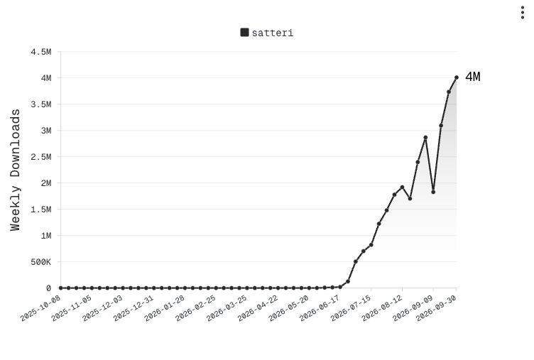

<h1 class="!text-5xl !font-700 leading-tight">
  Astro と Rust で考える<br />フロントエンドツールチェーンの今
</h1>

<div class="text-2xl text-black mt-10">Vue Fes 2026</div>

<div class="text-2xl text-black mt-3">kenji(jp-knj)</div>

<!--
予定時刻：00:00 から 00:09（9 秒）
発話 53 文字。時間は予定であり、実測ではない。
進行：クリックなし。発話後に次へ進む。

### 発話

今日は Astro Compiler を題材に、動いていたツールチェーンを、なぜ書き直すのか、という話をします。
-->

---
class: flex items-center justify-center h-full
---

<div class="grid grid-cols-2 gap-10">
  <div>
    <div class="flex items-center gap-4">
      
      <div class="flex flex-col justify-center gap-0">
        <p class="text-2xl !my-0">ケンジ</p>
        <p class="text-xl !my-0">GitHub: <a href="https://github.com/jp-knj">jp-knj</a></p>
      </div>
    </div>
  </div>
  <div>
    <ul class="text-xl">
      <li>Astro Maintainer</li>
      <li>Astro Japan Community</li>
    </ul>
  </div>
</div>

<!--
予定時刻：00:09 から 00:24（15 秒）
発話 86 文字。時間は予定であり、実測ではない。
進行：クリックなし。発話後に次へ進む。

### 発話

皆さん、はじめまして。ケンジと申します。
Astro のメンテナとして開発に参加していて、Astro Japan Community の運営もしています。
今日はよろしくお願いします。

### 確認メモ（発表では話さない）

自己紹介は本人が共有した内容に限定する。

### 出典と確認資料（発表では話さない）

- [jp-knj](https://github.com/jp-knj)
-->

---
layout: default
class: community-story
---

## Vue Fes 2025 から Astro Japan Community へ

<ol class="community-thread" data-community-step="thread">
  <li class="thread-post thread-continues">
    <span class="thread-avatar avatar-pilcrow" aria-hidden="true"></span>
    <div>
      <p class="thread-meta"><a href="https://x.com/pilcrowonpaper" target="_blank" rel="noreferrer"><b>pilcrow</b> @pilcrowonpaper</a></p>
      <p class="thread-text">Why isn’t anyone from @astrodotbuild here at @vuefes :(</p>
    </div>
  </li>
  <li class="thread-post thread-continues">
    <span class="thread-avatar avatar-astro" aria-hidden="true"></span>
    <div>
      <p class="thread-meta"><a href="https://x.com/astrodotbuild" target="_blank" rel="noreferrer"><b>Astro</b> @astrodotbuild</a></p>
      <p class="thread-text">@jp_knj was there!</p>
    </div>
  </li>
  <li class="thread-post thread-continues">
    <span class="thread-avatar avatar-pilcrow" aria-hidden="true"></span>
    <div>
      <p class="thread-meta"><a href="https://x.com/pilcrowonpaper" target="_blank" rel="noreferrer"><b>pilcrow</b> @pilcrowonpaper</a></p>
      <p class="thread-text">We need more people!</p>
    </div>
  </li>
  <li class="thread-post">
    <span class="thread-avatar avatar-astro" aria-hidden="true"></span>
    <div>
      <p class="thread-meta"><a href="https://x.com/astrodotbuild" target="_blank" rel="noreferrer"><b>Astro</b> @astrodotbuild</a></p>
      <p class="thread-text">Who is organizing Astro meetups in Japan?</p>
    </div>
  </li>
</ol>

<!--
予定時刻：00:24 から 00:48（24 秒）
発話 167 文字。時間は予定であり、実測ではない。
進行：クリックなし。発話後に次へ進む。

### 発話

実は、Astro Japan Community を立ち上げたきっかけが、去年の Vue Fes だったんですね。
Lucia を開発した pilcrow が、Vue Fes に Astro の人はいないのか、と投稿したんです。Astro の認証まわりにも貢献した人です。そこから、コアメンバーも交えて、日本の Meetup は誰がやるんだろう、という話になりました。

### 確認メモ（発表では話さない）

学生という紹介は、発表者が今回の練習で共有した内容に基づく。Lucia は認証ライブラリとしての活動を紹介する。Astro との関係は、本人が公開した Astro DB adapter などで確認できる。
画面の投稿は原文の引用。投稿の日時と出典と画像の撮影方法は images/community/README.md を参照する。

### 出典と確認資料（発表では話さない）

- [2025-10-25 16:12](https://x.com/pilcrowonpaper/status/1981982063650812385)
- [2025-10-26 04:02](https://x.com/astrodotbuild/status/1982160958450520242)
- [2025-10-26 10:32](https://x.com/pilcrowonpaper/status/1982259070112292924)
- [2025-10-27 01:25](https://x.com/astrodotbuild/status/1982483654858441181)
- [pilcrow の GitHub](https://github.com/pilcrowonpaper)
- [Lucia と Astro DB を組み合わせる実装](https://github.com/pilcrowonpaper/lucia-adapter-astrodb)
- [Lucia の Astro での利用例](https://v2.lucia-auth.com/getting-started/astro/)
-->

---
layout: default
class: community-story
---

## Vue Fes 2025 から Astro Japan Community へ

<div class="community-state" data-community-step="meetup">
  <a class="community-post" href="https://x.com/PLAID_Tech/status/1991667457032089615" target="_blank" rel="noreferrer" aria-label="PLAID の開催告知を開く">
    
  </a>
  <p class="community-caption">コミュニティを設立し、PLAID で Meetup を開催</p>
  <a class="community-source" href="https://x.com/PLAID_Tech/status/1991667457032089615" target="_blank" rel="noreferrer">PLAID の開催告知を見る</a>
</div>

<!--
予定時刻：00:48 から 01:04（16 秒）
発話 95 文字。時間は予定であり、実測ではない。
進行：クリックなし。発話後に次へ進む。

### 発話

そこで僕が手を挙げて、コミュニティを立ち上げ、Meetup も開催しました。そのきっかけになった Vue Fes に、今年は登壇者として参加しています。Astro のコアメンバーも登壇してくれました。

### 確認メモ（発表では話さない）

投稿の日時と出典と画像の撮影方法は images/community/README.md を参照する。

### 出典と確認資料（発表では話さない）

- [PLAID の開催告知](https://x.com/PLAID_Tech/status/1991667457032089615)
-->

---
layout: statement
class: flex flex-col justify-center h-full intro-question
---

# Go で動いていたものを、<br />なぜ、Rust に書き直すのか？

<a class="intro-question-video" href="https://www.youtube.com/live/wZ3OZh9IP54?t=7644" target="_blank" rel="noreferrer" aria-label="Vue Amsterdam での Matt Kane の発表動画を開く">
  <figure class="intro-question-screenshot">
    
    <figcaption>Vue Amsterdam の発表動画</figcaption>
  </figure>
</a>

<!--
予定時刻：01:04 から 01:16（12 秒）
発話 86 文字。時間は予定であり、実測ではない。
進行：クリックなし。発話後に次へ進む。

### 発話

Matt は Vue Amsterdam で、Astro Compiler を Rust で書き直した話をしていました。
今日は、なぜ Go から Rust へ書き直すのか、その背景を掘り下げます。

### 画像の出典（発表では話さない）

ユーザーが提供した Vue Amsterdam のスクリーンショットを編集し、右下の登壇者と演台を削除した。元画像と編集時の指示文は images/talks に保存している。
発表動画は [Astro の公式記事](https://astro.build/blog/whats-new-march-2026/#astro-team-news) で確認。画像のリンクは [Matt Kane の登壇開始位置](https://www.youtube.com/live/wZ3OZh9IP54?t=7644) を指定する。
-->

---
layout: default
class: body-center
---

## 話すこと

<div class="grid grid-cols-1 gap-4 mt-10">
  <div>
    <div class="text-3xl font-600 mt-1" style="color: var(--astro-heading)">1. 当時の判断</div>
    <div class="text-lg mt-2">なぜ最初に Go を選んだのか</div>
  </div>
  <div>
    <div class="text-3xl font-600 mt-1" style="color: var(--astro-heading)">2. 発見した問題</div>
    <div class="text-lg mt-2">使い続けるなかで何が見えたのか</div>
  </div>
  <div>
    <div class="text-3xl font-600 mt-1" style="color: var(--astro-heading)">3. 前提の変化</div>
    <div class="text-lg mt-2">2026年までに周囲はどう変わったのか</div>
  </div>
  <div>
    <div class="text-3xl font-600 mt-1" style="color: var(--astro-heading)">4. 新しい判断</div>
    <div class="text-lg mt-2">その結果、責務をどう分け直したのか</div>
  </div>
</div>

<!--
予定時刻：01:16 から 01:30（14 秒）
発話 97 文字。時間は予定であり、実測ではない。
進行：クリックなし。発話後に次へ進む。

### 発話

当時、なぜ Go を選んだのか。使い続けて、どんな問題が分かったのか。その間に、利用できる技術はどう変わったのか。最後に、どんな判断で書き直すのか。この四つを、ビルドと編集支援の両面から確認します。
-->

---
layout: section
---

# 1. 当時の判断
## なぜ最初に Go を選んだのか

<!--
予定時刻：01:30 から 01:35（5 秒）
発話 22 文字。時間は予定であり、実測ではない。
進行：クリックなし。発話後に次へ進む。

### 発話

まず、Astro が Go を選んだときの話です。
-->

---
layout: center
---

<Overview
  visible="source,compiler,build,browser"
  :labels="{ compiler: 'Svelte Compiler', build: 'Snowpack' }"
  :icons="{ compiler: 'svelte', build: 'snowpack' }"
/>

<div class="text-center text-xl mt-2">Astro 0.x の出発点</div>

<Ref href="https://www.youtube.com/watch?v=bmWQqAKLgT4&amp;t=460s">VITE: The Documentary（Snowpack の話は 7:40 から）</Ref>

<!--
予定時刻：01:35 から 01:56（21 秒）
発話 164 文字。時間は予定であり、実測ではない。
進行：クリックなし。発話後に次へ進む。

### 発話

Go を選んだ当時と、Rust を選ぶ今では、必要な機能と利用できる技術が違います。その変化を知るために、初期の Astro から振り返ります。
当時は Svelte Compiler の fork でコードをパースし、Snowpack がビルドと配信を担当していました。
下のドキュメンタリーでは、Snowpack と Vite の関係も紹介されています。

### 確認メモ（発表では話さない）

Svelte の fork は Compiler の実装。Snowpack はビルドを担当する。
配信は開発サーバーからブラウザへのファイル配信を指す。Snowpack の開発中の動作を説明し、本番環境でのサイト公開やホスティングとは区別する。
CultRepo の VITE: The Documentary は確認資料。動画の概要欄で、7 分 40 秒から Snowpack との比較、20 分 21 秒から Astro の Vite 採用を扱うことを確認した。このページの下端に、7 分 40 秒から再生するリンクを表示する。Vite の採用経緯は 10 ページのトークスクリプトで話す。

### 話す場合の補足（任意）

Astro のビルド基盤は、Snowpack から Vite へ移行しました。Vite の改善や Rollup のプラグインを、Astro でも利用できるようになるからです。

### 補足の確認事項（発表では話さない）

Snowpack と Vite は、図の Build の役割を担う基盤。Astro 0.21 では、ビルド基盤を Snowpack から Vite へ移行した。同時期に行った、Svelte Compiler の fork から Go Compiler への移行とは担当が異なる。
Vite の採用理由として、当時の記事は保守と資料の充実、性能、エラーメッセージ、コミュニティと Rollup のプラグインを挙げている。改善を複数のフレームワークで共有できることも説明している。
この補足は、利用できる基盤を選び直すという講演の主題につながる。本編の時間に合わせて省略できる。任意の補足は発話文字数に含めていない。

### 出典と確認資料（発表では話さない）

- [Snowpack から Vite への移行の説明](https://astro.build/blog/astro-021-preview/)
- [VITE: The Documentary（CultRepo）](https://www.youtube.com/watch?v=bmWQqAKLgT4)
- [Astro が Vite を採用した経緯（20 分 21 秒から）](https://www.youtube.com/watch?v=bmWQqAKLgT4&t=1221s)
- [Astro 初期の Compiler とビルド基盤](https://astro.build/blog/astro-021-release/)
- [Snowpack の開発サーバー](https://www.snowpack.dev/concepts/dev-server)
- [Snowpack のファイル単位の更新](https://www.snowpack.dev/concepts/how-snowpack-works)
-->

---
layout: default
class: body-center
---

## 2021年は、Rust 一色ではなかった

<div class="mt-12 relative">

  <!-- 軸。ドットの中心（上から 50px）に合わせて引く -->
  <div class="absolute left-0 right-0 top-[50px] h-[2px] bg-[#D9D3E2]"></div>

  <div class="relative flex items-start">
    <div class="flex-1 min-w-0 flex flex-col items-center">
      <div class="text-3xl text-black h-11 leading-none">Feb</div>
      <div class="w-3.5 h-3.5 rounded-full bg-[#9A90AB]"></div>
      <logos-vitejs class="text-6xl mt-8" />
      <div class="text-xl mt-5 leading-snug">Vite 2.0</div>
      
    </div>
    <div class="flex-1 min-w-0 flex flex-col items-center">
      <div class="text-3xl text-black h-11 leading-none">Sep</div>
      <div class="w-3.5 h-3.5 rounded-full bg-[#9A90AB]"></div>
      <logos-rome-icon class="text-6xl mt-8" />
      <div class="text-xl mt-5 leading-snug">Rome</div>
      
    </div>
    <div class="flex-1 min-w-0 flex flex-col items-center">
      <div class="text-3xl text-black h-11 leading-none">Oct</div>
      <div class="w-3.5 h-3.5 rounded-full bg-[#9A90AB]"></div>
      <logos-parcel-icon class="text-6xl mt-8" />
      <div class="text-xl mt-5 leading-snug">Parcel 2</div>
      
    </div>
    <div class="flex-1 min-w-0 flex flex-col items-center">
      <div class="text-3xl text-black h-11 leading-none">Oct</div>
      <div class="w-3.5 h-3.5 rounded-full bg-[#9A90AB]"></div>
      <logos-nextjs-icon class="text-6xl mt-8" />
      <div class="text-xl mt-5 leading-snug">Next.js 12</div>
      
    </div>
    <div class="flex-1 min-w-0 flex flex-col items-center">
      <div class="text-3xl text-primary font-700 h-11 leading-none">Nov</div>
      <div class="w-5 h-5 rounded-full bg-[#BC52EE] -mt-[3px]"></div>
      <logos-astro-icon class="text-6xl mt-8" />
      <div class="text-xl mt-5 leading-snug text-primary font-600">Astro 0.21</div>
      
    </div>
    <div class="flex-1 min-w-0 flex flex-col items-center">
      <div class="text-3xl text-black h-11 leading-none">Dec</div>
      <div class="w-3.5 h-3.5 rounded-full bg-[#9A90AB]"></div>
      <logos-turborepo-icon class="text-6xl mt-8" />
      <div class="text-xl mt-5 leading-snug">Turborepo</div>
      
    </div>
  </div>
</div>

<!--
予定時刻：01:56 から 02:10（14 秒）
発話 79 文字。時間は予定であり、実測ではない。
進行：クリックなし。発話後に次へ進む。

### 発話

2021 年は Rust の採用が増えた年ですが、Go の選択肢もありました。Vite が利用した esbuild と、当時の Turborepo は Go で実装されていました。

### 確認メモ（発表では話さない）

Vite 自体を Go で実装したという説明ではない。製品の採用時期は既存の参照資料に基づく。
-->

---
layout: default
class: go-era-slide go-era-build
---

<div class="go-era-heading">
  <h2>Astro v1</h2>
  <span class="go-era-year">2022年</span>
</div>

<div class="go-era-body">
  <div class="go-era-summary">Build のための Compiler だった</div>

  <Overview
    visible="source,compiler,build,browser"
    era="go"
    :subnotes="{ build: 'Rollup\nesbuild' }"
  />

  <div class="go-era-reason">
    <div class="text-2xl font-600 text-primary">深く考えすぎずに選んだ</div>
    <div class="text-xl mt-2">esbuild が Go だった。Go は学びやすかった。</div>
  </div>
</div>

<Ref>
  <a class="block w-fit" href="https://natemoo.re/posts/hello-from-the-other-side/" target="_blank" rel="noreferrer">Nate Moore: Hello from the other side</a>
  <a class="block w-fit mt-1" href="https://www.youtube.com/watch?v=bmWQqAKLgT4&amp;t=1221s" target="_blank" rel="noreferrer">VITE: The Documentary（Astro の Vite 採用は 20:21 から）</a>
</Ref>

<!--
予定時刻：02:10 から 03:00（50 秒）
発話 282 文字。時間は予定であり、実測ではない。
進行：クリックなし。発話後に次へ進む。

### 発話

Astro は Go Compiler と Vite に移行しました。Vite の改善や Rollup のプラグインを利用できることも、理由の一つでした。当時の話は下のリンクから確認できます。
Nate Moore が挙げた Go の選定理由は、esbuild が Go だったことと、学びやすかったことです。本人も、深くは考えなかったと書いています。
実装では HTML5 Parser を fork し、CSS には esbuild の Parser を取り込んでいました。参考になる土台があったんですね。一方、JavaScript の式を完全にパースする仕組みは持っていません。ここが後の AST の問題につながります。

### 確認メモ（発表では話さない）

Go の経験者だったという理由へ変更しない。Compiler 内の esbuild は CSS の解析と生成、Vite の部分の esbuild は TypeScript の変換を担当する。HTML5 Parser 由来の実装を Astro Syntax に対応させた。原文は "esbuild was written in Go and it was easy to learn. We didn't overthink it." で、深い技術的判断として語らない。`internal/parser.go` と `internal/token.go` は `golang.org/x/net/html` の fork（Copyright The Go Authors）。JavaScript は `tdewolff/parse` による走査（`internal/js_scanner`）だけで、完全な JS Parser はない。

### 出典と確認資料（発表では話さない）

- [esbuild の CSS Parser の導入](https://github.com/withastro/compiler/pull/329)
- [Astro v1 の Vite plugin](https://github.com/withastro/astro/blob/astro%401.0.0/packages/astro/src/vite-plugin-astro/index.ts)
- [Go Compiler と Vite を採用した Astro v0.21](https://astro.build/blog/astro-021-release/)
- [Nate Moore: Hello from the other side](https://natemoo.re/posts/hello-from-the-other-side/)
-->

---
layout: section
---

# 2. 発見した問題
## 使い続けるなかで何が見えたのか

<!--
予定時刻：03:00 から 03:06（6 秒）
発話 43 文字。時間は予定であり、実測ではない。
進行：クリックなし。発話後に次へ進む。

### 発話

では、その Go Compiler を使い続けて、何が分かったのか。ここからは、その話です。
-->

---
layout: default
class: syntax-overview body-center
clicks: 6
---

## Astro Syntax

````md magic-move
```astro
---
const products = await getProducts();
---
```
```astro
---
const products = await getProducts();
---

<ul>
  <!-- template -->
</ul>
```
```astro
---
const products = await getProducts();
---

<ul>
  {products.map((product) => (
    <li>{product.name}: {product.price}</li>
  ))}
</ul>
```
```astro {3,7}
---
const products = await getProducts();
const props = { title: "second" };
---
<ul>
  {products.map((product) => (
    <li title="first" {...props}>{product.name}</li>
  ))}
</ul>
```
````

<div class="mt-0 text-center text-2xl">
  <div v-if="$clicks === 0"><span class="text-primary font-600">Component script</span><br /><code>---</code> で囲む。ビルド時とサーバーで実行する JavaScript と TypeScript</div>
  <div v-if="$clicks === 1"><span class="text-primary font-600">Template</span><br />HTML を基礎に、JavaScript expression や<br />コンポーネントを書ける</div>
  <div v-if="$clicks === 2"><span class="text-primary font-600">JavaScript expression（式）</span><br />波かっこの中の JavaScript expression を評価し、結果を表示する。<br />Astro の書き方って、JSX っぽいですよね。</div>
  <div v-if="$clicks === 3"><span class="text-primary font-600">Q. </span>この <code>title</code> は、どちらの値になる？</div>
  <div v-if="$clicks === 3" class="mt-4"><code>first</code> か、<code>second</code> か</div>
  <div v-if="$clicks === 4"><span class="text-primary font-600">A. </span><code>first</code></div>
  <Overlay v-if="$clicks >= 5" aria-label="Astro Syntax への問いと答え">
    <template #title>
      <span v-if="$clicks === 5">JSX なら second。なぜ first になった？</span>
      <span v-else>HTML の規則で扱ったため</span>
    </template>
    <p v-if="$clicks >= 6">
      この報告では、Astro が同じ属性を二つ出力した。<br />
      ブラウザは HTML の規則で先の <code>title="first"</code> を採用した。
    </p>
    <template v-if="$clicks >= 6" #reference>
      <a href="https://html.spec.whatwg.org/multipage/parsing.html#attribute-name-state" target="_blank" rel="noopener noreferrer">HTML Standard：同じ名前の属性は後のものを取り除く</a>
    </template>
  </Overlay>
</div>

<Ref v-if="$clicks < 3" href="https://docs.astro.build/en/reference/astro-syntax/">Astro Syntax</Ref>
<Ref v-if="$clicks === 4" href="https://github.com/withastro/astro/issues/5558#issuecomment-1343799494">astro#5558 の説明</Ref>

<!--
予定時刻：03:06 から 04:36（90 秒）
発話 464 文字。時間は予定であり、実測ではない。
進行：6 回のクリックを発話に合わせる。

### 発話

[初期表示]
まず Astro の書き方です。三本線で囲まれた部分が Component script です。JavaScript と TypeScript を書けて、ビルド時やサーバーで実行します。この例では商品データを取得しています。
[クリック 1]
その下が Template です。HTML を基礎に、表示する内容を書きます。
[クリック 2]
波かっこの中で式を評価します。ここでは商品の配列を map で扱い、名前と価格を表示しています。Astro の書き方って、JSX っぽいですよね。
[クリック 3]
li の title に first を指定して、その後に title が second の props を展開します。JSX のつもりなら second ですよね。Astro では、first だと思う人。second だと思う人。
[クリック 4]
2022 年の報告では、first になりました。
[クリック 5]
なぜ、後の指定が優先されなかったんでしょうか。
[クリック 6]
当時の Astro は、title 属性を二つ含む HTML を生成していました。ブラウザは重複した属性の先のものを採用します。Astro が生成した HTML と、ブラウザの規則を順に確認すると、first になった理由が分かります。

### 確認メモ（発表では話さない）

2022 年の報告を説明する。現在の Astro の挙動ではない。報告の class 属性を title に簡略化した例。HTML の重複属性と、JSX で後の指定を優先する props の合成を区別する。JavaScript expression は日本語では式。発話では初出で説明し、以後は JavaScript expression に統一する。Astro AST の expression node は波かっこを含む領域を指すため、その中の JavaScript expression と区別する。

### 出典と確認資料（発表では話さない）

- [astro#5558 の説明](https://github.com/withastro/astro/issues/5558#issuecomment-1343799494)
- [Astro Syntax](https://docs.astro.build/en/reference/astro-syntax/)
- [HTML Standard の attribute name state](https://html.spec.whatwg.org/multipage/parsing.html#attribute-name-state)
-->

---
layout: default
class: body-center
clicks: 2
---

## Astro Syntax

```astro
<span>Astro</span>
<span>1200</span>
```

<!-- クイズと答えの表示領域を固定し、空白の説明は Overlay で表示する -->
<div class="mt-4 h-[96px] flex flex-col items-center justify-center text-center text-2xl">
  <div v-if="$clicks === 0"><span class="text-primary font-600">Q. </span>このコードは、どちらの表示になる？</div>
  <div v-if="$clicks === 0" class="mt-4"><code>Astro1200</code> か、<code>Astro 1200</code> か</div>
  <div v-if="$clicks === 1"><span class="text-primary font-600">A. </span><code>Astro 1200</code></div>
  <Overlay v-if="$clicks >= 2" aria-label="Astro Syntax の空白の扱い">
    <template #title>
      ブラウザが空白にする
    </template>
    <p>
      この報告では、Astro が要素間の改行を HTML に保持した。<br />
      ブラウザがその改行を空白として表示し、<code>Astro 1200</code> になった。
    </p>
    <template #reference>
      <a href="https://github.com/withastro/astro/issues/6011" target="_blank" rel="noopener noreferrer">astro#6011: 要素間の空白テキスト node</a>
      <a href="https://blog.dwac.dev/posts/html-whitespace/" target="_blank" rel="noopener noreferrer" class="ml-8">HTML Whitespace is Broken</a>
    </template>
  </Overlay>
</div>

<!--
予定時刻：04:36 から 05:08（32 秒）
発話 131 文字。時間は予定であり、実測ではない。
進行：2 回のクリックを発話に合わせる。

### 発話

[初期表示]
二つの span を改行して並べます。JSX なら Astro1200 と続けて表示されますよね。
[クリック 1]
2023 年の報告では、空白が入りました。
[クリック 2]
Astro が改行を HTML に保持し、ブラウザが空白として表示していました。ここでも、生成する HTML とブラウザの表示を分けて考えます。

### 確認メモ（発表では話さない）

2023 年の報告。既定の CSS の空白規則を前提とする。この空白の話は HTML correction と別の論点。関連ページで Astro v7 の設定の変更へ戻る。

### 出典と確認資料（発表では話さない）

- [astro#6011: 要素間の空白テキスト node](https://github.com/withastro/astro/issues/6011)
- [参照資料 2](https://blog.dwac.dev/posts/html-whitespace/)
-->

---
layout: default
class: table-comparison body-center code-example-compact
clicks: 4
---

## Astro Syntax

<div>

<div class="flex gap-8 w-full">
  <div class="min-w-0 code-split" :class="$clicks >= 1 ? 'w-[calc(50%-1rem)]' : 'w-full'">
    <div class="text-primary font-600 text-xl mb-1 flex items-center gap-2"><logos-astro-icon class="w-5 h-5 shrink-0" aria-hidden="true" />.astro</div>

```astro
<table>
  <tr><td>{'foo'}</td></tr>
</table>
<h2>Chats</h2>
```

  </div>
  <Transition name="reveal-right">
  <div class="min-w-0 w-[calc(50%-1rem)]" v-if="$clicks >= 1">
    <div class="text-primary font-600 text-xl mb-1 flex items-center gap-2"><logos-html-5 class="w-5 h-5" />生成された HTML</div>

```html
<table>
  <tr><td>foo</td></tr>
  <h2>Chats</h2>
</table>
```

  </div>
  </Transition>
</div>

<Overlay v-if="$clicks >= 2" aria-label="Astro Syntax への問いと答え">
  <template #title>
    <span v-if="$clicks === 2">table の外に書いた h2 が、なぜ中に入った？</span>
    <span v-else-if="$clicks === 3">Compiler が担っていた HTML correction</span>
    <span v-else>HTML Standard の <code>sarcasm</code> 終了タグ</span>
  </template>
  <p v-if="$clicks === 3">
    HTML の規則に従い、省略されたタグを補完し、入れ子を補正する。<br />
    Go Compiler は HTML5 Parser を拡張し、ビルド時にも補正を行っていた。
  </p>
  <p v-if="$clicks === 3">
    今回の <code>h2</code> の移動は、expression を扱う部分の不具合。<br />
    HTML の規則による補正とは区別する。
  </p>
  
  <template v-if="$clicks === 3" #reference>
    <a href="https://html.spec.whatwg.org/multipage/parsing.html#tree-construction" target="_blank" rel="noopener noreferrer">HTML Standard のパース規則</a>
    <a href="https://github.com/withastro/compiler/issues/870" target="_blank" rel="noopener noreferrer" class="ml-8">compiler#870 の不具合報告</a>
  </template>
  <template v-else-if="$clicks === 4" #reference>
    <a href="https://html.spec.whatwg.org/multipage/parsing.html#parsing-main-inbody" target="_blank" rel="noopener noreferrer">HTML Standard の原文</a>
  </template>
</Overlay>

</div>

<Ref href="https://github.com/withastro/compiler/issues/870">compiler#870</Ref>

<!--
予定時刻：05:08 から 05:44（36 秒）
発話 289 文字。時間は予定であり、実測ではない。
進行：4 回のクリックを発話に合わせる。

### 発話

[初期表示]
次は表の中に expression を含む例です。
[クリック 1]
表の後に書いた h2 が、生成結果では表の中に入っています。
[クリック 2]
table の外に書いた h2 が、なぜ中に入ったんでしょうか。
[クリック 3]
HTML correction は、HTML の規則に従ってタグの補完や入れ子の補正をすることです。Go Compiler は HTML5 Parser を拡張していて、ビルド時にもこの補正を担っていました。ただ、この h2 の移動は規則どおりの補正ではなく、expression の後にタグの親子関係を間違えた不具合です。
[クリック 4]
ここで仕様書の小話です。皮肉を意味する sarcasm の終了タグには、Take a deep breath と書かれています。

### 確認メモ（発表では話さない）

compiler#870 と修正 PR #925。この例で h2 が table に入った直接の理由は、波かっこの領域の終了時にパースの状態を戻せなかった不具合。修正は resetInsertionMode() でパースの状態を選び直すもの。Compiler が生成した誤った HTML と、Browser がそれを補正して作る DOM は区別する。このスライドは前者を示す。

HTML Standard の Take a deep breath は、sarcasm という名前の終了タグについての一文。sarcasm は皮肉という意味で、文面はジョークとして理解できる。その後は他の終了タグと同じ規則に従う。表の不具合の原因を説明する文ではない。原文の画像と出典は images/html-spec/README.md を参照する。

### 出典と確認資料（発表では話さない）

- [JavaScript expression を含む表のパースを修正した PR #925](https://github.com/withastro/compiler/pull/925)
- [compiler#870](https://github.com/withastro/compiler/issues/870)
- [HTML Standard：Tree construction](https://html.spec.whatwg.org/multipage/parsing.html#tree-construction)
- [HTML Standard：The "in body" insertion mode](https://html.spec.whatwg.org/multipage/parsing.html#parsing-main-inbody)
-->

---
layout: default
class: ch2-detail
---

## Astro Syntax を振り返る

<div class="ch2-reflection">
  <div>
    <h3>HTML らしさ</h3>
    <ul><li>HTML に似た構文と、利用者が期待する挙動</li></ul>
  </div>
  <div>
    <h3>空白の扱い</h3>
    <ul><li>Browser で空白になる改行を、Astro Syntax の規則で扱えないか</li></ul>
  </div>
  <div>
    <h3>HTML5 Parser のふるまい</h3>
    <ul><li>タグの補完や入れ子の補正まで、Astro で採用する必要があるか</li></ul>
  </div>
</div>
<div class="ch2-next-question">HTML5 Parser は必要なのか？</div>

<!--
予定時刻：05:44 から 05:57（13 秒）
発話 85 文字。時間は予定であり、実測ではない。
進行：クリックなし。発話後に次へ進む。

### 発話

ここには、属性の規則、空白の規則、Parser の不具合という別の論点があります。HTML に似た構文で、ブラウザと同じタグの補正まで Compiler が担うかを考え直します。

### 確認メモ（発表では話さない）

HTML correction の有無は実装言語とは独立した設計判断。Rust ならこれらが自動的に解消されるとは説明しない。
-->

---
layout: default
class: go-era-slide go-era-tools
---

<div class="go-era-heading">
  <h2>Astro v2〜v5</h2>
  <span class="go-era-year">2023〜2025年</span>
</div>

<div class="go-era-summary">ビルドに加え、書いている間のサポートも必要になる</div>

<Overview
  highlight="source,compiler,editor"
  era="go"
  :subnotes="{ editor: 'Linter と LSP と Formatter' }"
/>

<!--
予定時刻：05:57 から 06:32（35 秒）
発話 227 文字。時間は予定であり、実測ではない。
進行：クリックなし。発話後に次へ進む。

### 発話

次は、同じ Compiler を編集ツールが使う場面です。Astro で開発するときには、ビルドに加えて、コードを書いている間のサポートも必要になります。
コードを検査したり、整形したり、補完候補を表示したりするために、Linter と Formatter と Language Server も Go Compiler を利用していました。
実行できるコードを作ることと、書いている途中のコードをサポートすることでは、必要な情報が違うんですね。まずは Linter の例で確認します。
-->

---
layout: default
class: ch2-detail
---

## Go Compiler の AST だけで検査できるのか

<div class="ch2-cols">
<div>
<div class="ch2-label">Go Compiler が返す Astro AST</div>

```js
{
  type: "expression",
  children: [{
    type: "text",
    value: "price * amount"
  }]
}
```

<div class="ch2-note"><code>TextNode.value</code> は文字列</div>
</div>
<div>
<div class="ch2-label flex items-center gap-2"><logos-astro-icon class="w-5 h-5 shrink-0" aria-hidden="true" />.astro の構文は Espree へ直接渡せない</div>

```astro
---
const price = 10;
const amount = 3;
---

<p>{price * amount}</p>
```

</div>
</div>
<div class="ch2-summary">JavaScript expression の識別子と演算子が必要</div>

<!--
予定時刻：06:32 から 07:04（32 秒）
発話 212 文字。時間は予定であり、実測ではない。
進行：クリックなし。発話後に次へ進む。

### 発話

まず Linter です。検査には、JavaScript の識別子や演算子をたどれる AST が必要です。ESTree は、その AST の形式を定める仕様です。
ところが、左の Go Compiler の結果では、price と amount の掛け算が TextNode の文字列になっています。これだけでは、変数名と演算子を node としてたどれません。
Astro のタグは分かっても、その中の JavaScript の式は別にパースする必要があったんですね。

### 確認メモ（発表では話さない）

ESTree は JavaScript の AST の形式を定める仕様。JavaScript 言語の仕様である ECMAScript と区別する。Go Compiler の Astro AST 全体が文字列という意味ではない。この JavaScript expression が TextNode.value の文字列であり、JavaScript の node を提供しない点を説明する。実装言語が Go であることの制約とは説明しない。
Compiler 2.12.2 の parse(source, { position: true }) の抜粋。Astro AST の expression node は子に Markup の node を含められるため、JavaScript expression 全体が常に一つの文字列という意味ではない。入力の行と末尾の LF は元の検証例に基づく。

### 出典と確認資料（発表では話さない）

- [Compiler 2.12.2 と AST](https://github.com/withastro/compiler/blob/ab9b285a34c482544da359f0ca91d0b0c25cdee4/README.md#parse-astro-and-return-an-ast)
- [ESTree の AST の定義](https://github.com/estree/estree/blob/master/es5.md)
-->

---
layout: default
class: ch2-detail ch2-expression-static
---

## 変数名と演算子をどう取得するのか

<div class="ch2-cols">
<div>
<div class="ch2-label flex items-center gap-2"><logos-javascript class="w-5 h-5 shrink-0" aria-hidden="true" />JavaScript と JSX</div>

```jsx
const price = 10;
const amount = 3;
<>
  <p>{price * amount}</p>
</>;
```

<div class="ch2-note">元の <code>.astro</code> を<br />JavaScript と JSX に変換する</div>
</div>
<div>
<div class="ch2-label">JavaScript expression の AST</div>

```text
BinaryExpression
├─ operator: "*"
├─ left: Identifier
│  └─ name: "price"
└─ right: Identifier
   └─ name: "amount"
```

<div class="ch2-note"><strong>BinaryExpression</strong> は二項演算<br /><strong>Identifier</strong> は識別子</div>
</div>
</div>
<div class="ch2-summary">Espree でパースし、変数名と演算子を AST の項目として取得する</div>

<!--
予定時刻：07:04 から 07:35（31 秒）
発話 201 文字。時間は予定であり、実測ではない。
進行：クリックなし。発話後に次へ進む。

### 発話

そこで、元の Astro を JavaScript と JSX に変換して、JavaScript Parser に渡します。右の結果では、price と amount が Identifier、掛け算が BinaryExpression になっています。
演算子も項目として取得できるので、ここから検査できます。ただ、検査したコードは元の Astro と同じ文字列ではありません。診断をどこに表示するか、位置も対応させる必要があります。

### 確認メモ（発表では話さない）

Identifier という node の種類と、変数の型の情報は区別する。この例で参照先の宣言を調べるにはスコープ解析が必要。AST の種類を説明するときに Typed AST という名称は使わない。
画面の JavaScript と JSX は説明のために一部のセミコロンと空行を省いた抜粋。Language Tool の convertToTSX() とは生成元と目的が異なる。

### 出典と確認資料（発表では話さない）

- [astro-eslint-parser 1.2.2 と processTemplate](https://github.com/ota-meshi/astro-eslint-parser/blob/v1.2.2/src/parser/process-template.ts)
-->

---
layout: default
class: ch2-detail ch2-position-slide body-center
---

## 位置の対応と位置情報の不具合

<SourcePositionComparison />

<!--
予定時刻：07:35 から 08:02（27 秒）
発話 181 文字。時間は予定であり、実測ではない。
進行：クリックなし。発話後に次へ進む。

### 発話

位置についても、二つの仕事がありました。上段は、生成したコードの位置を、元の Astro の位置に対応させる話です。
下段は、Compiler が返す位置情報そのものの不具合です。これは Linter の Adapter で修正していました。
変換後のコードを扱う仕事と、Compiler の不具合への対応は別なんですね。Linter が検査を始める前にも、こうした手間がありました。

### 確認メモ（発表では話さない）

図の上段は変換前後の位置対応、下段は Compiler の位置計算の不具合を示す。不具合の例は expression.astro を Compiler 2.12.2 と astro-eslint-parser 1.2.2 に渡して再確認した。Compiler が返す Astro AST の expression node の範囲は [47, 80)、元の波かっこを含む範囲は [48, 64)。astro-eslint-parser が後者へ修正する。変換した JavaScript の AST の位置を元のコードへ対応させる工程と、この修正を区別する。
数値は発話しない。変換で位置が変わることと、Compiler 2.12.2 の Astro AST の expression node の範囲計算の不具合は別。例の price は変換後の全文で [46, 51)、元の全文で [49, 54)。一定の差をファイル全体に加える方式ではない。ASCII の例なので UTF-8 と UTF-16 の値が一致する。

### 出典と確認資料（発表では話さない）

- [Compiler 2.12.2 の位置情報の実装](https://github.com/withastro/compiler/blob/ab9b285a34c482544da359f0ca91d0b0c25cdee4/internal/printer/print-to-json.go#L134-L175)
- [astro-eslint-parser の位置対応](https://github.com/ota-meshi/astro-eslint-parser/blob/v1.2.2/src/context/restore.ts)
- [astro-eslint-parser 1.2.2 の解析と位置対応](https://github.com/ota-meshi/astro-eslint-parser/blob/v1.2.2/src/parser/index.ts)
- [位置情報を再確認するコード](/Users/kenji/Projects/slidev/validation/chapter2/verify.mjs)
-->

---
layout: default
class: ch2-detail ch2-tool-overview
---

## Formatter が .astro を整形するまで

<div class="ch2-tool-route">
<div class="ch2-route-step"><div class="ch2-route-node">.astro</div><div class="ch2-route-caption">整形したい元のコード</div></div>
<svg class="ch2-route-arrow" viewBox="0 0 24 18" aria-hidden="true"><path d="M12 0 V15 M7 10 L12 15 L17 10" /></svg>
<div class="ch2-route-step"><div class="ch2-route-node">JavaScript expression<br />のコード</div><div class="ch2-route-caption">JavaScript をパースするために取り出す</div></div>
<svg class="ch2-route-arrow" viewBox="0 0 24 18" aria-hidden="true"><path d="M12 0 V15 M7 10 L12 15 L17 10" /></svg>
<div class="ch2-route-step"><div class="ch2-route-node">JavaScript expression<br />の AST</div><div class="ch2-route-caption">JavaScript の Parser でパース<br />AST はコードを node で表すデータ</div></div>
<svg class="ch2-route-arrow" viewBox="0 0 24 18" aria-hidden="true"><path d="M12 0 V15 M7 10 L12 15 L17 10" /></svg>
<div class="ch2-route-step"><div class="ch2-route-node">Doc</div><div class="ch2-route-caption">文字と改行候補と字下げの指示</div></div>
<svg class="ch2-route-arrow" viewBox="0 0 24 18" aria-hidden="true"><path d="M12 0 V15 M7 10 L12 15 L17 10" /></svg>
<div class="ch2-route-step"><div class="ch2-route-node">整形後の .astro</div><div class="ch2-route-caption">Prettier が行幅に合わせて文字列を生成</div></div>
</div>

<!--
予定時刻：08:02 から 08:27（25 秒）
発話 166 文字。時間は予定であり、実測ではない。
進行：クリックなし。発話後に次へ進む。

### 発話

Formatter も JavaScript expression の AST が必要なので、プラグインがコードを取り出して Babel でもう一度パースします。
続いて Prettier は、AST から Doc という整形のための中間表現を作ります。Doc は、出力する文字と改行候補と字下げの指示を表します。この指示から、行幅に合わせてコードを整形します。

### 確認メモ（発表では話さない）

prettier-plugin-astro 0.14.1 と Prettier 3.6.2 の例。Babel が解析し、Prettier の Printer が Doc を作る。再解析と整形指示への変換は別の工程。

### 出典と確認資料（発表では話さない）

- [Prettier の Parser と Printer](https://prettier.io/docs/plugins)
- [Prettier の整形方式](https://prettier.io/docs/technical-details)
- [prettier-plugin-astro 0.14.1 と JavaScript expression の整形](https://github.com/withastro/prettier-plugin-astro/blob/v0.14.1/src/printer/embed.ts)
-->

---
layout: default
class: ch2-detail ch2-formatter-failure
clicks: 2
---

## コードの再生成で、整形が止まった

<FormatterFailureExample :step="$clicks" />

<!--
予定時刻：08:27 から 09:04（37 秒）
発話 231 文字。時間は予定であり、実測ではない。
進行：2 回のクリックを発話に合わせる。

### 発話

[初期表示]
Go Compiler の AST では、この expression の子に TextNode と p 要素と空の Fragment が混在します。TextNode.value はすでに文字列です。
[クリック 1]
プラグインはタグの node をコードの文字列に戻し、TextNode.value と連結して Babel に渡します。このとき、空の Fragment が不正なタグになってしまいました。
[クリック 2]
Babel が構文エラーを返し、整形が止まります。検査や整形の前に、文字列化の不具合にも対応する必要があったんですね。

### 確認メモ（発表では話さない）

prettier-plugin-astro の空の Fragment に関する報告を簡略化し、Compiler 2.12.2 と prettier-plugin-astro 0.14.1 と Prettier 3.6.2 で再現した。現在の実装の挙動を示すものではない。
入力は {true ? <p>OK</p> : <></>}。Compiler の transform() は成功し、parse() は空の fragment node を返す。条件演算子を含む JavaScript expression 全体は AST として返らない。
expression の子は TextNode.value の true ? 、p 要素の node、TextNode.value の : 、空の Fragment の node という順序。TextNode.value はすでに文字列で、serialize() はその値をそのまま使う。タグの node をコードの文字列に戻し、連結して expression 全体のコードにする。
プラグインの printRaw() は Astro AST の expression node の子を Compiler package の serialize() で文字列にする。serialize() の初期設定 selfClose は true で、子が空の fragment を < /> にする。文字列化の実装は Compiler package の JavaScript の補助機能である。Go Parser が Fragment を解析できなかったという説明はしない。
再生成された true ? <p>OK</p> : < /> を astroExpressionParser が JSX Fragment と波かっこで囲み、Babel に渡すと構文エラーになる。整形前の元の入力を Babel で解析できることも確認する。
以前の JSX で囲む理由は補足にする。オブジェクトリテラルを文と区別するために <>{式}</> の形式を使い、閉じ波かっこの前の改行で行コメントとの混同を避ける。

### 出典と確認資料（発表では話さない）

- [空の Fragment を含む JavaScript expression の整形エラー](https://github.com/withastro/prettier-plugin-astro/issues/444)
- [JavaScript expression を文字列にするプラグインの実装](https://github.com/withastro/prettier-plugin-astro/blob/v0.14.1/src/printer/embed.ts)
- [Compiler の serialize()](https://github.com/withastro/compiler/blob/ab9b285a34c482544da359f0ca91d0b0c25cdee4/packages/compiler/src/node/utils.ts)
- ローカルの再現: validation/chapter2/formatter-fragment.mjs。
-->

---
layout: default
class: ch2-detail ch2-formatter-requirements
---

## Formatter は Compiler に何を求めたのか

<FormatterResponsibilities />

<!--
予定時刻：09:04 から 09:31（27 秒）
発話 177 文字。時間は予定であり、実測ではない。
進行：クリックなし。発話後に次へ進む。

### 発話

Formatter が欲しかったのも、JavaScript の式をたどれる AST です。さらに Astro のタグとコメント、元のコードの正確な位置も必要でした。
この情報を Compiler から受け取れれば、AST を得るための再生成と再パースを減らせます。改行と字下げを決めるのは Formatter の担当です。パース結果を渡す仕事と、整形する仕事を分けたいんですね。

### 確認メモ（発表では話さない）

このページは第 2 章の要求を整理する。Rust Compiler が再パースをすべて廃止したという説明はしない。Astro の node を含む AST は、Prettier の AST とそのまま同じとは限らず、対応する Printer や変換が必要になる。
旧ページの group と softline と indent の詳説は本編では扱わない。group は改行を判断するまとまり、softline は 1 行なら空文字で改行時には改行、indent は字下げを表す。JavaScript expression を解析して AST を取得する工程と、AST から Doc を作る工程は区別する。
前の Fragment の例では、Astro AST に Fragment は保持されていた。必要なのは、タグの認識に加えて JavaScript expression 全体の AST を提供し、整形ツールが文字列の再生成と再解析を引き受ける範囲を減らすこと。

### 出典と確認資料（発表では話さない）

- [新 Compiler と Prettier plugin の検討](https://github.com/withastro/roadmap/discussions/1306)
- [Prettier の整形工程](https://prettier.io/docs/plugins#the-printing-process)
- [Doc の定義と命令](https://github.com/prettier/prettier/blob/main/commands.md)
-->

---
layout: default
class: ch2-detail ch2-language-overview
---

## Go Compiler と Language Tool の分担

<LanguageToolOverview />

<Ref><a href="https://code.visualstudio.com/api/language-extensions/language-server-extension-guide">LSP と Language Server</a> と <a href="https://volarjs.dev/core-concepts/embedded-languages/">Volar と位置対応</a> と <a href="https://github.com/withastro/language-tools/blob/b4bcb4fc02cd960936a5faee6c9cc0ad94fc4c05/packages/language-server/src/core/index.ts">従来の Astro の実装</a></Ref>

<!--
予定時刻：09:31 から 10:13（42 秒）
発話 247 文字。時間は予定であり、実測ではない。
進行：クリックなし。発話後に次へ進む。

### 発話

[初期表示]
これが従来の Language Tool の全体像です。左がエディタ、右が Astro Language Server です。LSP は、その間で補完や診断を受け渡す規約です。
Go Compiler は TSX と Source map を返します。Astro の言語対応は HTML も作り、TSX と位置の対応を Volar に登録します。
HTML Language Service が属性を補完し、TypeScript が TSX をパースして型を検査します。Volar が結果を元の Astro の位置へ対応させ、サーバーからエディタに返します。

### 出典と確認資料（発表では話さない）

- [Biome を使う実装とテスト](https://github.com/withastro/compiler-rs/pull/34/files)
-->

---
layout: default
class: ch2-detail ch2-tsx-evolution
---

## TSX 変換で抱えていた課題

<div class="tsx-challenges">
  <section>
    <h3>型の情報を正しく渡す</h3>
    <p><code>as: Tag</code> を取り違え、使っている <code>Props</code> が未使用と診断された。</p>
  </section>
  <section>
    <h3>診断を元の位置へ戻す</h3>
    <p>CRLF で Source map の位置がずれ、診断を正しい場所へ戻せなかった。</p>
  </section>
  <section>
    <h3>書きかけのコードも扱う</h3>
    <p>独自の Scanner で JavaScript の構文を判別していた。<br />構文への対応に加え、入力途中の扱いも保守する必要があった。</p>
  </section>
</div>

<Ref><a href="https://github.com/withastro/compiler/issues/927">Props の事例</a> と <a href="https://github.com/withastro/compiler/issues/714">CRLF の事例</a> と <a href="https://github.com/withastro/compiler-rs/pull/34">TSX 変換の見直し</a></Ref>

<!--
予定時刻：10:13 から 10:45（32 秒）
発話 209 文字。時間は予定であり、実測ではない。
進行：クリックなし。発話後に次へ進む。

### 発話

[初期表示]
Go Compiler の TSX 変換にも課題がありました。
as という prop を取り違え、使っている Props が未使用と診断される事例がありました。CRLF では、Source map が誤った位置を示しました。
JavaScript の構文は独自の Scanner で判別していたので、構文への対応や書きかけの入力を扱う負担もありました。
ビルドできるコードを作るだけでなく、型の情報と元の位置を保って、編集を支える必要があったんですね。

### 確認メモ（発表では話さない）

Props と CRLF は、従来の Go Compiler に報告された事例。現在も同じ不具合があるという説明はしない。
独自の Scanner による構文の判別は実装上の負担として扱う。すべての不完全なコードで TSX 生成が失敗したという説明はしない。

### 出典と確認資料（発表では話さない）

- [Props の不具合](https://github.com/withastro/compiler/issues/927)
- [CRLF の位置対応の不具合](https://github.com/withastro/compiler/issues/714)
- [TSX 変換の見直し](https://github.com/withastro/compiler-rs/pull/34)
-->

---
layout: default
class: ch2-detail
---

## Compiler の課題とツールの分担

<CompilerToolRequirements />

<!--
予定時刻：10:45 から 11:30（45 秒）
発話 326 文字。時間は予定であり、実測ではない。
進行：クリックなし。発話後に次へ進む。

### 発話

ここまで、Linter と Formatter と Language Tool が必要とする情報を見てきました。検査や整形を始める前に、パースし直したり、Compiler が返す位置情報を修正したりする必要があったんですね。

それなら、Compiler を直して、ツールの負担を減らした方がいいですよね。必要な AST と正確な位置情報を、最初から返してほしい。

ただ、その Compiler 自体も保守が難しくなっていました。コードを理解して修正できる人が少なく、不具合への対応も進みにくかったんです。

そこで、自分たちが実装する範囲を見直して、既存の基盤を利用する方針になります。では、Go Compiler を使い続けている間に、僕たちが使える基盤はどう変わっていたんでしょうか。

### 確認メモ（発表では話さない）

関連ページから 関連ページは、ツールが必要とする情報、Compiler の情報不足と不具合、利用するツールに必要な変換の順で振り返る。Virtual Code と位置対応と Doc の生成を、それ自体が Go Compiler の不具合であるとは説明しない。
未定義の参照の詳説は本編から省略し、補足にする。関連ページは再解析のためのコード生成の途中の不具合、関連ページは Compiler と Formatter の分担に改稿した。JSX で囲む理由と Doc の命令の詳説は確認メモに移した。LSP と Volar の分担は本編で説明する。
AST があればスコープ解析や型検査が不要という意味ではない。Compiler が生成したコードの位置対応は Compiler が、Adapter が独自に生成したコードの位置対応は Adapter が管理する。

保守の難しさと既存の基盤を利用する方針は、2026 年の公開提案に基づく。TSX 生成は同じ提案の対象外とされ、Language Tool の改善がすべて完了したとは説明しない。

### 出典と確認資料（発表では話さない）

- [新しい Compiler の提案と Prettier の AST に関する議論](https://github.com/withastro/roadmap/discussions/1306)
- [保守範囲と既存の基盤の利用を示した正式提案](https://github.com/withastro/roadmap/issues/1356)
-->

---
layout: statement
---

<h1 class="!text-5xl !leading-relaxed !m-0">Astro が使える基盤は、<br />2021年からどう変わったのか？</h1>

<!--
予定時刻：11:30 から 11:35（5 秒）
発話 23 文字。時間は予定であり、実測ではない。
進行：クリックなし。発話後に次へ進む。

### 発話

では、今はどんな基盤を利用できるのでしょうか。
-->

---
layout: section
---

# 3. 前提の変化
## Astro が再利用できる基盤はどう変わったのか

<!--
予定時刻：11:35 から 11:40（5 秒）
発話 17 文字。時間は予定であり、実測ではない。
進行：クリックなし。発話後に次へ進む。

### 発話

ここから、前提の変化を確認します。
-->

---
layout: default
class: ch3-detail chapter-three ch3-tools
---

## Rust とフロントエンドツールチェーン

<div class="ch3-tool-grid">
  <div class="ch3-tool">
    <logos-swc class="ch3-tool-logo" aria-hidden="true" />
    <h3><a href="https://swc.rs/">SWC</a></h3>
    <p>JavaScript と TypeScript の<br />変換</p>
  </div>
  <div class="ch3-tool">
    <logos-oxc-icon class="ch3-tool-logo" aria-hidden="true" />
    <h3><a href="https://oxc.rs/">Oxc</a></h3>
    <p>JavaScript と TypeScript の<br />パースと変換</p>
  </div>
  <div class="ch3-tool">
    <logos-biomejs-icon class="ch3-tool-logo" aria-hidden="true" />
    <h3><a href="https://biomejs.dev/">Biome</a></h3>
    <p>検査と整形</p>
  </div>
  <div class="ch3-tool">
    
    <h3><a href="https://lightningcss.dev/">Lightning CSS</a></h3>
    <p>CSS の変換と最適化</p>
  </div>
  <div class="ch3-tool">
    <logos-rolldown-icon class="ch3-tool-logo" aria-hidden="true" />
    <h3><a href="https://rolldown.rs/">Rolldown</a></h3>
    <p>バンドル</p>
  </div>
  <div class="ch3-tool">
    
    <h3><a href="https://rspack.rs/">Rspack</a></h3>
    <p>バンドル</p>
  </div>
  <div class="ch3-tool">
    <logos-turbopack-icon class="ch3-tool-logo" aria-hidden="true" />
    <h3><a href="https://nextjs.org/docs/app/api-reference/turbopack">Turbopack</a></h3>
    <p>Next.js のバンドル</p>
  </div>
  <div class="ch3-tool">
    <logos-turborepo-icon class="ch3-tool-logo" aria-hidden="true" />
    <h3><a href="https://turborepo.dev/blog/turbo-1-11-0">Turborepo</a></h3>
    <p>タスク実行</p>
  </div>
</div>

<!--
予定時刻：11:40 から 12:24（44 秒）
発話 228 文字。時間は予定であり、実測ではない。
進行：クリックなし。発話後に次へ進む。

### 発話

この間に、Rust で作られたフロントエンドのツールが増えました。Oxc、Biome、Lightning CSS などですね。
注目したいのは、その中のライブラリを、自分たちの実装にも組み込めることです。従来の Astro Compiler が返していなかった JavaScript の式の AST を、既存の基盤から取得する選択肢ができました。
Go 全体に Parser がない、という話ではありません。Astro が再利用したい機能と、保守できる実装の組み合わせが変わったんですね。

### 確認メモ（発表では話さない）

Astro が図のすべてのツールを採用しているという説明ではない。SWC は 2021 年にも利用されていた。Lightning CSS は CSS の解析と変換と生成と最適化を担当し、SCSS から CSS への変換は Sass の担当。

### 出典と確認資料（発表では話さない）

- [SWC](https://swc.rs/)
- [Oxc](https://oxc.rs/)
- [Biome](https://biomejs.dev/)
- [Lightning CSS](https://lightningcss.dev/)
- [Rolldown](https://rolldown.rs/)
- [Rspack](https://rspack.rs/)
- [Turbopack](https://nextjs.org/docs/app/api-reference/turbopack)
- [Turborepo](https://turborepo.dev/blog/turbo-1-11-0)
- [参照資料 9](https://nextjs.org/blog/next-12)
- [参照資料 10](https://biomejs.dev/blog/announcing-biome/)
-->

---
layout: default
class: ch3-detail chapter-three code-example-dense
---

## Oxc で JavaScript expression をパースする

<div class="ch3-cols ch3-oxc">
<div>
<div class="ch3-label">JavaScript から Parser を呼ぶ</div>

```js
import { parseSync } from "oxc-parser";

const { program } = parseSync(
  "example.js",
  "price * amount",
);
```

</div>
<div>
<div class="ch3-label">AST の抜粋</div>

```text
BinaryExpression
├─ operator: "*"
├─ left: Identifier
│  └─ name: "price"
└─ right: Identifier
   └─ name: "amount"
```

</div>
</div>
<div class="ch3-summary">Rust で実装された Parser を npm package から利用できる</div>

<Ref href="https://oxc.rs/docs/guide/usage/parser.html">Oxc Parser</Ref>

<!--
予定時刻：12:24 から 12:44（20 秒）
発話 107 文字。時間は予定であり、実測ではない。
進行：クリックなし。発話後に次へ進む。

### 発話

Oxc に、先ほどの price と amount の掛け算を渡してみます。

変数名と演算子を持つ AST が取得できます。Astro の構文にも対応させる必要はありますが、JavaScript の部分には Oxc を利用できるんですね。

### 確認メモ（発表では話さない）

ここは oxc-parser の JavaScript API の例。Astro Compiler の内部では Astro Syntax に対応させた Oxc の Rust crate を利用する。実装言語と、npm パッケージと、ネイティブコードや WASM という配布方法は別の判断。

### 出典と確認資料（発表では話さない）

- [Oxc Parser](https://oxc.rs/docs/guide/usage/parser.html)
- [参照資料 2](https://vite.dev/blog/announcing-vite8)
- [参照資料 3](https://napi.rs/docs/introduction/simple-package)
- [参照資料 4](https://napi.rs/blog/announce-v2)
-->

---
layout: default
class: ch3-detail chapter-three ch3-information-slide
---

## 整形ツールの基盤を比べる

<FormattingInformation :stage="1" />

<!--
予定時刻：12:44 から 13:14（30 秒）
発話 158 文字。時間は予定であり、実測ではない。
進行：クリックなし。発話後に次へ進む。

### 発話

次は、元のコードの情報をどこまで持つかです。Biome は JavaScript の構文に加えて、空白とコメントも保持します。
整形に加えて、一部の文字だけを変更する編集支援でも、この情報が役立ちます。その一例が Lossless CST です。ここで紹介するのは Biome の設計で、Astro が導入したという説明ではありません。

### 確認メモ（発表では話さない）

上段は Go Compiler と Astro の Prettier plugin の課題の振り返り。下段は JavaScript を扱う Biome の設計例。入力言語と目的が異なるため、性能や対応範囲の直接比較にはしない。空の Fragment の再生成の不具合は、コードの再生成で整形が止まったページを参照する。
Biome は Rust で実装された別のツール。Prettier の内部に Biome があるという意味ではない。Astro が Biome や Lossless CST を採用したとは説明しない。Rust Compiler を基盤にした Astro の Prettier plugin は、第 4 章で説明する。

### 出典と確認資料（発表では話さない）

- [Prettier の整形工程](https://prettier.io/docs/plugins#the-printing-process)
- [Biome の設計資料](https://biomejs.dev/internals/architecture/)
-->

---
layout: default
class: ch3-detail chapter-three ch3-information-slide body-center
---

## AST と Lossless CST が保持する情報

<FormattingInformation :stage="2" />

<!--
予定時刻：13:14 から 13:48（34 秒）
発話 181 文字。時間は予定であり、実測ではない。
進行：クリックなし。発話後に次へ進む。

### 発話

同じコードを左右で比べます。Babel の AST には変数名と演算子があり、コメントも取得できます。空白を判断するときは、元のコードも参照します。
右の Biome の Lossless CST は、空白が二文字だったこと、コメント、末尾の改行まで、構文の木に保持します。名前や演算子に加えて、その周囲の文字も取得できるんですね。次の例では、その情報を使って名前だけを変えます。

### 確認メモ（発表では話さない）

図の AST は BinaryExpression の抜粋で、Prettier の全データを表さない。Prettier は言語とプラグインにより Parser が異なり、ここでは Babel の例を扱う。コメントを持つ AST もあり、コメントの保持だけで CST と分類しない。
Biome では空白とコメントなどを trivia として token に付随させる。token は名前や記号など、コードを分けた単位。CST が常に lossless とは限らない。元の文字を保持することと、不完全な入力からパースを続けるエラー回復は別の性質。

### 出典と確認資料（発表では話さない）

- [Prettier の整形工程](https://prettier.io/docs/plugins#the-printing-process)
- [Biome の Parser と CST](https://biomejs.dev/internals/architecture/#parser-and-cst)
-->

---
layout: default
class: ch3-detail chapter-three ch3-information-slide
---

## 名前だけを変え、空白とコメントを保つ

<FormattingInformation :stage="3" />

<!--
予定時刻：13:48 から 14:16（28 秒）
発話 147 文字。時間は予定であり、実測ではない。
進行：クリックなし。発話後に次へ進む。

### 発話

一か所の price を unitPrice に変えたいとします。名前の部分を変更し、ほかの情報を引き継げば、空白二文字もコメントも末尾の改行もそのままです。
直したい場所だけを変え、ほかの書式を保つ。編集支援で、こういう情報を基盤から使えるのが嬉しいんですね。整形で空白を決め直す話とは分けて考えます。

### 確認メモ（発表では話さない）

一か所の token の変更を示す模式例。biome_rowan の BatchMutation::replace_token は replace_element を呼び、元の token の leading trivia と trailing trivia を新しい token に引き継ぐ。commit で反映する。宣言と参照をまとめて改名するには、名前の参照関係を調べる機能も必要。
元の書式を保つ修正は、AST と元のコードの範囲を使うツールでも実装できる。Lossless CST だけが可能にする機能とは説明しない。利点は、構文と元の文字を一つの木で保持し、編集 API で扱えること。

### 出典と確認資料（発表では話さない）

- [Biome の Parser と CST](https://biomejs.dev/internals/architecture/#parser-and-cst)
- [biome_rowan の token の変更](https://github.com/biomejs/biome/blob/main/crates/biome_rowan/src/ast/batch.rs)
-->

---
layout: default
class: mdx-contribution-page
clicks: 1
---

## MDX の試作とライブラリへの貢献

<div v-if="$clicks === 0" class="mdx-contribution-map">
  <div class="mdx-contribution-trials">
    <section>
      <h3>Astro への提案</h3>
      <p>2025 年 7 月に Rust Compiler の統合を提案</p>
      <p>2025 年 8 月に AST Bridge を提案</p>
      <p class="mdx-contribution-detail">remark と rehype plugin の互換性が課題</p>
    </section>
    <section>
      <h3>ライブラリへの提案と試作</h3>
      <p>NAPI-RS で関数を公開し、型定義を生成</p>
      <p>ネイティブコードは OS と CPU ごとに検証</p>
      <p class="mdx-contribution-detail">僕は配布と保守を考え wasm-bindgen を選択</p>
    </section>
  </div>

</div>

<div v-if="$clicks >= 1" class="mt-8 grid grid-cols-2 gap-8">
  <section>
    <h3 class="!text-2xl !mb-4">Remco の告知投稿</h3>
    <a href="https://bsky.app/profile/remcohaszing.nl/post/3mu5jnocvbk2r" target="_blank" rel="noopener noreferrer">
      
    </a>
    <p class="!text-xl !leading-7">MDX の言語ツールのリリースを告知。</p>
  </section>
  <section class="flex flex-col justify-center gap-5">
    <h3 class="!text-3xl !normal-case !my-0">Thanks, Remco!</h3>
    <p class="!text-2xl !leading-8 !my-0">親切に教えてくれて、<br />貢献をサポートしてくれました。</p>
    <a href="https://bsky.app/profile/remcohaszing.nl" class="text-xl underline">@remcohaszing.nl</a>
  </section>
</div>

<Ref><a href="https://github.com/withastro/astro/pull/14080">Compiler の統合提案</a> と <a href="https://github.com/withastro/astro/pull/14181">AST Bridge の提案</a></Ref>

<!--
予定時刻：14:16 から 16:07（111 秒）
発話 580 文字。時間は予定であり、実測ではない。
進行：提案と試作を説明し、クリック 1 で Remco の告知投稿を紹介し、サポートへの感謝を伝える。

### 発話

ここからは僕の Markdown と MDX の試作です。Astro は content-first を掲げ、公式ドキュメントにも MDX が多いので、高速な実装を使いたいと思いました。
2025 年 7 月に Rust Compiler の統合、8 月に AST を JavaScript のプラグインへ渡す AST Bridge を提案しました。既存の remark と rehype との互換性が課題でした。
ライブラリにも配布方法や機能を提案しました。NAPI-RS は Rust の関数の公開と TypeScript の型定義を支援します。ただ、ネイティブコードを配布するには、OS と CPU ごとのビルドと検証を続ける必要があります。
僕の提案は、配布と保守の負担を減らすため wasm-bindgen を選びました。まず動くものを作り、続けやすくしたかったんですね。
採用の見通しは立ちませんでしたが、交流は続きました。Remco にサポートしてもらいながら MDX の編集支援を改善しました。[クリック 1]
親切に教えてくれて、貢献をサポートしてくれた Remco に感謝しています。不完全な import と export で補完や診断が止まる問題を直し、マージしてもらいました。
親切に教えてもらえて、楽しかったです。助けてくれた人に直接返すことも、別のプロジェクトに貢献することもある。知識や助けを次の人へ渡せるところも、OSS の面白さだと思っています。

### 確認メモ（発表では話さない）

最初の統合提案は 2025 年 7 月 16 日、AST Bridge の提案は 2025 年 8 月 3 日（日本時間）。PR の作成日であり、試作を開始した日とは限らない。提案と試作を並行して進めた時期もある。
動機とボトルネックについてのやり取りは、本人がこの会話で共有した経験。相手と対象工程と計測範囲は未特定。一般的なベンチマーク事実や特定人物の発言として提示しない。6999 ページ、10 秒、半減などの数値は使わない。Astro の PR #14080 と PR #14181 は未マージで終了。拒否されたとは断定しない。AST Bridge と、xmdx の生成コードと付随情報を返す仕組みは別。

### 出典と確認資料（発表では話さない）

- [Remco Haszing の Bluesky](https://bsky.app/profile/remcohaszing.nl)
- [Astro PR #14080](https://github.com/withastro/astro/pull/14080)
- [PR #14181 での提案と助言](https://github.com/withastro/astro/pull/14181#issuecomment-3311059055)
-->

---
layout: default
class: ch3-detail chapter-three mdx-integration
clicks: 2
---

## Processor を自作して Astro に組み込む

<div class="mdx-relation" :class="{ 'is-rust-focus': $clicks === 1 }" role="group" aria-label="Astro と Vite と Rollup、および Astro integration と Vite plugin と Node-API bindings と Compiler の関係">
  <svg class="mdx-relation-lines" viewBox="0 0 868 398" aria-hidden="true">
    <defs><marker id="mdx-relation-arrow" viewBox="0 0 10 10" refX="9" refY="5" markerWidth="7" markerHeight="7" orient="auto-start-reverse"><path d="M 1 1 L 9 5 L 1 9" /></marker></defs>
    <g class="mdx-relation-context">
      <path d="M 240 64 H 300" /><path d="M 550 64 H 634" />
      <path d="M 120 104 V 162" /><path d="M 240 206 H 300" />
      <path d="M 425 104 V 162" />
    </g>
    <path class="mdx-relation-call" d="M 425 254 V 306" />
    <path class="mdx-relation-native" d="M 550 350 H 634" />
  </svg>
  <div class="mdx-relation-context">
    <div class="mdx-starlight">Starlight のサイトが利用</div>
    <section class="mdx-relation-node mdx-node-astro"><strong>Astro</strong></section>
    <section class="mdx-relation-node mdx-node-vite"><strong>Vite</strong></section>
    <section class="mdx-relation-node mdx-node-rollup"><span>Bundler</span><strong>Rollup</strong><small>module をまとめる</small></section>
    <section class="mdx-relation-node mdx-node-integration"><strong>Astro integration</strong></section>
    <section class="mdx-relation-node mdx-node-plugin"><strong>Vite plugin</strong><small>Astro の<br />モジュールに変換</small></section>
    <span class="mdx-edge-label mdx-edge-use">利用</span>
    <span class="mdx-edge-label mdx-edge-build">本番で<br />利用</span>
    <span class="mdx-edge-label mdx-edge-introduce">導入</span>
    <span class="mdx-edge-label mdx-edge-register">登録</span>
    <span class="mdx-edge-label mdx-edge-hook">hook を実行</span>
  </div>
  <section class="mdx-relation-node mdx-node-bindings"><strong>Node-API bindings</strong><small>JavaScript から Rust を呼ぶ</small></section>
  <section class="mdx-relation-node mdx-node-compiler"><strong>Compiler</strong><small>Rust でパースと変換<br />MDX のコードを生成</small></section>
  <span class="mdx-edge-label mdx-edge-binding-call">呼び出し</span>
  <span class="mdx-edge-label mdx-edge-compiler-call">呼び出し</span>
</div>

<Ref href="https://github.com/jp-knj/xmdx">xmdx と Astro integration</Ref>

<!--
予定時刻：16:07 から 17:16（69 秒）
発話 319 文字。時間は予定であり、実測ではない。
進行：2 回のクリックを発話に合わせる。

### 発話

[初期表示]
自作した xmdx は、Astro integration として導入します。integration は Astro に機能を追加するプラグインです。そこから Vite plugin を登録し、開発やビルドの途中に MDX の変換を追加します。
[クリック 1]
変換には Rust の mdxjs-rs を使い、Node-API bindings で JavaScript から呼びます。本文に加えて、frontmatter と見出しの情報も返す必要がありました。
[クリック 2]
これを Starlight に組み込み、当時の公式ドキュメントで確認しました。僕が試した環境では、ビルド全体が半分以下になりました。サイトと設定による結果ですが、Compiler 以外にも Rust の基盤を活かせる、という手応えがありました。

### 確認メモ（発表では話さない）

参照する試作は Astro 5 と Vite 6 と Rollup の組み合わせ。本番ビルドと開発時の依存関係の事前バンドルを混同しない。Rust の MDX コード生成には mdxjs-rs を利用。frontmatter と見出し情報は xmdx が取得する。実装の関数名は発話しない。

### 出典と確認資料（発表では話さない）

- [参照資料 1](https://github.com/jp-knj/xmdx/tree/7a89fdb17140e2b710e40d52d26338d978bc5c13)
-->

---
layout: default
class: ch3-detail chapter-three ch3-recap-slide
---

## 第 3 章の結論

<table class="ch3-recap">
<thead><tr><th>必要な情報と条件</th><th>参考にできる基盤と経験</th></tr></thead>
<tbody>
<tr><td>JavaScript expression の AST</td><td>Oxc の Parser</td></tr>
<tr><td>元の空白とコメントの保持</td><td>Biome の Lossless CST</td></tr>
<tr><td>互換性と配布と統合</td><td>Markdown と MDX の試作</td></tr>
</tbody>
</table>
<div class="ch3-summary">欲しい情報と導入の条件から、基盤を選び直せる</div>

<!--
予定時刻：17:16 から 17:45（29 秒）
発話 145 文字。時間は予定であり、実測ではない。
進行：クリックなし。発話後に次へ進む。

### 発話

JavaScript expression の AST は Oxc から取得できる。Biome には、元の文字も保持する設計があります。
MDX の試作では、既存プラグインとの互換性、配布、Astro への統合を考えました。
欲しい機能を基盤から利用できるか。それを、どんな条件で自分たちのツールに組み込めるか。

### 確認メモ（発表では話さない）

MDX の編集支援は本人の貢献の経験として、MDX のページで説明する。前提の変化をまとめるこの表では扱わない。MDX の試作と Astro Compiler の変更、xmdx と Sätteri の間に、未確認の直接的な因果関係を作らない。Astro Syntax の規則と空白の設定は、第 4 章の新しい判断として説明する。
-->

---
layout: section
---

# 4. 新しい判断
## Astro は何を実装し、何を基盤に任せるのか

<!--
予定時刻：17:45 から 17:51（6 秒）
発話 26 文字。時間は予定であり、実測ではない。
進行：クリックなし。発話後に次へ進む。

### 発話

これを踏まえて、Astro の新しい判断を確認します。
-->

---
layout: default
class: body-center
---

## Astro が選んだ Compiler の基盤

<div class="grid grid-cols-2 gap-10 mt-12 text-2xl leading-relaxed">
  <section><h3>Oxc</h3><p>JavaScript の Parser と AST</p><p>TypeScript の変換と JS の生成</p></section>
  <section><h3>Lightning CSS</h3><p>CSS のパースと出力</p><p>Astro の CSS スコープ規則を利用</p></section>
</div>
<p class="mt-10 text-2xl">Compiler の AST は、ビルドと編集ツールから利用できる</p>

<Ref href="https://github.com/withastro/compiler-rs/tree/main/crates">Compiler の実装と依存関係</Ref>

<!--
予定時刻：17:51 から 18:28（37 秒）
発話 179 文字。時間は予定であり、実測ではない。
進行：クリックなし。発話後に次へ進む。

### 発話

新しい Compiler では、JavaScript の Parser と AST に Oxc、CSS のパースと出力に Lightning CSS を使います。
Astro のコードから、ビルドで実行するコードを作ります。その途中で得られる JavaScript の AST は、編集ツールからも利用できます。まずは Compiler の選択を確認し、Markdown と MDX の話は後で戻ります。

### 確認メモ（発表では話さない）

このページは全体の案内に絞る。Go と Rust の比較、Astro Syntax の規則と空白の扱い、Compiler 内部の担当の順に説明する。

### 出典と確認資料（発表では話さない）

- [Astro の構文解析と AST](https://github.com/withastro/compiler-rs/blob/main/crates/astro_napi/src/lib.rs)
- [CSS の解析と生成](https://github.com/withastro/compiler-rs/blob/main/crates/astro_codegen/src/css_scoping.rs)
-->

---
layout: default
class: chapter-four ch4-comparison
clicks: 1
---

## Go と Rust のツールチェーン

<div class="ch4-state">
  <p>{{ $clicks === 0 ? 'Build 時の変換で HTML correction' : 'Compiler は HTML correction を行わない' }}</p>
</div>
<Overview
  compiler-frame
  :era="$clicks === 0 ? 'go' : 'rust'"
  :labels="{ build: 'Vite', compiler: $clicks === 0 ? 'Go Compiler' : 'Rust Compiler' }"
  :icons="{ compiler: $clicks === 0 ? 'go' : 'rust' }"
  :subnotes="{ build: '' }"
/>

<Ref href="https://github.com/withastro/roadmap/issues/1356">新 Compiler の方針と RFC #1356</Ref>

<!--
予定時刻：18:28 から 19:19（51 秒）
発話 219 文字。時間は予定であり、実測ではない。
進行：1 回のクリックを発話に合わせる。

### 発話

[初期表示]
前半と同じ Go の図です。Compiler は HTML5 Parser を基礎に、Astro の構文と変換を実装していました。ビルド時には HTML correction も担っていました。

[クリック 1]
Rust Compiler は HTML correction を行わず、書かれた親子関係を保つ方針にしました。出力された HTML から DOM を作るのは、引き続きブラウザです。
言語を Rust に変えただけではなくて、Compiler がどこまで担当するかも選び直しているんですね。

### 確認メモ（発表では話さない）

Go の parse() には literal parsing があり、すべての API が常に HTML correction を行うとは説明しない。書かれた親子関係の保持と、構文エラーを許容することは別。閉じ忘れたタグや未終了の属性はエラーになる。Build の表示は Vite にそろえ、Compiler の変更を比較する。詳細な独自 AST と HTML correction と Astro Codegen の担当はノートと Compiler 内部の関連図で説明し、全体図の内部項目は共通設定に従う。

### 出典と確認資料（発表では話さない）

- [RFC #1356](https://github.com/withastro/roadmap/issues/1356)
- [Go の parse API](https://github.com/withastro/compiler/blob/ab9b285a34c482544da359f0ca91d0b0c25cdee4/README.md#parse-astro-and-return-an-ast)
-->

---
layout: default
class: ch3-detail chapter-four ch3-syntax-spec
---

## Astro Syntax の規則と空白の扱い

<div class="ch3-syntax-date">2026 年 2 月、構文の共通基準を仕様ドラフトにまとめる</div>
<div class="ch3-syntax-setting">
  <p>Astro v7 の既定値は <code>compressHTML: 'jsx'</code></p>
  <p>JSX の規則で空白を扱う</p>
</div>

<div class="ch3-cols ch3-syntax">
<div>

```astro
---
const name = "Astro";
---
<h1 class="title">{name}</h1>
<p>複数のルート要素</p>
```

</div>
<div class="ch3-syntax-labels">
  <div><strong>Component script</strong><span><code>---</code> で囲んだ領域</span></div>
  <div><strong>HTML 属性</strong><span><code>class="title"</code></span></div>
  <div><strong>JavaScript expression</strong><span><code>{name}</code> の中の <code>name</code></span></div>
  <div><strong>複数のルート要素</strong><span><code>h1</code> と <code>p</code> を並べた Template</span></div>
</div>
</div>

<Ref><a href="https://github.com/withastro/compiler/blob/04170031ce2f30d1882fe480e87998197e0016aa/SYNTAX_SPEC.md">Astro Syntax の仕様ドラフト</a> と <a href="https://docs.astro.build/en/guides/upgrade-to/v7/#new-default-whitespace-handling-compresshtml-jsx">v7 の空白規則</a> と <a href="https://docs.astro.build/en/reference/configuration-reference/#compresshtml">compressHTML の設定</a></Ref>

<!--
予定時刻：19:19 から 19:56（37 秒）
発話 182 文字。時間は予定であり、実測ではない。
進行：クリックなし。発話後に次へ進む。

### 発話

2026 年 2 月の仕様ドラフトでは、Astro の構文の共通基準を確認できます。空白の扱いも整理しました。
Astro v7 では compressHTML の既定値が jsx になり、JSX の規則で空白を扱います。前半の二つの span は、Astro1200 と表示されます。以前の扱いも設定で選べます。
構文の文書化と、HTML の空白の規則。これも Astro が担当する判断なんですね。

### 確認メモ（発表では話さない）

仕様は 2026 年 2 月 3 日付の Draft。Component Script と Component Template は以前からの呼称。構文の呼称がこの時点で初めて定義されたとは説明しない。
compressHTML は既存の設定。Astro v7 では既定値が true から 'jsx' に変更された。関連ページの二つの span を改行して並べる例では、'jsx' は Astro1200、従来の true は Astro 1200。既定の CSS の空白規則を前提とする。false は空白を保持する。
仕様ドラフトは位置情報の精度やエラー回復を保証しない。元の文字を保持する Lossless CST と、出力する HTML の空白をどう扱うかは別の判断。

### 出典と確認資料（発表では話さない）

- [Astro v7 の空白規則](https://docs.astro.build/en/guides/upgrade-to/v7/#new-default-whitespace-handling-compresshtml-jsx)
- [compressHTML の設定](https://docs.astro.build/en/reference/configuration-reference/#compresshtml)
- [Astro Syntax の仕様ドラフト](https://github.com/withastro/compiler/blob/04170031ce2f30d1882fe480e87998197e0016aa/SYNTAX_SPEC.md)
-->

---
layout: default
class: chapter-four ch4-compiler
---

## Compiler 内部の関連図

<div class="ch4-diagram ch4-compiler-diagram">
  <svg class="ch4-lines" viewBox="0 0 868 398" aria-hidden="true">
    <defs><marker id="ch4-compiler-arrow" viewBox="0 0 10 10" refX="9" refY="5" markerWidth="8" markerHeight="8" orient="auto"><path d="M1,1 L9,5 L1,9" /></marker></defs>
    <path d="M175,68 V145" /><path d="M675,68 V145" />
    <path d="M350,191 H479" />
    <path d="M600,236 V269 H404 V301" /><path d="M745,236 V301" />
  </svg>
  <div class="ch4-node ch4-api"><strong>Astro の公開 API と Node-API bindings</strong><span>parse() と transform()</span></div>
  <div class="ch4-node ch4-parser"><strong>Oxc Parser と AST</strong><span>Astro Syntax への対応</span></div>
  <div class="ch4-node ch4-codegen ch4-owned"><strong>Astro Codegen</strong><span>Astro の変換と CSS スコープ規則</span></div>
  <div class="ch4-node ch4-oxc"><strong>Oxc Transformer と Codegen</strong><span>TypeScript の変換と JS の生成</span></div>
  <div class="ch4-node ch4-css"><strong>Lightning CSS</strong><span>CSS のパースと出力</span></div>
  <span class="ch4-edge ch4-edge-parse">パースを呼ぶ</span>
  <span class="ch4-edge ch4-edge-transform">変換を呼ぶ</span>
  <span class="ch4-edge ch4-edge-ast">AST を渡す</span>
  <span class="ch4-edge ch4-edge-js">変換と生成を利用</span>
  <span class="ch4-edge ch4-edge-css">パースと出力を利用</span>
</div>

<Ref href="https://github.com/withastro/compiler-rs/tree/main/crates">Compiler の実装と依存関係</Ref>

<!--
予定時刻：19:56 から 20:39（43 秒）
発話 208 文字。時間は予定であり、実測ではない。
進行：クリックなし。発話後に次へ進む。

### 発話

内部の分担を確認します。Astro の構文への対応は、Astro が保守します。そこから実行するコードを作るのが Astro Codegen です。TypeScript の変換と JavaScript の出力には、Oxc の機能を使います。
CSS のパースと出力には Lightning CSS を使いますが、スタイルをどのコンポーネントに限定するかは、Astro が実装します。基盤に任せる機能と、Astro が決める規則を分けているんですね。

### 確認メモ（発表では話さない）

parse() は AST と位置情報を返す。transform() は解析の後に Astro Codegen を呼ぶ。Oxc の Astro 拡張も保守範囲に含む。CSS のスコープ規則まで Lightning CSS に任せる説明はしない。実装言語、Node-API や WASM という配布方法、AST の設計は別の判断。

### 出典と確認資料（発表では話さない）

- [astro_napi](https://github.com/withastro/compiler-rs/blob/main/crates/astro_napi/src/lib.rs)
- [Astro Codegen](https://github.com/withastro/compiler-rs/tree/main/crates/astro_codegen/src/printer)
- [CSS scoping](https://github.com/withastro/compiler-rs/blob/main/crates/astro_codegen/src/css_scoping.rs)
- [Cargo.toml](https://github.com/withastro/compiler-rs/blob/main/Cargo.toml)
- [Compiler の実装と依存関係](https://github.com/withastro/compiler-rs/tree/main/crates)
-->

---
layout: default
class: chapter-four ch4-tools
---

## Compiler とツールの分担

<div class="ch4-responsibilities">
  <section><h3>Compiler が提供する情報</h3><ul class="ch4-list"><li>Astro の親子関係と Source の位置情報</li><li>埋め込まれた JavaScript の AST</li><li>JavaScript expression の演算子と識別子</li></ul></section>
  <section><h3>ツールが担当する機能</h3><ul class="ch4-list"><li>Linter は規則の検査、Formatter は整形を行う</li><li>Language Tool は宣言と参照、型情報を使って診断と補完を作る</li><li>Astro Syntax と位置情報、不完全な入力を扱う</li></ul></section>
</div>

<Ref href="https://github.com/withastro/compiler-rs">Rust Compiler の公開 API と AST</Ref>

<!--
予定時刻：20:39 から 21:11（32 秒）
発話 152 文字。時間は予定であり、実測ではない。
進行：クリックなし。発話後に次へ進む。

### 発話

JavaScript の式の AST と位置情報を、Compiler から受け取れるようになりました。前半の、コードを再生成してパースし直す入口を変えられます。
その AST で何を検査するか、どう整形するかは、引き続きツールが決めます。すべての調整がなくなるわけではありませんが、共通のデータから仕事を始められます。

### 確認メモ（発表では話さない）

RFC は実行コードの生成と Language Server に渡す TSX を別の要件として扱う。現在のツールがすべて Rust Compiler へ移行済みとは説明しない。

### 出典と確認資料（発表では話さない）

- [Rust Compiler の公開 API と AST](https://github.com/withastro/compiler-rs)
-->

---
layout: default
class: chapter-four ch4-formatter-reuse
---

## Compiler を整形ツールでも再利用する

<FormatterReuse />

<Ref><a href="https://github.com/withastro/prettier-plugin-astro/blob/12c5a89d63227c7992f63a1d4e5ad08baecbf705/src/parser.ts">Astro plugin の実装</a> と <a href="https://github.com/oxc-project/oxc/issues/19715">Oxfmt の対応計画</a></Ref>

<!--
予定時刻：21:11 から 21:43（32 秒）
発話 154 文字。時間は予定であり、実測ではない。
進行：クリックなし。発話後に次へ進む。

### 発話

Rust Compiler を使う Prettier plugin は公開されています。受け取った AST を調整し、Prettier の機能で整形します。
Oxfmt でも、このプラグインと Rust Compiler を使う計画があります。Astro 対応はまだ提供されていませんが、別のツールでも再利用できる一歩だと思っています。

### 確認メモ（発表では話さない）

上段は公開済みの呼び出し関係。Astro plugin の Parser は Rust Compiler の parse() を呼ぶ。AST の調整とコメントの扱い、Prettier の ESTree Printer の利用も行う。Rust Compiler に変われば、すべての調整や再パースが不要になるとは説明しない。

下段は Oxfmt の対応計画で、実装済みの機能ではない。2026 年 10 月 1 日の公式の対応表は Astro を未対応とし、Issue #19715 の Astro の項目も未完了。計画では Prettier plugin と @astrojs/compiler-rs を利用する。Astro の全体を Oxfmt が直接 Rust で整形するという説明はしない。

2026 年 8 月 20 日の Erika の投稿は、Astro の Prettier plugin 1.0 の beta の紹介。発表者が関心を持った今後の再利用の例として Oxfmt を紹介し、Astro が Rust を選んだ原因としては扱わない。

### 出典と確認資料（発表では話さない）

- [Erika の投稿と Prettier plugin](https://bsky.app/profile/erika.florist/post/3mtjah7okdc22)
- [Astro plugin の Parser](https://github.com/withastro/prettier-plugin-astro/blob/12c5a89d63227c7992f63a1d4e5ad08baecbf705/src/parser.ts)
- [Astro plugin の Printer](https://github.com/withastro/prettier-plugin-astro/blob/12c5a89d63227c7992f63a1d4e5ad08baecbf705/src/printer/index.ts)
- [Oxfmt の対応表](https://oxc.rs/compatibility.html)
- [Oxfmt の Astro 対応計画](https://github.com/oxc-project/oxc/issues/19715)
-->

---
layout: default
class: body-center
---

## Astro と Content Processor の分担

<div class="grid grid-cols-2 gap-10 mt-10 text-2xl leading-relaxed">
  <section><h3>Astro</h3><p>Processor を選ぶ入口</p><p>Collections とビルドへの統合</p></section>
  <section><h3>Processor</h3><p>Markdown と MDX のパースと変換</p><p>plugin の実行</p></section>
</div>
<div class="mt-8 text-xl leading-relaxed"><p>remark と rehype plugin を使うなら unified</p><p>Sätteri への移行では plugin の API も確認する</p></div>

<Ref href="https://docs.astro.build/en/guides/markdown-content/#markdown-processors">Astro の Markdown Processors</Ref>

<!--
予定時刻：21:43 から 22:27（44 秒）
発話 211 文字。時間は予定であり、実測ではない。
進行：クリックなし。発話後に次へ進む。

### 発話

Content では、Astro が Processor を選ぶ入口と、Collections とビルドへの統合を担当します。Markdown と MDX のパースと変換、プラグインの実行は Processor が担当します。
既存の remark と rehype を使うなら、unified という選択肢があります。Sätteri に移るときは、プラグインの API も確認します。変換の速さに加えて、今のサイトの機能を続けられるかが判断の条件なんですね。

### 確認メモ（発表では話さない）

Astro Compiler と Content Processor は別に選ぶ。

### 出典と確認資料（発表では話さない）

- [Astro の Markdown Processors](https://docs.astro.build/en/guides/markdown-content/#markdown-processors)
-->

---
layout: default
class: mdx-source-post
---

## Sätteri が選んだ Rust と JavaScript の分担

<div class="satteri-growth-body">
  <div class="satteri-growth-context">計算負荷の高い部分は Rust。柔軟な plugin は JavaScript。</div>
  
</div>

<Ref><a href="https://npmx.dev/package-stats/satteri/v/0.10.5?end=2026-09-30&start=2025-10-02#trends">npmx のグラフ</a> と <a href="https://bsky.app/profile/erika.florist/post/3mj2tfwryw226">Erika の Sätteri 紹介</a></Ref>

<!--
予定時刻：22:27 から 23:25（58 秒）
発話 159 文字。時間は予定であり、実測ではない。
進行：クリックなし。発話後に次へ進む。

### 発話

4 月に Erika が Sätteri を紹介しました。僕も関心があった課題なので、実装が進むのは嬉しかったです。
Sätteri は、負荷の高い部分を Rust に、柔軟なプラグインを JavaScript に分けます。
Compiler の AST と同じように、言語の間で何を渡すかを決めることで、それぞれの得意な機能を組み合わせています。

### 確認メモ（発表では話さない）

Erika の紹介は 2026 年 4 月 9 日。npmx のグラフは 2026 年 10 月 2 日に撮影した。
発表者も関心を持っていた課題に、別の実装で取り組む人がいた嬉しさを話す。以前の xmdx の提案の採否と、Sätteri の開発を混同しない。

### 出典と確認資料（発表では話さない）

- [Erika の投稿と Sätteri](https://bsky.app/profile/erika.florist/post/3mj2tfwryw226)
-->

---
layout: default
class: body-center
---

## この章の結論

<div class="mt-10 text-xl leading-relaxed">
  <ul>
    <li>Rust への移行では、<b>Compiler の設計と保守範囲</b> も見直している</li>
    <li>汎用的なパースと変換には、<b>Oxc などの基盤</b> を利用する</li>
    <li>Astro は、<b>Astro Syntax と変換と統合</b> を担当する</li>
    <li>用途に応じて、<b>Rust と JavaScript の役割</b> を分ける</li>
    <li>Astro Compiler と Markdown と MDX の Processor も、<br />それぞれの要件に合った構成を選ぶ</li>
  </ul>
</div>

<!--
予定時刻：23:25 から 23:45（20 秒）
発話 81 文字。時間は予定であり、実測ではない。
進行：クリックなし。発話後に次へ進む。

### 発話

今回の変更では、実装言語とともに設計と保守範囲を見直しています。汎用的な機能は基盤を利用し、Astro の構文と変換と統合を、自分たちの仕事として明確にしています。
-->

---
layout: statement
class: flex flex-col justify-center h-full
---

# Go で動いていたものを、<br />なぜ、Rust に書き直すのか？

<!--
予定時刻：23:45 から 23:51（6 秒）
発話 26 文字。時間は予定であり、実測ではない。
進行：クリックなし。発話後に次へ進む。

### 発話

Go で動いていたものを、なぜ Rust に書き直すのか。

### 確認メモ（発表では話さない）

関連ページと同じ問い。
-->

---
layout: default
class: body-center
---

## 最初の問いへの答え

<div class="answer-recap-grid">
  <section>
    <h3>当時の判断</h3>
    <ul>
      <li>学びやすさと参考になる実装</li>
      <li>Go を選んでビルドを支えた</li>
    </ul>
  </section>
  <section>
    <h3>発見した問題</h3>
    <ul>
      <li>Source の親子関係と位置情報への要求</li>
      <li>HTML correction による予想しにくい挙動</li>
      <li>独自実装の保守コスト</li>
    </ul>
  </section>
  <section>
    <h3>前提の変化</h3>
    <ul>
      <li>Rust 基盤の成熟</li>
      <li>再利用できる範囲の拡大</li>
      <li>Astro Syntax の整理</li>
    </ul>
  </section>
  <section>
    <h3>新しい判断</h3>
    <ul>
      <li>保持する情報と変換する段階の明確化</li>
      <li>保守範囲を絞る</li>
      <li>改善し続けられる設計へ</li>
    </ul>
  </section>
</div>

<!--
予定時刻：23:51 から 24:38（47 秒）
発話 181 文字。時間は予定であり、実測ではない。
進行：クリックなし。発話後に次へ進む。

### 発話

当時は、学びやすさと参考になる実装から Go を選びました。使い続けるなかで、編集支援が求める AST と位置情報、HTML の補正、独自実装の保守が課題になりました。
その間に、Oxc と Lightning CSS など、再利用したい基盤が Rust にそろいました。構文の規則と、Compiler が渡す情報を整理し、Astro が保守する範囲を選び直す。それが、今書き直す理由です。

### 確認メモ（発表では話さない）

Go の採用が失敗だった、Rust なら必ず高速になるという一般論にはしない。
-->

---
layout: center
class: text-center
---

<div class="text-5xl font-700 leading-[1.5]" style="color: #7611A6">
  基盤を再利用し、<br />
  <span>自分たちの実装範囲を絞り、</span><br />
  <span>保守し続けられる設計にするため。</span>
</div>

<!--
予定時刻：24:38 から 24:50（12 秒）
発話 48 文字。時間は予定であり、実測ではない。
進行：クリックなし。発話後に次へ進む。

### 発話

基盤を再利用し、自分たちの実装範囲を絞り、保守し続けられる設計にするため。これが今日の答えです。
-->

---
layout: center
class: text-center
---

## ありがとうございました

<div class="mt-8 text-xl ">Vue Fes 楽しんでね。</div>

<!--
予定時刻：24:50 から 25:00（10 秒）
発話 28 文字。時間は予定であり、実測ではない。
進行：クリックなし。発話後に次へ進む。

### 発話

ありがとうございました。Vue Fes、楽しんでください。
-->

---
layout: default
class: ch2-detail code-example-dense ch2-linter-check
disabled: true
---

## 未定義の変数をどう検出するのか

<div class="ch2-context-flow ch2-lint-context" aria-label="Linter の全体図から、AST の取得と位置対応と診断の工程を再掲">
  <div class="ch2-context-node">AST</div>
  <svg class="ch2-context-arrow" viewBox="0 0 28 24" aria-hidden="true"><path d="M1 12 H25 M19 6 L25 12 L19 18" /></svg>
  <div class="ch2-context-node">AST とスコープ情報<span>位置を元の .astro に対応させる</span></div>
  <svg class="ch2-context-arrow" viewBox="0 0 28 24" aria-hidden="true"><path d="M1 12 H25 M19 6 L25 12 L19 18" /></svg>
  <div class="ch2-context-node is-current">ESLint の診断</div>
</div>

<div class="ch2-cols ch2-scope">
<div>
<div class="ch2-label">ここで変数名を誤記する</div>

```astro
---
const price = 10;
const amount = 3;
---

<p>{pirce * amount}</p>
<!-- pirce は診断のための誤記 -->
```

</div>
<div>
<div class="ch2-label">スコープ情報で宣言と参照を照合する</div>
<div class="ch2-lint-matches"><div><code>price</code><span>宣言あり</span></div><div><code>amount</code><span>参照先の宣言あり</span></div><div><code>pirce</code><span>参照先の宣言なし</span></div></div>
<div class="ch2-label flex items-center gap-2"><logos-astro-icon class="w-5 h-5 shrink-0" aria-hidden="true" />.astro への診断</div>
<pre class="ch2-lint-diagnostic">&lt;p&gt;{<span>pirce</span> * amount}&lt;/p&gt;</pre>
<div class="ch2-note">元のコードの範囲 <code>[49, 54)</code><br /><code>no-undef</code>: <code>'pirce' is not defined.</code></div>
</div>
</div>
<div class="ch2-summary">未定義の参照を検出し、元の5文字に波線を表示する</div>

<Ref href="https://github.com/ota-meshi/astro-eslint-parser/blob/v1.2.2/src/parser/index.ts">ESLint へ AST を渡すまで</Ref>

<!--
本編から省略。参考としてソースに保持する。

予定時間 05:30 から 05:45（15 秒）。発話 71 文字。予定配分であり、実測ではない。

### 進行案内（発表では話さない）

ページ内のクリックなし。発話後に次へ進む。

### 発話

price を pirce と誤記すると、対応する宣言がありません。スコープ情報でこれを検出し、位置の対応を使って、元の五文字に波線を表示できます。

### 確認メモ（発表では話さない）

ESLint の no-undef は未定義の参照を検査する。正しい綴りを推測して修正する機能ではない。元の検証は ESLint 9.36.0 と astro-eslint-parser 1.2.2。

### 出典と確認資料（発表では話さない）

- [astro-eslint-parser と ESLint への返却値](https://github.com/ota-meshi/astro-eslint-parser/blob/v1.2.2/src/parser/index.ts)
-->
