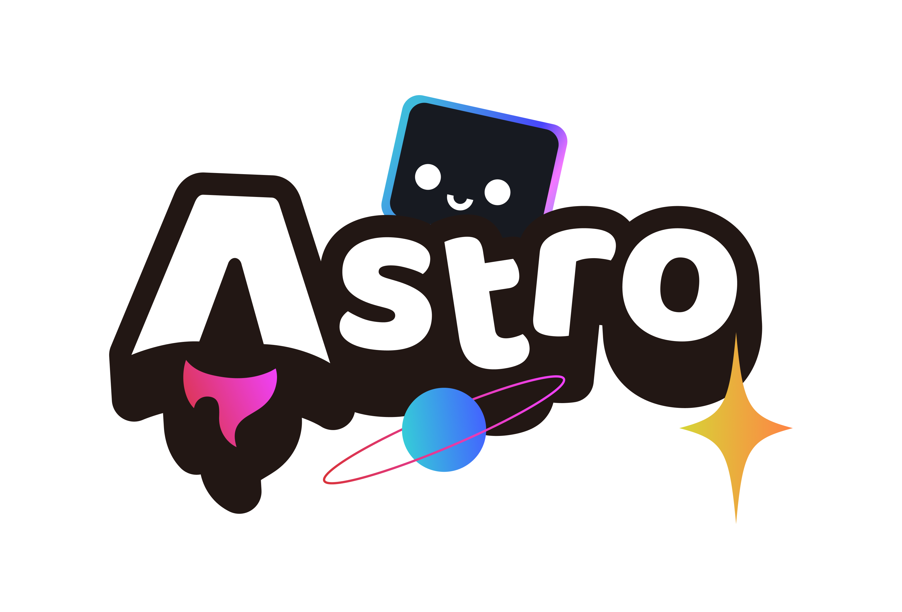
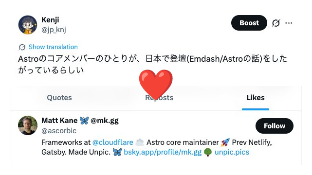
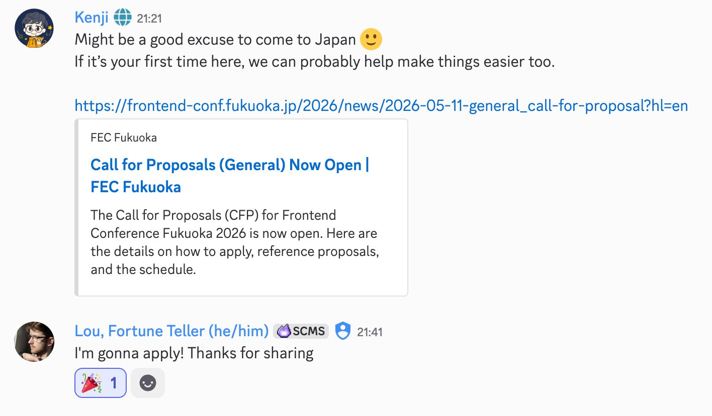

  
  

    
Astro Meetup Japan

    
v1

  

<!--
（開幕）こんばんは。Astro Meetup Japan v1 へお越しいただき、ありがとうございます。本日 司会を務めます、ケンジ と申します。今夜は3時間ほど、よろしくお願いします。
-->

---
class: flex items-center justify-center h-full
---

    

        

            
            

                
ケンジ

                
GitHub: <a href="https://github.com/jp-knj">jp-knj</a>

            

        

    

    

        <h3>今夜のながれ</h3>
        <ol class="text-xl font-bold">
            <li>立ち上げの想い</li>
            <li>今夜のテーマ</li>
            <li>会場・ルール</li>
        </ol>
    

<!--
（自己紹介）GitHub では jp-knj として活動しています。最近は Astro 本体へのコントリビュートが増えてきました。今夜は、この Meetup を立ち上げた想い、今夜のテーマ、会場とルール、この3つを駆け足でお伝えします。
-->

---
layout: cover
class: center
---

  

    専門性の内側で、強くなる 
    専門性の外側で、変わっていく
  

<!--
まず、方向性の話から。ずっと頭にあることなんですが——専門性やセンスは、人を強くする一方で、自分が通用する場所に閉じ込めてもしまう。だからこそ、自分の専門性がまだ通用しない場所に踏み込むことには、価値がある。

そこでは評価も不安定で、うまく話せないし、判断も鈍る。でも、その場所に入ることでしか、自分の専門性は次の形に変わらない——そう思っています。
-->

---
class: flex items-center justify-center h-full
---

    

        
    

    

        <h3 class="!mt-0">Astro Core への往復</h3>
        

          Princesseuh / ematipico / matthewp —— 
          英語のニュアンスも議論の作法も、 
          自分のセンスが通用しない場所。
        

    

    

        

          Astroをキッカケに 日本にきてもらう
        

    

    

        
        

            🎉
        

    

<!--
個人的な話で恐縮ですが、私自身、ここ最近 Astro 本体へのコントリビュートを通じて、Princesseuh さん、ematipico さん、matthewp といった海外のチームメンバーとやり取りする機会が増えてきました。

英語のニュアンスに自信がない、議論の作法もまだ慣れない——まさに、自分のセンスが通用しない場所です。

でも、やってみて分かったのは、距離は思ったほど遠くないということ。Issue、PR、Discord での雑談——その一つひとつが、確かに本体に届いていく感覚があります。

逆方向も、ちゃんと作りたいと思っています。いつか Core のメンバーが日本に来てくれたとき、ちゃんとサポートできるコミュニティでありたい。

日本と Astro 本体の間に 双方向の往復 が生まれたら、もっと面白いことが起きるはずです。この Meetup を、その往復の入口にしたい——というのが、立ち上げの一番の想いです。
-->

---
layout: section
---

# 今夜のテーマ
## Astro で自作したものを見せ合う

  デザイナーがコードに踏み込む。 
  エンジニアがデザインを覗き込む。 
  ノンコードの人がフレームワークの世界に入る。

  Astro は、そういう敷居を低くしてくれる道具。

<!--
今夜のテーマは「Astro で自作したものを見せ合う」。パネリストがそれぞれ作ったもの、考え方を持ち寄って、みんなで話していく時間です。

デザイナーがコードに踏み込む、エンジニアがデザインを覗き込む、ノンコードの人がフレームワークの世界に入る——Astro はそういう敷居を、わりと低くしてくれる道具だと思っています。

今夜、自分の専門の外側に一歩はみ出す何かを、持ち帰っていただけたら本望です。
-->

---
layout: default
---

## 会場のご案内

  
会場：サイボウズ株式会社 日本橋オフィス

  
スポンサーいただきありがとうございます 🙏

  

    <h3 class="!mt-0 !mb-2">Wi-Fi</h3>
    
SSID: <code>{{TODO_SSID}}</code>

    
Password: <code>{{TODO_PW}}</code>

  

  

    <h3 class="!mt-0 !mb-2">設備</h3>
    
お手洗い：{{TODO_TOILET}}

    
非常時：{{TODO_EVAC}}

  

<!--
TODO（当日埋める）:
- Wi-Fi SSID / パスワード
- お手洗いの場所
- 非常時の避難経路

会場は サイボウズ株式会社さんの日本橋オフィスをお借りしています。改めて、ありがとうございます。

Wi-Fi は SSID が [SSID]、パスワードが [PW] です。後ろのスライドにも出しておきます。お手洗いは [場所] にあります。非常時は [避難経路] でお願いします。
-->

---
layout: default
class: flex flex-col items-center justify-center h-full
---

  
実況・感想は

  
#AstroJP

  
{{TODO_PHOTO_NOTE}}

  
困ったことがあれば、運営スタッフまで。

<!--
TODO（当日埋める）:
- 写真撮影の配慮事項（一言）

最後に、お願いを2つだけ。実況・感想は #AstroJP でお願いします。[写真撮影の配慮事項を一言]。困ったことがあれば、運営スタッフまでお声がけください。
-->

---
layout: center
---

  
それでは、

  
Astro Meetup Japan v1 楽しんでいきましょう

  

    モデレーター @yuheiy さんへ
  

<!--
それでは、Astro Meetup Japan v1、楽しんでいきましょう。

最初のセッションは、パネルディスカッション 『Astro で自作したものを見せ合う』。ここからは、モデレーターの _yuhey さん にバトンをお渡しします。よろしくお願いします。
-->
