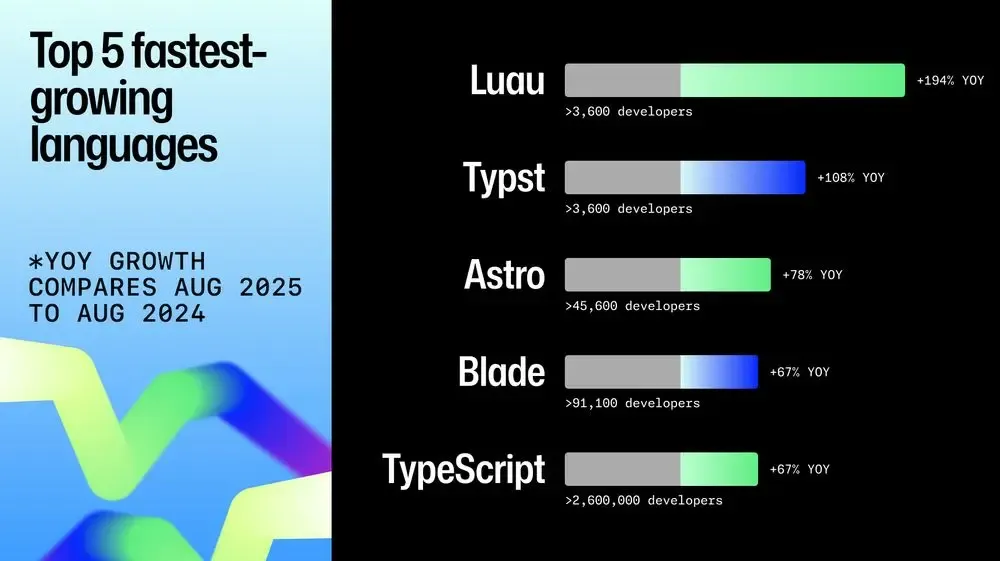
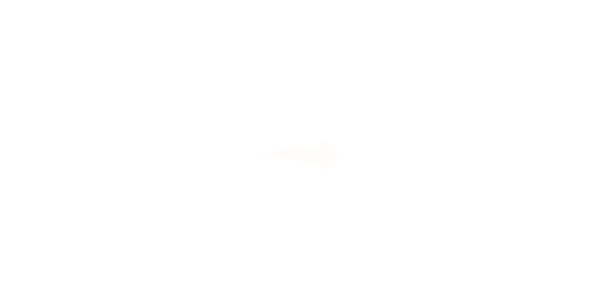
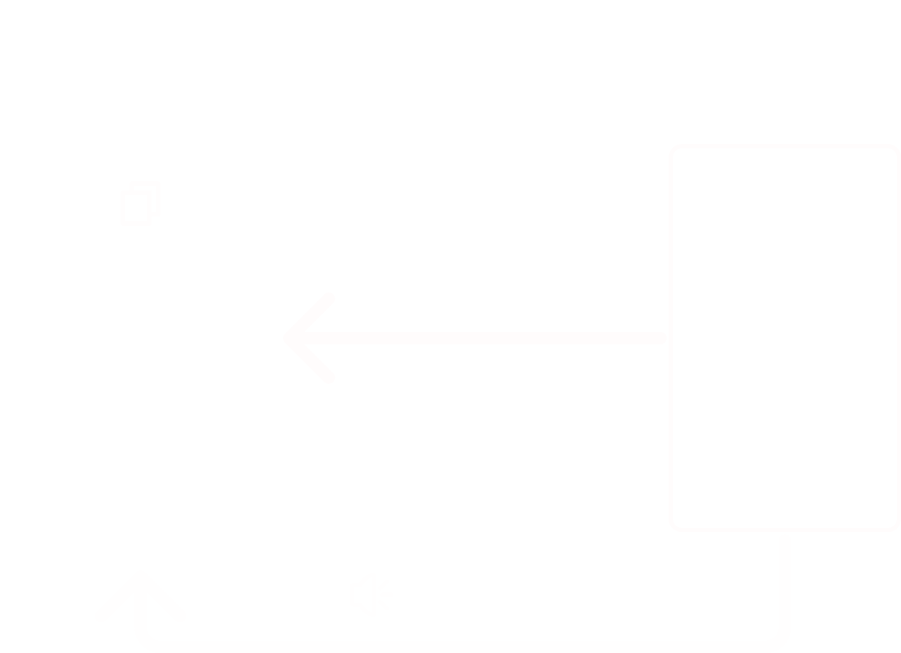
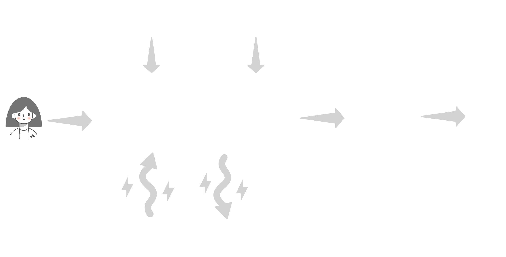
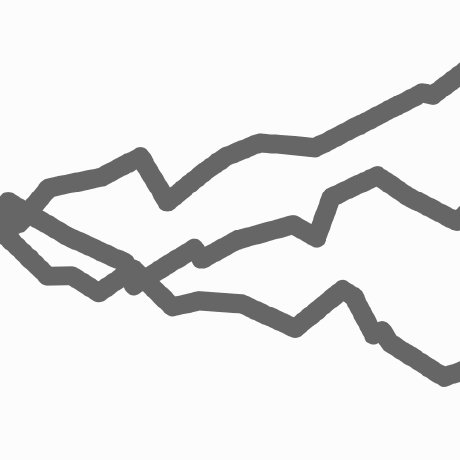

---
class: text-left flex flex-col justify-center h-full
---

## コンテンツ駆動と
## コミュニティの役割

---
class: flex items-center justify-center h-full
---

    

        

            
            

                
ケンジ

                
GitHub: <a href="https://github.com/jp-knj">jp-knj</a>

            

        

    

    

        <h3>今日のはなし</h3>
        <ol class="text-xl font-bold">
            <li>Astroのいま</li>
            <li>Astroのつらみ</li>
            <li>コミニティの役割</li>
        </ol>
    

---
layout: cover
class: flex flex-col items-center justify-center h-full
---

## Astroは静的サイト向けなのか 🤔

---
layout: cover
class: center
---

  
静的サイト向けではなく

  

    コンテンツ駆動
  

  
としてがんばってきた

---
layout: center
---

# 👀　👀　👀

---
layout: section
---

# 1. コンテンツ駆動の深み
## ファイル管理からデータ基盤へ

---
layout: default
---

## コンテンツのパラダイムシフト

  

    <h2 class="font-bold">Data Layer</h2>
    <h4 class="mt-8 leading-8 tracking-tighter">
      Gatsby.js+GraphQL  
      Content Mesh
    </h4>
  

  

    <h2 class="font-bold text-lg">Validation</h2>
    <h4 class="mt-8 leading-8 tracking-tighter">
      Zod + File System 
      Content Collection
    </h4>
  

  

    
New

    <h2 class="font-bold text-white">Database</h2>
    <h4 class="mt-8">
      Content Layer
    </h4>
  

<h2 class="mt-8 p-4 text-center">
  エンジンはSQLite化 
  Live Content Collections
</h2>

---
layout: section
---

# 2. パフォーマンスの再定義
## Islands から Server Islands へ

---
layout: center
---

## Server Islands

  

    

      🖼️
    

    <h4 class="font-bold text-white whitespace-nowrap overflow-visible">Static Shell</h4>
  

  
➜

  

    

      ⚙️
    

    <h4 class="font-bold text-white whitespace-nowrap overflow-visible">Server Defer</h4>
  

  
➜

  

      

      👤
    

    <h4 class="font-bold text-white whitespace-nowrap overflow-visible">Injection</h4>
  

---
layout: default
---

## Server Islandsのポテンシャル

<h4 class="mt-8 text-center">コンポーネント単位でStatic→Serverへ段階的移行</h4>

  

    <h4 class="text-center mb-4 font-bold">Static</h4>
    

      <h2>
        📄 
        📄 
        📄 
        📄 
        📄
      </h2>
    

  

  

    <h4 class="text-center mb-4 font-bold">Static + Server</h4>
    

      <h2>
        📄 
        ⚙️ Server 
        📄 
        ⚙️ Server 
        📄
      </h2>
    

  

<strong>🚀 メインプロセスを邪魔せず、遅いAPIが全体を止めない</strong> 

---
layout: section
---

# 3. アプリケーション基盤の強化
## 開発を支える標準化

---
layout: center
---

## 開発体験の標準化

  

    

      💻
      <h4 class="text-xl font-bold text-white">Astro Actions</h4>
    

    

      

        actions.like.safe(input) 
        ⬇ 
        Type Safe Result
      

    

  

  

    

      👤
      <h4 class="text-xl font-bold text-white">Standard Sessions</h4>
    

    

      

      

      

      

    

  

---
layout: center
---

## どこでも動くAstro
<h4 class="font-bold text-white mt-6">Container API (Enviroment API) + Server Island</h4>

  <!-- Left: Backend Frameworks -->
  

    

      
      Laravel
    

    

      
      Rails
    

    

      
      Hono
    

  

  <!-- Arrow -->
  →

  <!-- Center: Astro -->
  

    
    Astro
  

  <!-- Arrow -->
  →

  <!-- Right: Runtime Environments -->
  

    

      
      Browser
    

    

      
      Edge
    

    

      
      Node.js
    

  

---
layout: center
class: flex flex-col items-center justify-center h-full
---

## Proxyとしてもイケる
## UIレンダリングエンジン

---

## Astroの2025

    
npmダウンロード数 📈

    

---

## Astroの2025

    

        GitHub Octoverse 
        成長率が高い言語としてピックアップ 🚀
    

    

---
layout: cover
class: flex flex-col items-center justify-center h-full
---

## Astro Ecosystem

---
layout: cover
class: flex flex-col items-center justify-center h-full
---

<h2 class="flex items-center justify-center">
Open Collective 🏦　+

  

</h2>

---
layout: cover
class: flex flex-col items-center justify-center h-full
---

## withastro 🚀 + astrolicious 🍨

---
layout: cover
class: flex flex-col items-center justify-center h-full
---

## Astro AwardsとEcosystem Fund 🤝

  <a href="https://github.com/ktym4a">
    
    ktym4a
  </a>
  <a href="https://github.com/kyosuke">
    
    kyosuke
  </a>
  <a href="https://github.com/pilcrowonpaper" class="flex flex-col items-center justify-center h-full">
    
    pilcrowonpaper
  </a>
  <a href="https://github.com/ota-meshi">
    
    ota-meshi
  </a>
  <a href="https://github.com/morinokami">
    
    Shinya Fujino
  </a>

---
layout: cover
class: flex flex-col items-center justify-center h-full
---

## New Maintainer 🥳

  <a href="https://github.com/morinokami">
    
    Shinya Fujino
  </a>

---
layout: cover
class: flex flex-col items-center justify-center h-full
---

# Astroは順調だ

## 📈 🚀 🤝

---
class: flex flex-col items-center justify-center h-full
---

## ...本当に？🤔

---
class: flex flex-col items-center justify-center h-full
---

## ここから本題
### Astroのつらみ

---

## シリアライズの壁

---

## nanostores

---

## Astroはサーバーで完結させたい
### ComponentPropsとPolymorphicの限界がある

  
  
  
  

  
  
  

---

## Astroのツールチェーン

---
layout: center
class: flex flex-col items-center justify-center h-full
---

# .astroという
# 独自言語が抱える
# 宿命的な課題

---
layout: center
class: flex flex-col justify-center
---

## 話がしたい。話を聞きたい。

---
layout: center
class: flex flex-col justify-center
---

## Astro Japan Community 設立

### 設立したはいいんだけど

---
layout: center
class: flex flex-col justify-center
---

## 🥹 🥹 🥹

もしかしたら、会場提供のお願いとか

登壇依頼するかもしれません。 助けてください🙏

---
layout: center
class: text-center
---

## 終わり

---
layout: center
class: text-center
---

## 休憩

---
layout: center
---

<h2>#Gulp #jQuery #Webpack #EJS</h2>
<h2 class="mt-6">#MPA #SPA</h2>
<h2 class="mt-6">#Vite #Next.js(Turbopack)</h2>
<h2 class="mt-6">#Node #WinterCG(Deno, Bun)</h2>
<h2 class="mt-6">#ホースティングサービス</h2>
<h2 class="mt-6">#Nuxt #React #Svelte #Starlight #Edge</h2>

  

      
  

  

    
    
kyosuke

  

  

    
    
wattanx（わったん）

  

  

      
      
全部入りHTML太郎

  

---
